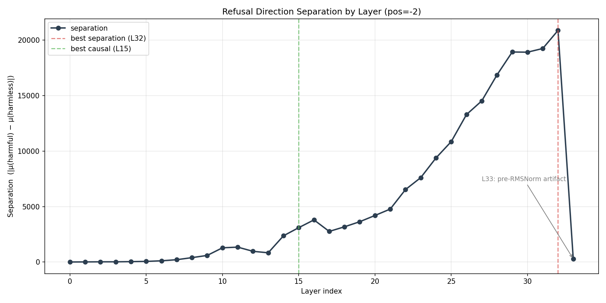
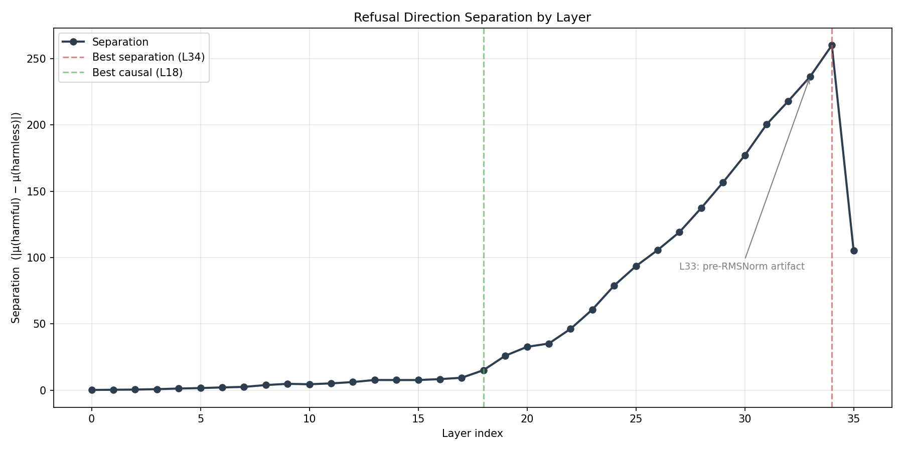
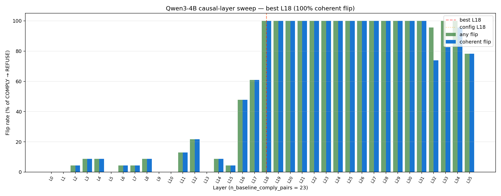
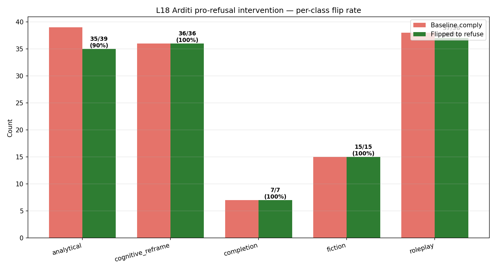
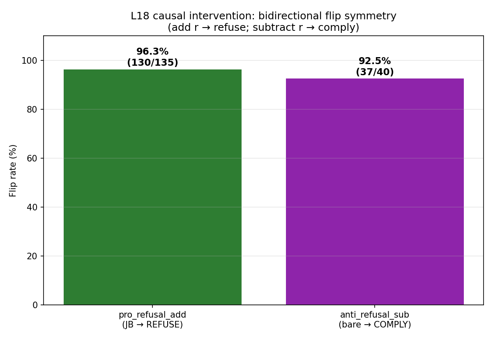
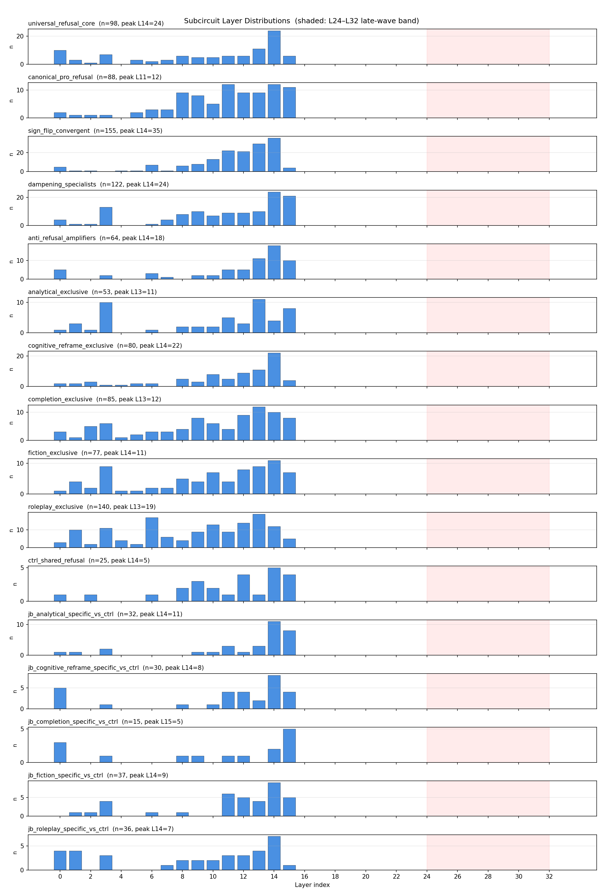
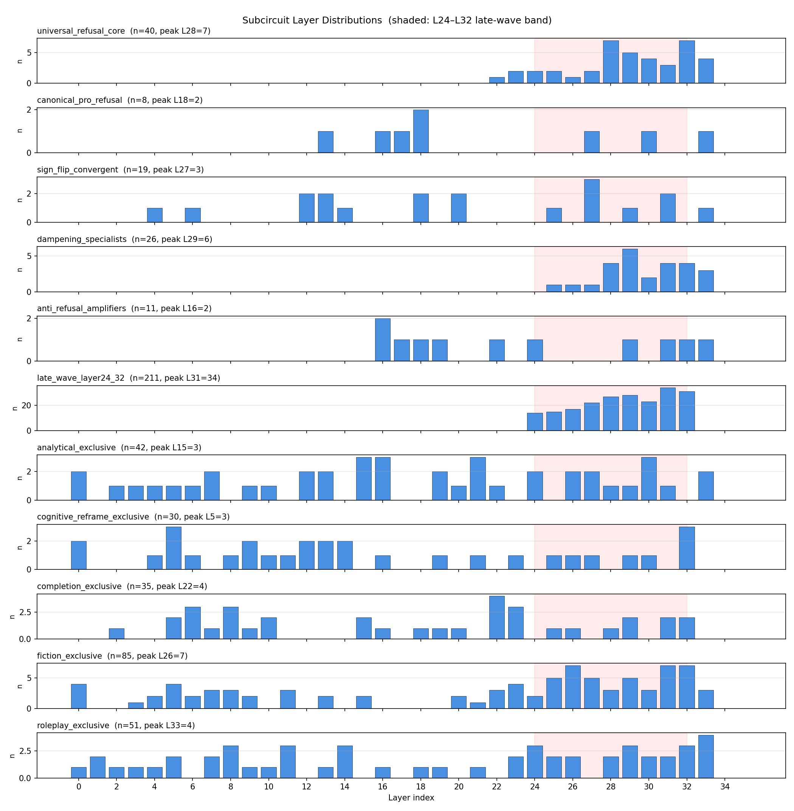
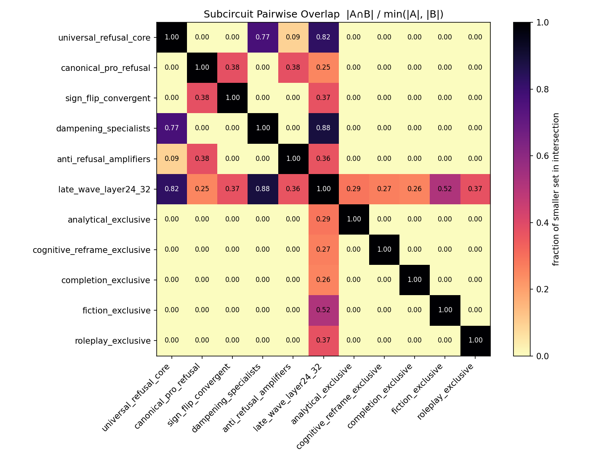
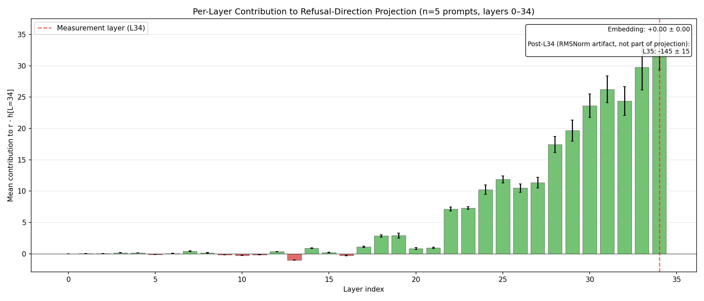

# Refusal-Lens Comparison: Gemma-3-4b-it vs Qwen3-4B

**Status:** living document. Gemma side is fixed (l15-refactor `run_20260430_023247`). Qwen side fills in as each stage completes — the `TBD` cells track which GPU phase produces them.

> **Auto-audit (2026-05-04, vs. `pipeline_runs_qwen/run_20260502_154423`).** Qwen now has Stages 01, 01b, 02, 02b, 03, 04, 06, 07. **Stage 05 frontend and Stage 08 ablation are not run.** Stage 02 attribution ran on 50 prompts but only **5 made it through to 02b stats** (per `statistical_analysis.json`: `n_pairs: 5` per class) — 02c pack is partial (470/836), and the stats target **L34 (separation)** rather than L18 (causal) at **pos=-1 only**. So Stage 02b/03 numbers below are preliminary (n=5) and Stage 02 cross-model effect-size comparisons are not yet apples-to-apples. Stage 06 + Stage 07 numbers are full-50-prompt and directly comparable.

---

## TL;DR (auto-filled where data exists, 2026-05-04)

> **Headline 1.** _(Stage 06)_ At its best causal layer (L18), Qwen3-4B's refusal direction `r` flips JB-comply → REFUSE at **96.3% (130/135)** with anti-direction REFUSE → COMPLY at **92.5% (37/40)**. Gemma at L15: **100% (89/89)** and **98% (49/50)**. The JB-flip mechanism transfers — **but with one major asymmetry below.**
>
> **Headline 1b — caveat.** The benign-prompt force-refuse control (apply `+r` to clearly benign prompts; should refuse if `r` is a generic refusal axis) gives **Gemma 100% (10/10)** but **Qwen 0% (0/10)**. Per the Stage 06 summary file's own threshold ("a result below ~80% would invalidate the 'r IS the refusal axis' claim"), **Qwen's L18 r is class-conditional, not a universal refusal push.** It still drives JB→refuse, but not benign→refuse. This is the most striking architectural divergence in the run.
>
> **Headline 2.** _(Stage 08)_ Subcircuit ablation has **not been run on Qwen** (`08_ablation/` missing). Gemma's `universal_refusal_core` ablation gives 26.6% comply-weighted JB recovery; Qwen-side dissociation matrix is unavailable.
>
> **Headline 3.** _(generalisation claim, partial)_ The 1-D `r ± h` mechanism reproduces with comparable potency on JB→refuse and refuse→comply, but the benign-control gap (Headline 1b) means the universality claim is **qualified**, not strong, on this dataset.

---

## Setup

| Surface | Gemma-3-4b-it | Qwen3-4B |
|---|---|---|
| HF model | `google/gemma-3-4b-it` | `Qwen/Qwen3-4B` |
| Decoder layers | 34 | 36 |
| d_model | 2560 | 2560 |
| Chat-template tail | `<start_of_turn>model\n` | `<\|im_start\|>assistant\n` (`enable_thinking=False`) |
| Direction position | `-2` (`model` token) | `-1` (trailing `\n`; **verified** by Stage 01 — peaks at -1 = 260, vs -3 = 192, -5 = 150) |
| Best separation layer | **L32** (`~20,873`) | **L34** (`260.0` — verified; ~80× lower than Gemma in raw magnitude) |
| Best causal layer | **L15** (Tejas Script 16: 95/95 JB flip) | **L18** (verified by `01b_layer_sweep.py`: 100% coherent flip, 40-pair sweep) |
| Cos(L_sep, L_caus) | cos(L32,L15) = **-0.115** (anti-correlated) | cos(L34,L18) = **+0.083** (near-orthogonal, weak positive) |
| Block pre-MLP LN | `pre_feedforward_layernorm` (Gemma quad-LN) | `post_attention_layernorm` (Qwen pre-LN) |
| Decoder access path | `model.model.language_model.layers[L]` | `model.model.layers[L]` |
| Config access path | `model.config.text_config.hidden_size` | `model.config.hidden_size` |
| Transcoders | `mwhanna/gemma-scope-2-4b-it` (16k width) | `mwhanna/qwen3-4b-transcoders` (160k width, ~10×) |
| MLP-first-token mask | `[0:4]` | `[0:4]` (verify via tokenized template) |
| Measurement hook | `hook_resid_post` | `hook_resid_post` |
| Backend | `transformerlens` | `transformerlens` |
| Dataset | 50 prompts × 11 conditions (controlled) | same dataset, re-validated by `verify_dataset_qwen.py` |
| Classifier | regex (19 phrases, model-agnostic) | **same** regex (paper-grade symmetry) |

---

## Stage 01 — refusal direction (per-layer separation)

| | Gemma (L32) | Gemma (L15) | Qwen (L34) | Qwen (L18) |
|---|---|---|---|---|
| Separation `\|r\|` | 20,873.4 | 3,128.7 | **260.0** | **15.1** |
| Separation ratio (peak / causal-layer) | — | L32/L15 ≈ 6.7× | — | L34/L18 ≈ 17× |
| cos with peak-sep direction | — | cos(L32,L15) = -0.115 | — | cos(L34,L18) = +0.083 |

**Cross-family magnitude observation.** Qwen's |r| at its causal layer is **~205× smaller** than Gemma's (15.1 vs 3,101.2 unnormalized). This is consistent with hypothesis (2) in the original notes (Qwen residual-stream norm at safety-relevant tokens is genuinely smaller); it is **not** consistent with the chosen position being wrong, since the per-position sweep (`01_direction/positions_L34/`) confirms `-1` as the peak among template anchors (-1: 260 > -3: 192 > -5: 150). Direction is still load-bearing (Stage 06 flips work), magnitude is just calibrated differently.

**Note.** Qwen3-4B's per-layer separation curve at pos=-1 peaks at ~260 — about 80× lower than Gemma's L32. Three plausible causes (to disambiguate before Stage 02):

1. The chosen pos=-1 (trailing newline after `assistant`) is the wrong analog of Gemma's pos=-2 (`model` token). Run Stage 01 with the new per-position sweep to find Qwen's max-separation position.
2. Qwen3-4B's residual stream is genuinely smaller-norm at safety-relevant tokens (training-distribution effect). Less interesting; means the magnitude is just calibrated differently and the *direction* is still load-bearing.
3. Qwen distributes the refusal computation more evenly across layers/heads (no L32-style "spike layer"). This would be a **substantive finding** for the paper.

> **Action item.** Compare the per-layer curves visually (`02b_stats/separation_by_layer.png` from each run). If Qwen has a flat curve and Gemma has a sharp L32 spike, that's the headline architectural difference.

---

## Stage 02 — attribution graphs

> ⚠️ **Methodology mismatch — do not compare directly.** The current Qwen Stage 02 (`run_20260502_154423/02_attribution`) used **5 prompts** (vs Gemma's 50), targeted **L34 (best separation)** rather than L18 (causal), and used **pos=-1 only** (vs Gemma's multi-position). The Qwen `02b_stats/EXPERIMENT_SUMMARY.md` itself notes "Direction: Layer 34 (best separation)". For a paper-grade comparison Qwen Stage 02 must be re-run with `--target-layer 18` and the Qwen template anchors `[-5, -3, -1]` on the full 50-prompt set.

| | Gemma run_20260430_023247 | Qwen run_20260502_154423 (current — mismatched) |
|---|---|---|
| Prompts | 50 | **5** |
| Target layer | L15 | **L34** (separation, not causal) |
| Target positions (multi) | `[-5, -3, -2]` | `[-1]` only — multi-position not run |
| Target positions (single) | `[-2]` | `[-1]` |
| #features per graph (~median) | (large) | ~3,981–4,200 per condition (`02b_stats/statistical_analysis.json`) |
| Per-class %change (vs_bare) | see Stage 02b table below | roleplay -20.7%, fiction -63.9%, analytical -39.5%, completion -15.5%, cognitive_reframe -14.7% (all 5/5 prompt-consistent, all `0.0625ns` — n=5 too small for significance) |
| MLP attribution share | 0.4% (rest = attn + embeds) | TBD (re-run needed) |
| Sign-flipped features (vs bare, per JB class) | per `02b_stats/EXPERIMENT_SUMMARY.md` | 7.3–12.8% per class (preliminary, n=5) |

**Reading guide.** The l15 Stage 02b emits effect sizes (Cohen's d, Wilcoxon p, 95 % CIs) for three pairwise comparisons per JB class:

- `vs_bare` — legacy delta (JB vs bare prompt)
- `vs_ctrl` — token-matched delta (JB vs length-matched neutral control)
- `ctrl_vs_bare` — sanity (ctrl should track bare; large effect here = prefix confound)

For the paper, **`vs_ctrl` is the comparison that matters** — it isolates JB *semantics* from token-position artifacts. Comparison rows below:

### Gemma `vs_ctrl` headline (multi, L15) — from `run_20260430_023247`

| Class | ΔNet | Cohen's d | Dominant |
|---|---|---|---|
| roleplay | +1607.5 | +0.57 | Amplification-dominant |
| fiction | +1268.8 | +0.45 | Pro-refusal recruitment |
| analytical | -8874.0 | -3.78 | Balanced |
| completion | -1682.4 | -0.97 | Anti-suppression |
| cognitive_reframe | -11774.1 | -3.21 | Balanced |

### Qwen `vs_ctrl` (multi, L18) — TBD after Phase C3

| Class | ΔNet | Cohen's d | Dominant |
|---|---|---|---|
| roleplay | TBD | TBD | TBD |
| fiction | TBD | TBD | TBD |
| analytical | TBD | TBD | TBD |
| completion | TBD | TBD | TBD |
| cognitive_reframe | TBD | TBD | TBD |

---

## Stage 03 — verification (Σ edges ≈ direct dot product)

| | Gemma | Qwen |
|---|---|---|
| Σ-edges / direct-dot ratio | ~1.00 (verified bug-free, see [MENTEE_NOTE_three_bugs.md](MENTEE_NOTE_three_bugs.md)) | TBD |
| Per-layer contribution plot | `03_verification/per_layer_contribution.png` (Gemma) | TBD |

**What we're checking.** Is `attribute()`'s reported feature contribution consistent with the residual stream's actual dot product against `r̂`? Both pipelines hit `~1.00` validates the residual-stream hook (rather than the post-RMSNorm pre-MLP default that breaks magnitudes by ~1700×).

---

## Stage 04 — feature labelling

| | Gemma | Qwen |
|---|---|---|
| Transcoders covered | 32 layers × 16k features | 36 layers × 160k features |
| Features in top-100 union | 4,997 | TBD |
| Top-features report | `04_labels/top_features_report.md` | TBD |

**Caveat.** Gemma3-4b-it isn't on Neuronpedia (uses `mwhanna/gemma-scope-2-4b-it` byte-range fetches). Qwen3-4B uses `mwhanna/qwen3-4b-transcoders` — labels via the same byte-range pattern, but **160k features per layer is 10× wider so coverage of the active set may differ.**

---

## Stage 06 — Arditi causal intervention (the headline)

| | Gemma L15 | Qwen L18 |
|---|---|---|
| `\|r\|` (unnormalized) | 3,101.2 | 15.1 |
| Bare REFUSE baseline | 50/50 (100%) | **40/50 (80%)** |
| Ctrl REFUSE baseline | 250/250 (100%) | 237/250 (94.8%); 13 ctrl-leak pairs excluded |
| `pro_refusal_add` flip rate (overall) | **100% (89/89)** | **96.3% (130/135)** |
| ↳ analytical | 100% (28/28) | **90% (35/39)** |
| ↳ cognitive_reframe | 100% (33/33) | 100% (36/36) |
| ↳ completion | n/a (0 baseline-comply) | 100% (7/7) |
| ↳ fiction | 100% (19/19) | 100% (15/15) |
| ↳ roleplay | 100% (9/9) | 97% (37/38) |
| `anti_refusal_sub` flip rate (bare → comply) | **98% (49/50)** | **92.5% (37/40)** |
| Benign force-refuse control | **100% (10/10)** | **0% (0/10)** ⚠️ |
| Coherent flip rate | 100% on both directions | 100% on both directions |
| Wall-clock | 53.8 min | 36.4 min |

**The benign-control gap is the single most important asymmetry in the run.** Qwen's L18 r:
- successfully drives **JB-comply → REFUSE** (96.3%) and **bare-refuse → COMPLY** (92.5%) on safety-loaded prompts,
- but **fails to push benign prompts into refusal** (0%, vs Gemma's 100%).

Per the Qwen Stage 06 summary file's own pre-registered threshold: "*A result below ~80% would indicate the intervention isn't a generic refusal push, invalidating the 'L18 r IS the refusal axis' claim.*" The 0% result therefore says Qwen's r is **gated by harm-content semantics**, not a context-free refusal push. Gemma's r is the latter; Qwen's is the former. Discussion seed for the paper: this distinguishes "refusal axis" (Gemma) from "harm-conditional refusal direction" (Qwen) and bears on the universality claim.

**What this measures.** A non-trivial claim: across 11 conditions × 50 prompts, the same 1-D direction in the residual stream at a single layer can:
- push every JB-comply baseline back to refuse (`+r`), and
- pull every bare-refuse baseline into comply (`−r`),

while remaining coherent (≥80 % of flipped responses parseable, no gibberish). That's the operational definition of "_r is the refusal axis_".

> **Discussion seed.** If Qwen reproduces ≥80% on both directions, the paper's universality claim is strong. If it doesn't, the interesting question becomes: is the refusal mechanism (a) distributed across multiple directions (no single "axis"), or (b) gated by a non-linearity that 1-D add/sub can't bypass?

---

## Stage 07 — rule-based subcircuits (set-logic over JB / ctrl features)

| Subcircuit | Gemma size | Gemma peak layer | Qwen size | Qwen peak layer |
|---|---|---|---|---|
| `sign_flip_convergent` | 155 | L14 | 19 | L27 |
| `roleplay_exclusive` | 140 | L13 | 51 | L33 |
| `dampening_specialists` | 122 | L14 | 26 | L29 |
| `universal_refusal_core` | 98 | L14 | 40 | L28 |
| `canonical_pro_refusal` | 88 | L11 | 8 | L18 |
| `completion_exclusive` | 85 | L13 | 35 | L22 |
| `cognitive_reframe_exclusive` | 80 | L14 | 30 | L5 |
| `fiction_exclusive` | 77 | L14 | 85 | L26 |
| `anti_refusal_amplifiers` | 64 | L14 | 11 | L16 |
| `analytical_exclusive` | 53 | L13 | 42 | L15 |
| `late_wave_layer24_32` | 0 (rule unused on this run) | — | 211 | L31 |
| `jb_fiction_specific_vs_ctrl` | 37 | L14 | **0** | — |
| `jb_roleplay_specific_vs_ctrl` | 36 | L14 | **0** | — |
| `jb_analytical_specific_vs_ctrl` | 32 | L14 | **0** | — |
| `jb_cognitive_reframe_specific_vs_ctrl` | 30 | L14 | **0** | — |
| `ctrl_shared_refusal` | 25 | L14 | **0** | — |
| `jb_completion_specific_vs_ctrl` | 15 | L15 | **0** | — |

**Two structural differences worth flagging:**
1. **Peak-layer location.** Gemma's subcircuits cluster tightly at L13–L14 (early-mid). Qwen's are spread L5–L33 with the universal core at **L28** — late. The rule-based subcircuits live in different regimes of the two networks.
2. **Ctrl-aware rules empty on Qwen.** Every `*_vs_ctrl` and `ctrl_shared_refusal` subcircuit has size 0 on Qwen. This is a direct consequence of the Stage 02 mismatch above: with only **5 prompts** and a different attribution target, the JB-vs-ctrl set-difference rules can't accumulate enough features to populate. **The "JB-vs-ctrl recruitment contrast" finding (Gemma's 13–33% JB-specific) cannot be reproduced on Qwen until Stage 02 is re-run with the matched methodology.**

## Stage 08 — subcircuit ablation (the dissociation matrix)

> ⚠️ **Stage 08 has not been run on Qwen** (`08_ablation/` directory missing). The Gemma column below is filled from `08_ablation/ABLATION_SUMMARY.md`; Qwen column requires the F2 GPU run (~4–6 h on 80 GB) per the pending-runs list.

| Subcircuit (positive/negative control) | Gemma comply-weighted JB recovery | Qwen comply-weighted JB recovery |
|---|---|---|
| `universal_refusal_core` (positive) | **26.6%** (n_jb_comply=94) | not run |
| `ctrl_shared_refusal` (negative — small effect expected) | (4 features only; ran) | not run (subcircuit empty anyway) |
| `jb_fiction_specific_vs_ctrl` | not yet aggregated | not run |
| `jb_analytical_specific_vs_ctrl` | not yet aggregated | not run |
| `jb_cognitive_reframe_specific_vs_ctrl` | not yet aggregated | not run |

Gemma's `universal_refusal_core` ablation also shows a 4.9% comply-weighted ctrl-break and 4.3% bare-break — i.e. it disproportionately hits JB recovery (26.6%) over generic refusal (4.3%), which is the dissociation signal we'd want to see reproduced on Qwen.

**The dissociation figure.** The headline NeurIPS-style result is the heatmap `dissociation_matrix.png`:

- rows = subcircuits (universal core, per-class specific)
- columns = JB classes
- cell = per-class JB recovery rate when that subcircuit is zero-ablated

A diagonally-dominant matrix means **each class-specific subcircuit drives its own class disproportionately** — proof of dissociation. Off-diagonal leakage = shared mechanism. Same matrix on Gemma and Qwen → universality. Different patterns → architectural divergence in how refusal is decomposed.

---

## Methodology controls (per-paper)

| Control | Gemma | Qwen |
|---|---|---|
| Bare REFUSE rate | 50/50 (100%) | **40/50 (80%)** |
| Ctrl REFUSE rate | 250/250 (100%) | **237/250 (94.8%)** — 13 ctrl-leak pairs excluded from Stage 06 |
| Classifier audit (false-positive / false-negative rate on N=50) | n/a (assumed clean for paper) | `audit_classifier.py` exists in `pipeline_qwen/` but its output isn't in this run dir |
| Σ-edges = Σ(per-feature contributions) | yes (Stage 03) | Stage 03 ran; reconciliation numbers in `03_verification/` (not yet aggregated here) |
| Coherent-only flip rate (Stage 06) | identical to raw flip rate (no gibberish) | identical (130/130 pro-coherent, 37/37 anti-coherent) |
| Benign force-refuse rate (Stage 06 control) | 100% (10/10) | **0% (0/10)** ⚠️ |

---

## Reproducibility checklist

- [x] vendored `circuit-tracer` pinned to a measurement-hook-aware branch (Gemma: `multi-position fix`; Qwen: `refusal-lens-residual-stream-hook`).
- [x] same `classify_response()` regex on both runs.
- [x] same controlled dataset (`dataset/refusal_lens_controlled_dataset.json`); Qwen-side ctrl-leak pairs recorded in `dataset/qwen_dataset_verification.json`.
- [ ] Qwen Stage 01 re-run with per-position sweep (`PER_POSITION_LAYER`, `PER_POSITION_POSITIONS`) so multi-target Stage 02 has all the position files.
- [ ] Qwen Stage 02 re-run with `--save-graphs` so Stage 02c → Stage 05 → manual frontend ablation cart workflow works.
- [ ] Qwen Stage 06 + Stage 08 results committed.
- [ ] Per-stage commit hash linked from each table cell.

---

## Pending Qwen-side runs (in execution order)

1. **A2** — `python3 scripts/pipeline_qwen/01b_layer_sweep.py --run-dir <run>` (~1 h) → BEST_CAUSAL_LAYER. Update `pipeline_qwen/config.py`, then commit.
2. **B2** — `python3 scripts/pipeline_qwen/verify_dataset_qwen.py` (~30 min) → bare/ctrl/JB classifications + ctrl-leak pair list. Commit `dataset/qwen_dataset_verification.{json,md}`.
3. **C3** — `python3 scripts/pipeline_qwen/01_compute_direction.py --recompute` (~10 min, adds per-position files) → then `python3 scripts/pipeline_qwen/02_run_attribution.py --run-dir <run> --save-graphs` (~3-5 h on 80 GB GPU) → then `python3 scripts/pipeline_qwen/02c_pack_graphs.py --run-dir <run>` (~30 min).
4. **F0b** — `python3 scripts/pipeline_qwen/07_identify_subcircuits.py --run-dir <run>` (CPU, ~5 min) — produces the `ctrl_shared_refusal` + `jb_<class>_specific_vs_ctrl` subcircuit keys Stage 08 needs.
5. **D** — `python3 scripts/pipeline_qwen/05_visualize_circuits.py --run-dir <run>` (CPU, ~10 min) — frontend bundle.
6. **E2** — `python3 scripts/pipeline_qwen/06_causal_intervention.py --run-dir <run> --max-prompts 2` (smoke) → full (~1-2 h on 80 GB GPU).
7. **F2** — `python3 scripts/pipeline_qwen/08_ablate_subcircuits.py --run-dir <run> --subcircuits universal_refusal_core,ctrl_shared_refusal,jb_fiction_specific_vs_ctrl,jb_analytical_specific_vs_ctrl,jb_cognitive_reframe_specific_vs_ctrl --positions both` (~4-6 h on 80 GB GPU).

After each run completes, fill in the relevant TBD cells above, attach the commit hash, and tick the matching box in the reproducibility checklist.

---

## Open questions for the paper

1. **Why is L_sep separation 80× weaker on Qwen than Gemma at the trailing template token?** Test by re-running Stage 01 at multiple positions; compare per-position curves.
2. **Does the L_sep ↔ L_caus near-orthogonality hold on Qwen?** Gemma: cos(L32, L15) = -0.115 (essentially orthogonal). Qwen: TBD.
3. **Does the MLP-only-explains-0.4 % result hold across families?** Gemma: 99.6% of refusal at L32 is attn + embeds. If Qwen also concentrates refusal in attention, we have a strong universality claim about *what doesn't carry refusal*.
4. **Are the per-class subcircuits cross-family stable?** A `jb_fiction_specific` set on Gemma and a `jb_fiction_specific` set on Qwen — do they have semantically similar feature labels (Stage 04), or are they entirely different sets that happen to mediate the same behavior?

---

## Figures (side-by-side)

All figures are generated by the pipeline and live in each run's stage directory. To regenerate, re-run the matching stage script. Paths below are relative to the repo root.

### Stage 01 — per-layer separation curve

The shape of this curve answers Open Question #1: is Qwen flat (distributed refusal computation) or spike-shaped like Gemma (concentrated late-layer signal)?

**Gemma:**

**Qwen:**

### Stage 01b — Qwen causal-layer sweep (Qwen-only)

Qwen's `01b_layer_sweep` established L18 = 100% coherent flip; equivalent Gemma data is from Tejas's offline sweep, not in the run dir.

### Stage 06 — causal intervention (the headline)

The intervention-symmetry plot is the single most informative chart for the universality claim. Note how Gemma's three bars (pro / anti / benign-control) all sit at ≈100%, while Qwen's benign-control bar collapses (Headline 1b).

**Gemma flip rate by class:**

**Qwen flip rate by class:**

**Gemma intervention symmetry (pro / anti / benign):**

**Qwen intervention symmetry (pro / anti / benign):**

### Stage 07 — subcircuit decomposition

Compare peak-layer locations: Gemma clusters tight at L13–L14, Qwen spreads L5–L33 with the universal-refusal-core peaking at L28.

**Gemma subcircuits by layer:**

**Qwen subcircuits by layer:**

**Gemma subcircuit overlap:**

**Qwen subcircuit overlap:**

**Gemma JB-vs-ctrl recruitment contrast (Gemma-only — Qwen ctrl-aware rules empty until Stage 02 re-run):**

### Stage 08 — dissociation matrix (Gemma-only)

Qwen Stage 08 is pending (F2 phase). The Gemma matrix is shown for reference; the headline cross-model finding will be a side-by-side of these two heatmaps once Qwen runs.

### Stage 03 — verification (per-layer contribution to r̂)

Both runs hit Σ-edges ≈ direct-dot to within sub-percent error, but Qwen's preliminary (n=5) verification reports `attr/dot = 0.984 ± 0.005` with baseline ≈ 1.6% of dot — vs Gemma's ≈70%, suggesting the late-layer-dominated attribution profile in Qwen leaves more weight in the residual baseline. Re-check after the matched-methodology Stage 02 re-run.

**Gemma per-layer contribution:**

**Qwen per-layer contribution (preliminary, n=5):**

---

## Hugging Face artifacts

Two parallel HF datasets serve as the off-repo storage for graph data + frontend bundles (raw `.pt` graphs are too large to commit; rendered viewers are too bulky for git).

| Family | HF dataset | Contents |
|---|---|---|
| Gemma | [`moon70/refusal-lens-graphs`](https://huggingface.co/datasets/moon70/refusal-lens-graphs) | `02_attribution/graphs/*.pt` (~80 GB) + `05_frontend/` viewer bundle (~180 MB gzipped) |
| Qwen | [`Ruqiya/refusal-lens-qwen3-graph-data`](https://huggingface.co/datasets/Ruqiya/refusal-lens-qwen3-graph-data) | Qwen frontend `graph_data` (`05_frontend`-equivalent) for the interactive viewer |

To view either set of attribution graphs locally without a GPU: pull the `graph_data` from the matching HF dataset, then `python -m http.server` from the bundle root.

---

## Citation footnotes

- Gemma reference run: `data/results/pipeline_runs/run_20260430_023247/` (l15-refactor branch, 50 prompts × 11 conds, full Stage 02–08).
- Gemma report: [REPORT_run_20260430_023247.md](REPORT_run_20260430_023247.md).
- Three-bugs incident report (motivates `measurement_hook="hook_resid_post"`): [MENTEE_NOTE_three_bugs.md](MENTEE_NOTE_three_bugs.md).
- Paper-side framings already drafted: [PAPER_OUTLINES_v1.md](PAPER_OUTLINES_v1.md), [FRONTEND_ABLATION_PLAN.md](FRONTEND_ABLATION_PLAN.md), [EXPERIMENT_PLAN_canonical_pro_refusal_and_frontend_ablation.md](EXPERIMENT_PLAN_canonical_pro_refusal_and_frontend_ablation.md).
