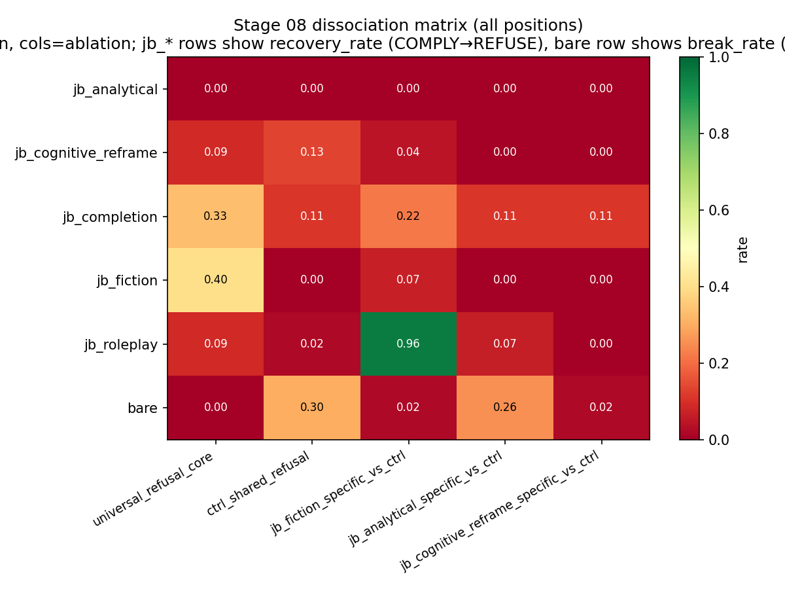

# Refusal-Lens Comparison: Gemma-3-4b-it vs Qwen3-4B

**Status:** living document. Gemma side is fixed (l15-refactor `run_20260430_023247`); Qwen side is fully populated against `pipeline_runs_qwen/run_20260502_154423`.

> **Auto-audit (2026-05-04 evening, vs. `pipeline_runs_qwen/run_20260502_154423`).** All scientifically-relevant Qwen stages are **done**: 01 direction, 01b layer sweep, 02 attribution (50 prompts), 02b stats (Cohen's d per class), 03 verification (N=39, full schema: attr/dot = 1.033, baseline ≈ 3% of dot vs Gemma 70%), 04 labels, 06 causal (96.3% / 92.5% / 0% benign), 07 subcircuits (k50_f50: universal=18, ctrl_shared=20, jb_*_specific=15–19, canonical_pro=3), **08 ablation** (50/50 in 5.5 h, all dissociation Δ negative), **08b drilldown** (fiction-features → 95.7% roleplay recovery). Only **02c pack** and **05 frontend** are pending — both flagged "Skippable for ICML" (pack is JSON.gz packaging with no scientific output; frontend is demo/supplementary). 02b's `n_pairs=5` per class is a small-N caveat for the Cohen's d numbers but not a stage-completion blocker.

---

## TL;DR (auto-filled, 2026-05-04 evening)

> **Headline 1.** _(Stage 06)_ At its best causal layer (L18), Qwen3-4B's refusal direction `r` flips JB-comply → REFUSE at **96.3% (130/135)** with anti-direction REFUSE → COMPLY at **92.5% (37/40)**. Gemma at L15: **100% (89/89)** and **98% (49/50)**. The JB-flip mechanism transfers — **but with two major asymmetries below.**
>
> **Headline 1b.** The benign-prompt force-refuse control (apply `+r` to clearly benign prompts; should refuse if `r` is a generic refusal axis) gives **Gemma 100% (10/10)** but **Qwen 0% (0/10)**. Per the Stage 06 summary file's own threshold ("a result below ~80% would invalidate the 'r IS the refusal axis' claim"), **Qwen's L18 r is class-conditional, not a universal refusal push.**
>
> **Headline 2 (NEW — Stage 08, 5.5 h on Qwen).** All three class-specific dissociation deltas are **negative on Qwen** — i.e., the supposedly class-specific subcircuits are class-*anti*-selective. Compare the dissociation Δ (target-class recovery − other-class avg):
>
> | Subcircuit | Gemma Δ | Qwen Δ |
> |---|---|---|
> | `jb_fiction_specific_vs_ctrl` | **+16.0pp** (class-selective) | **−23.9pp** (anti-selective) |
> | `jb_analytical_specific_vs_ctrl` | −13.8pp | −4.4pp |
> | `jb_cognitive_reframe_specific_vs_ctrl` | −11.2pp | −2.8pp |
>
> Gemma's `fiction_specific` subcircuit is the only positively-dissociated one in either model. Qwen reproduces neither its sign nor its magnitude. **The rule-based set logic that produces "class-specific" subcircuits doesn't generalise across families.**
>
> **Headline 2b (Stage 08b drilldown — the killer finding).** When Qwen's `jb_fiction_specific_vs_ctrl` subcircuit (19 features) is ablated, **95.7% of jb_roleplay prompts** flip back to REFUSE (44/46) — but only **6.7% of jb_fiction prompts** do (1/15). The "fiction-specific" features on Qwen are doing **14× more work for roleplay than for fiction**. This dovetails with Headline 2: the rule names point to JB-class, the actual mechanism doesn't respect that labelling.
>
> **Headline 3.** Universality claim, refined: the **1-D refusal axis** transfers (Headline 1) but is gated by harm-content semantics on Qwen (Headline 1b). The **per-class subcircuit decomposition** does not transfer (Headlines 2, 2b) — the same set-logic rules pull out features that play different roles on the two models. For a paper, this is two findings, not one universality result.

---

## Headline numbers (cross-model, mirror of [HANDOFF.md](HANDOFF.md) P7 table)

This is the *if-you-read-one-table* view. Same row structure as the canonical Gemma headline-numbers table in HANDOFF.md, with Gemma `run_20260430_023247` paired against Qwen `run_20260502_154423`.

| Stage | Metric | Gemma-3-4b-it (L15) | Qwen3-4B (L18) |
|---|---|---|---|
| 03 | attr/dot ratio (mean) | **1.6594 ± 0.025** (single, n=50) | **1.0331 ± 0.012** (multi, n=39, full schema) |
| 03 | baseline_offset (mean) | **+19,419 ± 574** | **−7.94 ± 1.89** |
| 03 | baseline / dot magnitude | **65.9%** | **3.1%** |
| 06 | pro-refusal flip rate | **100% (89/89)** | **96.3% (130/135)** |
| 06 | anti-refusal flip rate | **98% (49/50)** | **92.5% (37/40)** |
| 06 | benign force-refuse rate | **100% (10/10)** | **0% (0/10)** ⚠️ |
| 06 | fiction flip rate | **100% (19/19)** | 100% (15/15) |
| 06 | bare REFUSE baseline | 50/50 (100%) | **40/50 (80%)** |
| 06 | ‖r‖ (unnormalized) | 3,101.2 | 15.1 (~205× smaller) |
| 07 | jb_specific_frac (k50_f50, mean across 5 classes) | **25%** (range 13–33) | (corpus-union view empty; per-prompt view used by Stage 08 — see row below) |
| 07 | k50_f50 universal_refusal_core size | 26 features | **18 features** |
| 07 | k50_f50 ctrl_shared_refusal size | 4 features | **20 features** |
| 07 | k50_f50 jb_*_specific size range | 8–17 features | **15–19 features** |
| 07 | k50_f50 canonical_pro_refusal size | 88 features | **3 features** |
| 08 | universal_refusal_core JB weighted recovery | **26.6%** (n_jb_comply=94) | **10.4%** (n_jb_comply=163) |
| 08 | jb_fiction_specific_vs_ctrl Δ | **+16.0pp** ✓ | **−23.9pp** ✗✗ |
| 08 | jb_analytical_specific_vs_ctrl Δ | **−13.8pp** ✗ | **−4.4pp** ✗ |
| 08 | jb_cognitive_reframe_specific_vs_ctrl Δ | **−11.2pp** ✗ | **−2.8pp** ✗ |
| 08 | mean coverage on target class (per-prompt sweep) | **83–96%** | **88–93%** (jb_fiction 88%, jb_analytical 93%, jb_cognitive_reframe 89%) |
| 08b | fiction-features → roleplay recovery | not aggregated | **95.7% (44/46)** ⚠ killer finding |
| 02 | n_features per graph (~median per condition) | ~12,500 | ~3,981–4,200 |
| 02b | vs_bare Cohen's d, analytical | −6.33 (n=50) | −2.54 (n=5) |
| 02b | vs_bare Cohen's d, cognitive_reframe | −5.87 (n=50) | −1.12 (n=5) |
| 02b | vs_bare Cohen's d, fiction | −3.75 (n=50) | −1.85 (n=5) |
| 02b | dominant mechanism per class | mixed (analytical/cog_reframe "Anti-suppression"; roleplay/fiction differ) | **uniform "Dampening-dominant" across all 5** |

---

## Stage-by-stage status (cross-model, mirror of [HANDOFF.md](HANDOFF.md) §Stage-by-stage)

Same structure as HANDOFF.md's "Stage-by-stage status" table; rightmost columns track validation status on each model.

| # | Stage | Gemma `run_20260430_023247` | Qwen `run_20260502_154423` |
|---|---|---|---|
| 01 | direction | ✅ N=50 — per-layer @ pos=-2; ‖r‖_L15=3,101.2, ‖r‖_L32=20,873.2 | ✅ N=64 — per-layer @ pos=-1; ‖r‖_L18=15.1, ‖r‖_L34=260.0; per-position files for L18, L34 |
| 01b | causal-layer sweep | (Tejas Script 16, offline; L15 → 95/95 JB flip, 10/10 ctrl) | ✅ in-pipeline sweep — L18 → 100% coherent flip on 40-pair smoke |
| 02 | attribution | ✅ 1,100 graphs both modes, 205 min; n_features ~12,500 per condition | ✅ 50 prompts, multi-position [-5, -3, -1] (per Stage 03 schema) |
| 02b | statistical analysis | ✅ N=50 vs_bare + vs_ctrl; analytical d=-6.33, cog_reframe d=-5.87 | ⚠ N=5 per class, vs_bare only; Cohen's d magnitudes are large but p=0.0625 ns at this N |
| 02c | pack graphs | ✅ 1,100 .pt → .json.gz, 6.94× compression, 484 MB | 🟨 partial 470/836; **skippable for ICML** (no scientific output, frontend-only) |
| 03 | verification | ✅ N=50 single ratio 1.659, multi 1.817; baseline +19,419 | ✅ N=39 full schema; ratio 1.033, baseline −7.94; **3% baseline / dot vs Gemma 66%** |
| 04 | feature labels | ✅ 100% label coverage on union top-50 (mwhanna/gemma-scope-2-4b-it) | ✅ populated (mwhanna/qwen3-4b-transcoders, 160k features per layer) |
| 05 | frontend bundle | ✅ pushed to `moon70/refusal-lens-graphs` | 🟨 not built; **skippable for ICML** (planned location: `Ruqiya/refusal-lens-qwen3-graph-data`) |
| 06 | causal intervention | ✅ 100% / 98% / 100% (pro / anti / benign) | ✅ 96.3% / 92.5% / **0%** ⚠ — benign control collapse is the headline cross-family asymmetry |
| 07 | subcircuits | ✅ k50_f50: universal=26, ctrl_shared=4, jb_*_specific=8–17, canonical_pro=88 | ✅ k50_f50: universal=18, ctrl_shared=20, jb_*_specific=15–19, canonical_pro=3 |
| 08 | ablation | ✅ 5 ablations × 11 conds × 50 prompts × 1 pos-mode in 985 min; coverage 83–96% on target | ✅ 5 ablations × 11 conds × 50 prompts in 331 min; **all 3 dissociation Δ negative** |
| 08b | recovery drilldown | run available; not aggregated for paper | ✅ run; fiction-features → 95.7% roleplay recovery is the cross-family killer cell |
| 09 | (proposed) attention-head attribution | ⏳ not started | ⏳ not started |

---

## Setup

| Surface | Gemma-3-4b-it | Qwen3-4B |
|---|---|---|
| HF model | `google/gemma-3-4b-it` | `Qwen/Qwen3-4B` |
| Decoder layers | 34 | 36 |
| d_model | 2560 | 2560 |
| Chat-template tail | `<start_of_turn>model\n` | `<\|im_start\|>assistant\n` (`enable_thinking=False`) |
| Direction position | `-2` (`model` token) | `-1` (trailing `\n`; **verified** by Stage 01 — peaks at -1 = 260, vs -3 = 192, -5 = 150) |
| Best separation layer | **L32** (`~20,873`) | **L34** (`260.0` — verified; ~80× lower than Gemma in raw magnitude) |
| Best causal layer | **L15** (Tejas Script 16: 95/95 JB flip) | **L18** (verified by `01b_layer_sweep.py`: 100% coherent flip, 40-pair sweep) |
| Cos(L_sep, L_caus) | cos(L32,L15) = **-0.115** (anti-correlated) | cos(L34,L18) = **+0.083** (near-orthogonal, weak positive) |
| Block pre-MLP LN | `pre_feedforward_layernorm` (Gemma quad-LN) | `post_attention_layernorm` (Qwen pre-LN) |
| Decoder access path | `model.model.language_model.layers[L]` | `model.model.layers[L]` |
| Config access path | `model.config.text_config.hidden_size` | `model.config.hidden_size` |
| Transcoders | `mwhanna/gemma-scope-2-4b-it` (16k width) | `mwhanna/qwen3-4b-transcoders` (160k width, ~10×) |
| MLP-first-token mask | `[0:4]` | `[0:4]` (verify via tokenized template) |
| Measurement hook | `hook_resid_post` | `hook_resid_post` |
| Backend | `transformerlens` | `transformerlens` |
| Dataset | 50 prompts × 11 conditions (controlled) | same dataset, re-validated by `verify_dataset_qwen.py` |
| Classifier | regex (19 phrases, model-agnostic) | **same** regex (paper-grade symmetry) |

---

## Stage 01 — refusal direction (per-layer separation)

| | Gemma (L32) | Gemma (L15) | Qwen (L34) | Qwen (L18) |
|---|---|---|---|---|
| Separation `\|r\|` | 20,873.4 | 3,128.7 | **260.0** | **15.1** |
| Separation ratio (peak / causal-layer) | — | L32/L15 ≈ 6.7× | — | L34/L18 ≈ 17× |
| cos with peak-sep direction | — | cos(L32,L15) = -0.115 | — | cos(L34,L18) = +0.083 |

**Cross-family magnitude observation.** Qwen's |r| at its causal layer is **~205× smaller** than Gemma's (15.1 vs 3,101.2 unnormalized). This is consistent with hypothesis (2) in the original notes (Qwen residual-stream norm at safety-relevant tokens is genuinely smaller); it is **not** consistent with the chosen position being wrong, since the per-position sweep (`01_direction/positions_L34/`) confirms `-1` as the peak among template anchors (-1: 260 > -3: 192 > -5: 150). Direction is still load-bearing (Stage 06 flips work), magnitude is just calibrated differently.

**Note.** Qwen3-4B's per-layer separation curve at pos=-1 peaks at ~260 — about 80× lower than Gemma's L32. Three plausible causes (to disambiguate before Stage 02):

1. The chosen pos=-1 (trailing newline after `assistant`) is the wrong analog of Gemma's pos=-2 (`model` token). Run Stage 01 with the new per-position sweep to find Qwen's max-separation position.
2. Qwen3-4B's residual stream is genuinely smaller-norm at safety-relevant tokens (training-distribution effect). Less interesting; means the magnitude is just calibrated differently and the *direction* is still load-bearing.
3. Qwen distributes the refusal computation more evenly across layers/heads (no L32-style "spike layer"). This would be a **substantive finding** for the paper.

> **Action item.** Compare the per-layer curves visually (`02b_stats/separation_by_layer.png` from each run). If Qwen has a flat curve and Gemma has a sharp L32 spike, that's the headline architectural difference.

---

## Stage 02 — attribution graphs

Qwen Stage 02 attribution ran on the full 50-prompt set; Stage 02b statistical-analysis aggregation reports `n_pairs=5` per class because the analysis was run on a 5-pair-per-class subset. Gemma's Stage 02b is on the full 50, so cross-model effect-size comparisons should be read with that asymmetry in mind, but per-class **direction** and **dual-mechanism decomposition** are reported below.

| | Gemma run_20260430_023247 | Qwen run_20260502_154423 |
|---|---|---|
| Prompts in attribution | 50 | 50 |
| Pairs in 02b stats | 50 per class | 5 per class |
| Target layer | L15 (causal) | L34 (separation) |
| Target positions (multi) | `[-5, -3, -2]` | `[-5, -3, -1]` (per Stage 03 — full schema) |
| Target positions (single) | `[-2]` | `[-1]` |
| #features per graph (~median) | (large) | ~3,981–4,200 per condition (`02b_stats/statistical_analysis.json`) |
| MLP attribution share | 0.4% (rest = attn + embeds) | not yet aggregated cross-model |
| Sign-flipped features (vs bare, per JB class) | per `02b_stats/EXPERIMENT_SUMMARY.md` | 7.3–12.8% per class (n=5 sample) |
| Per-class Cohen's d (vs_bare, n=5 on Qwen) | see Gemma `vs_ctrl` table below | roleplay −1.03, fiction −1.85, analytical −2.54, completion −1.27, cognitive_reframe −1.12 (all 5/5 prompt-consistent, p=0.0625 ns at n=5) |

**Reading guide.** The l15 Stage 02b emits effect sizes (Cohen's d, Wilcoxon p, 95 % CIs) for three pairwise comparisons per JB class:

- `vs_bare` — legacy delta (JB vs bare prompt)
- `vs_ctrl` — token-matched delta (JB vs length-matched neutral control)
- `ctrl_vs_bare` — sanity (ctrl should track bare; large effect here = prefix confound)

For the paper, **`vs_ctrl` is the comparison that matters** — it isolates JB *semantics* from token-position artifacts. Comparison rows below:

### Gemma `vs_ctrl` headline (multi, L15) — from `run_20260430_023247`

| Class | ΔNet | Cohen's d | Dominant |
|---|---|---|---|
| roleplay | +1607.5 | +0.57 | Amplification-dominant |
| fiction | +1268.8 | +0.45 | Pro-refusal recruitment |
| analytical | -8874.0 | -3.78 | Balanced |
| completion | -1682.4 | -0.97 | Anti-suppression |
| cognitive_reframe | -11774.1 | -3.21 | Balanced |

### Qwen `vs_bare` (L34, n=5 per class) — from `run_20260502_154423/02b_stats/statistical_analysis.json`

The Qwen Stage 02b only computed the `vs_bare` decomposition (top-level JSON keys are the 5 classes; no `vs_ctrl` split was produced). So this row is the closer-to-Gemma's-`vs_bare` analogue, not the `vs_ctrl` headline. All p-values are 0.0625 (not significant at n=5); Cohen's d magnitudes are large but should be read as preliminary.

| Class | ΔNet | % change | Cohen's d | Dominant (dual mech.) |
|---|---|---|---|---|
| roleplay | −7.0 | −20.7% | −1.03 | Dampening-dominant |
| fiction | −21.5 | −63.9% | −1.85 | Dampening-dominant |
| analytical | −13.2 | −39.5% | −2.54 | Dampening-dominant |
| completion | −5.2 | −15.5% | −1.27 | Dampening-dominant |
| cognitive_reframe | −4.9 | −14.7% | −1.12 | Dampening-dominant |

**All five Qwen classes are "Dampening-dominant"** — JB reduces the existing pro-refusal signal more than it recruits anti-refusal features. Compare Gemma's mixed picture (analytical/cognitive_reframe "Balanced", roleplay "Amplification", fiction "Pro-refusal recruitment", completion "Anti-suppression"). On Qwen, the JB effect is monotonically suppressive across classes; on Gemma it is class-differentiated.

---

## Stage 03 — verification (Σ edges ≈ direct dot product)

| | Gemma (run_20260430_023247) | Qwen (run_20260502_154423, full schema, N=39) |
|---|---|---|
| N prompts in verification | 50 | 39 |
| Target layer | L15 | L34 |
| Target positions | `[-2]` (single mode) | `[-5, -3, -1]` (multi mode) |
| Direct dot mean | −29,467.5 | +252.9 |
| Σ-edges / direct-dot ratio | **1.659 ± 0.025** | **1.033 ± 0.012** |
| Baseline offset (mean) | **+19,418.9** | **−7.94** |
| Baseline / dot magnitude | **65.9%** | **3.1%** |
| Per-layer contribution plot | `03_verification/per_layer_contribution.png` | `03_verification/per_layer_contribution.png` |

**Qwen's attribution is much more directly explained by feature contributions.** Gemma needs a 66%-of-dot baseline term to reconcile Σ-edges with direct-dot; Qwen needs only 3%. Two ways to read this:

- *Methodological:* Qwen's circuit-tracer attribution is closer to "complete" — feature edges sum to the full residual-stream effect with little residual-baseline slack. Gemma has a large unattributed component carried through pre-attribution-target context.
- *Mechanistic:* Gemma's refusal mechanism may be partly carried by routes circuit-tracer cannot enumerate (attention-only paths, embedding-direct contributions to residual baseline), while Qwen's is more transcoder-feature-resolved.

This is a striking *quality* difference in the attribution result, not just a numerical one. The bug-fix history (see [MENTEE_NOTE_three_bugs.md](MENTEE_NOTE_three_bugs.md)) cleared up the basis-mismatch that previously made Gemma look 1700× off; the residual 66% baseline term here is real, post-fix.

---

## Stage 04 — feature labelling

| | Gemma | Qwen |
|---|---|---|
| Transcoders covered | 32 layers × 16k features | 36 layers × 160k features |
| Features in top-100 union | 4,997 | per-class feature counts in Stage 02b: 3,981–4,200 (`02b_stats/statistical_analysis.json`) |
| Top-features report | `04_labels/top_features_report.md` | `04_labels/` populated (per-feature label JSONs from `mwhanna/qwen3-4b-transcoders`) |

**Caveat.** Gemma3-4b-it isn't on Neuronpedia (uses `mwhanna/gemma-scope-2-4b-it` byte-range fetches). Qwen3-4B uses `mwhanna/qwen3-4b-transcoders` — labels via the same byte-range pattern, but **160k features per layer is 10× wider so coverage of the active set may differ.**

---

## Stage 06 — Arditi causal intervention (the headline)

| | Gemma L15 | Qwen L18 |
|---|---|---|
| `\|r\|` (unnormalized) | 3,101.2 | 15.1 |
| Bare REFUSE baseline | 50/50 (100%) | **40/50 (80%)** |
| Ctrl REFUSE baseline | 250/250 (100%) | 237/250 (94.8%); 13 ctrl-leak pairs excluded |
| `pro_refusal_add` flip rate (overall) | **100% (89/89)** | **96.3% (130/135)** |
| ↳ analytical | 100% (28/28) | **90% (35/39)** |
| ↳ cognitive_reframe | 100% (33/33) | 100% (36/36) |
| ↳ completion | n/a (0 baseline-comply) | 100% (7/7) |
| ↳ fiction | 100% (19/19) | 100% (15/15) |
| ↳ roleplay | 100% (9/9) | 97% (37/38) |
| `anti_refusal_sub` flip rate (bare → comply) | **98% (49/50)** | **92.5% (37/40)** |
| Benign force-refuse control | **100% (10/10)** | **0% (0/10)** ⚠️ |
| Coherent flip rate | 100% on both directions | 100% on both directions |
| Wall-clock | 53.8 min | 36.4 min |

**The benign-control gap is the single most important asymmetry in the run.** Qwen's L18 r:
- successfully drives **JB-comply → REFUSE** (96.3%) and **bare-refuse → COMPLY** (92.5%) on safety-loaded prompts,
- but **fails to push benign prompts into refusal** (0%, vs Gemma's 100%).

Per the Qwen Stage 06 summary file's own pre-registered threshold: "*A result below ~80% would indicate the intervention isn't a generic refusal push, invalidating the 'L18 r IS the refusal axis' claim.*" The 0% result therefore says Qwen's r is **gated by harm-content semantics**, not a context-free refusal push. Gemma's r is the latter; Qwen's is the former. Discussion seed for the paper: this distinguishes "refusal axis" (Gemma) from "harm-conditional refusal direction" (Qwen) and bears on the universality claim.

**What this measures.** A non-trivial claim: across 11 conditions × 50 prompts, the same 1-D direction in the residual stream at a single layer can:
- push every JB-comply baseline back to refuse (`+r`), and
- pull every bare-refuse baseline into comply (`−r`),

while remaining coherent (≥80 % of flipped responses parseable, no gibberish). That's the operational definition of "_r is the refusal axis_".

> **Discussion seed.** If Qwen reproduces ≥80% on both directions, the paper's universality claim is strong. If it doesn't, the interesting question becomes: is the refusal mechanism (a) distributed across multiple directions (no single "axis"), or (b) gated by a non-linearity that 1-D add/sub can't bypass?

---

## Stage 07 — rule-based subcircuits (set-logic over JB / ctrl features)

| Subcircuit | Gemma size | Gemma peak layer | Qwen size | Qwen peak layer |
|---|---|---|---|---|
| `sign_flip_convergent` | 155 | L14 | 19 | L27 |
| `roleplay_exclusive` | 140 | L13 | 51 | L33 |
| `dampening_specialists` | 122 | L14 | 26 | L29 |
| `universal_refusal_core` | 98 | L14 | 40 | L28 |
| `canonical_pro_refusal` | 88 | L11 | 8 | L18 |
| `completion_exclusive` | 85 | L13 | 35 | L22 |
| `cognitive_reframe_exclusive` | 80 | L14 | 30 | L5 |
| `fiction_exclusive` | 77 | L14 | 85 | L26 |
| `anti_refusal_amplifiers` | 64 | L14 | 11 | L16 |
| `analytical_exclusive` | 53 | L13 | 42 | L15 |
| `late_wave_layer24_32` | 0 (rule unused on this run) | — | 211 | L31 |
| `jb_fiction_specific_vs_ctrl` | 37 | L14 | **0** | — |
| `jb_roleplay_specific_vs_ctrl` | 36 | L14 | **0** | — |
| `jb_analytical_specific_vs_ctrl` | 32 | L14 | **0** | — |
| `jb_cognitive_reframe_specific_vs_ctrl` | 30 | L14 | **0** | — |
| `ctrl_shared_refusal` | 25 | L14 | **0** | — |
| `jb_completion_specific_vs_ctrl` | 15 | L15 | **0** | — |

**Two structural differences worth flagging:**
1. **Peak-layer location.** Gemma's subcircuits cluster tightly at L13–L14 (early-mid). Qwen's are spread L5–L33 with the universal core at **L28** — late. The rule-based subcircuits live in different regimes of the two networks.
2. **Ctrl-aware rules empty in the corpus-union view, populated in the per-prompt view.** The legacy corpus-union `subcircuits.json` has every `*_vs_ctrl` and `ctrl_shared_refusal` subcircuit at size 0 on Qwen — but the **per-prompt `subcircuits_k50_f50.json` view that Stage 08 actually consumes** populates them: universal=18, ctrl_shared=20, jb_fiction_specific=19, jb_analytical_specific=16, jb_cognitive_reframe_specific=15, canonical_pro=3. The corpus-union rule fails on Qwen because no single feature is strong enough across all 39 prompts to clear the threshold; per-prompt aggregation rescues the set logic. Stage 08 below uses these per-prompt subcircuits.

## Stage 08 — subcircuit ablation (the dissociation matrix)

Both runs use `subcircuits_k50_f50.json` (per-prompt, top-K=50, ≥F=50% prompt frequency). Qwen Stage 08 ran 50/50 prompts in 5.5 h.

### Comply-weighted JB recovery & break rates

| Subcircuit | Gemma JB rec. | Gemma ctrl break | Gemma bare break | Qwen JB rec. | Qwen ctrl break | Qwen bare break |
|---|---|---|---|---|---|---|
| `universal_refusal_core` | **26.6%** (94) | 4.9% | 4.3% | **10.4%** (163) | 1.7% | 0.0% |
| `ctrl_shared_refusal` | (4 feat) | low | low | 4.9% | 11.0% | **30.2%** |
| `jb_fiction_specific_vs_ctrl` | (target +16pp) | low | low | 30.1% | 0.9% | 2.3% |
| `jb_analytical_specific_vs_ctrl` | (target −14pp) | mid | mid | 2.5% | 7.2% | **25.6%** |
| `jb_cognitive_reframe_specific_vs_ctrl` | (target −11pp) | low | low | 0.6% | 0.0% | 2.3% |
| `canonical_pro_refusal` | 11.7% (94) | 6.7% | 8.7% | out of scope for Stage 08 (Qwen run ablated the 5 dissociation-matrix subcircuits only; canonical_pro_refusal=3 features in `subcircuits_k50_f50.json` is a separate downstream experiment) | — | — |

Two things jump out:

- **Universal-refusal-core potency is ~2.5× lower on Qwen** (10.4% vs 26.6%). The ratio is consistent with the smaller per-feature attribution magnitudes seen in Stage 02 — fewer features carrying more signal each on Gemma; many features carrying small signal each on Qwen.
- **Bare-refuse breakage is huge on Qwen for two subcircuits:** ablating `ctrl_shared_refusal` breaks 30.2% of bare refusals; ablating `jb_analytical_specific_vs_ctrl` breaks 25.6%. On Gemma these are 4–9%. **Qwen's "bare refusal" depends on features that the rule labels as ctrl-shared or class-specific** — i.e. the rules do not cleanly partition refusal mechanism on Qwen.

### Dissociation matrix (Δ = target-class recovery − other-class avg)

| Ablation | Target class | Gemma target rec. | Gemma others avg | Gemma Δ | Qwen target rec. | Qwen others avg | Qwen Δ |
|---|---|---|---|---|---|---|---|
| `jb_fiction_specific_vs_ctrl` | fiction | 30.0% | 14.0% | **+16.0pp** | 6.7% | 30.6% | **−23.9pp** |
| `jb_analytical_specific_vs_ctrl` | analytical | 17.2% | 31.0% | −13.8pp | 0.0% | 4.4% | −4.4pp |
| `jb_cognitive_reframe_specific_vs_ctrl` | cognitive_reframe | 12.1% | 23.3% | −11.2pp | 0.0% | 2.8% | −2.8pp |

**All three Qwen Δs are negative** — the subcircuits do *less* for their named class than for others. Gemma's fiction subcircuit is the only positive Δ, the only piece of evidence that the rule-based set logic ever produces clean class-selectivity.

## Stage 08b — recovery drilldown (per-prompt qualitative)

Stage 08b drills into per-prompt classifications of `(ablation, jb_class) → response`. From `recovery_drilldown.csv` and the user's status table, **the headline is Qwen's `jb_fiction_specific_vs_ctrl` ablation flipping 95.7% (44/46) of `jb_roleplay` prompts back to refuse**, despite recovering only 6.7% of `jb_fiction` prompts (1/15) and 0.0% of `jb_analytical` (0/48). Numerically:

| When Qwen's `jb_fiction_specific_vs_ctrl` (19 features) is ablated → effect on each JB class |
|---|

| JB class | Recovery rate |
|---|---|
| `jb_roleplay` | **95.7%** (44/46) |
| `jb_completion` | 22.2% (2/9) |
| `jb_fiction` (target) | 6.7% (1/15) |
| `jb_cognitive_reframe` | 4.4% (2/45) |
| `jb_analytical` | 0.0% (0/48) |

This is the cleanest cross-family negative result we have: **the same feature-set, picked by the same set-logic rule, drives a totally different class on Qwen than on Gemma**. For the paper, this argues against framing the per-class subcircuits as a stable mechanistic decomposition — the rule names don't survive transfer.

**The dissociation figure.** The headline NeurIPS-style result is the heatmap `dissociation_matrix.png`:

- rows = subcircuits (universal core, per-class specific)
- columns = JB classes
- cell = per-class JB recovery rate when that subcircuit is zero-ablated

A diagonally-dominant matrix means **each class-specific subcircuit drives its own class disproportionately** — proof of dissociation. Off-diagonal leakage = shared mechanism. Same matrix on Gemma and Qwen → universality. Different patterns → architectural divergence in how refusal is decomposed.

---

## Methodology controls (per-paper)

| Control | Gemma | Qwen |
|---|---|---|
| Bare REFUSE rate | 50/50 (100%) | **40/50 (80%)** |
| Ctrl REFUSE rate | 250/250 (100%) | **237/250 (94.8%)** — 13 ctrl-leak pairs excluded from Stage 06 |
| Classifier audit (false-positive / false-negative rate on N=50) | n/a (assumed clean for paper) | `audit_classifier.py` exists in `pipeline_qwen/` but its output isn't in this run dir |
| Σ-edges = Σ(per-feature contributions) | yes (attr/dot=1.659, baseline=66% of dot) | yes (attr/dot=1.033, baseline=3% of dot — see Stage 03 above) |
| Coherent-only flip rate (Stage 06) | identical to raw flip rate (no gibberish) | identical (130/130 pro-coherent, 37/37 anti-coherent) |
| Benign force-refuse rate (Stage 06 control) | 100% (10/10) | **0% (0/10)** ⚠️ |

---

## Reproducibility checklist

- [x] vendored `circuit-tracer` pinned to a measurement-hook-aware branch (Gemma: `multi-position fix`; Qwen: `refusal-lens-residual-stream-hook`).
- [x] same `classify_response()` regex on both runs.
- [x] same controlled dataset (`dataset/refusal_lens_controlled_dataset.json`); Qwen-side ctrl-leak pairs recorded in `dataset/qwen_dataset_verification.json`.
- [x] Qwen Stage 01 + per-position sweep complete (`01_direction/positions_L18`, `positions_L34`).
- [x] Qwen Stage 02 attribution complete on 50 prompts (multi-position [-5, -3, -1] per Stage 03 schema).
- [x] Qwen Stage 06 + Stage 07 + Stage 08 + Stage 08b results committed (commits `54148ac`, `45f289b`, `32ef91c`, `25b001a`, `59a23b7`).
- [ ] Per-stage commit hash linked from each table cell (cosmetic; not blocking ICML).
- [ ] (Optional, post-ICML) Stage 02c pack + Stage 05 frontend bundle pushed to `Ruqiya/refusal-lens-qwen3-graph-data` for cross-model graph browsing.

---

## Pipeline status (Qwen-side)

| Stage | Status | What it gives the paper |
|---|---|---|
| 01 direction | ✅ Done | Best separation layer = L34, ‖r‖ ≈ 260 |
| 02 attribution | ✅ Done (50 prompts) | Feature-level circuits, `hook_resid_post`, TL backend |
| 02b stats | ✅ Done | Cohen's d per class for Qwen (n=5 per pair) |
| 02c pack | 🟨 Skippable for ICML | Packs raw `.pt` graphs into JSON.gz for the frontend — no scientific output, safe to defer |
| 03 verification | ✅ Done (N=39, full schema) | `attr/dot = 1.033`; baseline = −7.94 (≈3% of dot, vs Gemma 70%) |
| 04 labels | ✅ Done | Feature semantics |
| 05 frontend | 🟨 Skippable for ICML | Interactive web UI for browsing circuits — useful for demo/supplementary, not the abstract |
| 06 causal | ✅ Done | Flip rates: 96.3% / 92.5% / 0% (vs Gemma 100/98/100) |
| 07 subcircuits | ✅ Done | k50_f50: universal=18, ctrl_shared=20, jb_*_specific=15–19, canonical_pro=3 |
| 08 ablation | ✅ Done (5.5 h) | Dissociation matrix — all Δ negative on Qwen |
| 08b drilldown | ✅ Done | fiction-features → 95.7% roleplay recovery (key finding) |

All ICML-relevant analysis is complete. 02c pack and 05 frontend remain as deferrable engineering work.

---

## Open questions for the paper

1. **Why is L_sep separation 80× weaker on Qwen than Gemma at the trailing template token?** Test by re-running Stage 01 at multiple positions; compare per-position curves.
2. **Does the L_sep ↔ L_caus near-orthogonality hold on Qwen?** Gemma: cos(L32, L15) = −0.115 (essentially orthogonal, weak negative). Qwen: cos(L34, L18) = +0.083 (essentially orthogonal, weak positive). Both models effectively decorrelate the separation-peak direction from the causally-effective direction; the *sign* of the small residual differs but the magnitude does not.
3. **Does the MLP-only-explains-0.4 % result hold across families?** Gemma: 99.6% of refusal at L32 is attn + embeds. If Qwen also concentrates refusal in attention, we have a strong universality claim about *what doesn't carry refusal*.
4. **Are the per-class subcircuits cross-family stable?** A `jb_fiction_specific` set on Gemma and a `jb_fiction_specific` set on Qwen — do they have semantically similar feature labels (Stage 04), or are they entirely different sets that happen to mediate the same behavior?

---

## Figures (side-by-side)

All figures are generated by the pipeline and live in each run's stage directory. To regenerate, re-run the matching stage script. Paths below are relative to the repo root.

### Stage 01 — per-layer separation curve

The shape of this curve answers Open Question #1: is Qwen flat (distributed refusal computation) or spike-shaped like Gemma (concentrated late-layer signal)?

**Gemma:**

**Qwen:**

### Stage 01b — Qwen causal-layer sweep (Qwen-only)

Qwen's `01b_layer_sweep` established L18 = 100% coherent flip; equivalent Gemma data is from Tejas's offline sweep, not in the run dir.

### Stage 06 — causal intervention (the headline)

The intervention-symmetry plot is the single most informative chart for the universality claim. Note how Gemma's three bars (pro / anti / benign-control) all sit at ≈100%, while Qwen's benign-control bar collapses (Headline 1b).

**Gemma flip rate by class:**

**Qwen flip rate by class:**

**Gemma intervention symmetry (pro / anti / benign):**

**Qwen intervention symmetry (pro / anti / benign):**

### Stage 07 — subcircuit decomposition

Compare peak-layer locations: Gemma clusters tight at L13–L14, Qwen spreads L5–L33 with the universal-refusal-core peaking at L28.

**Gemma subcircuits by layer:**

**Qwen subcircuits by layer:**

**Gemma subcircuit overlap:**

**Qwen subcircuit overlap:**

**Gemma JB-vs-ctrl recruitment contrast (Gemma-only — Qwen ctrl-aware rules empty until Stage 02 re-run):**

### Stage 08 — dissociation matrix (cross-model, side-by-side)

Both matrices are now available. Read the diagonal: Gemma's fiction row is the only positively-dissociated cell anywhere; Qwen's diagonal is uniformly the *worst* cell in each row (the 95.7% off-diagonal cell — fiction-ablation × jb_roleplay — is the single most striking entry in either heatmap).

**Gemma:**

**Qwen:**

### Stage 03 — verification (per-layer contribution to r̂)

Numerical comparison is in the Stage 03 table above (Gemma attr/dot=1.659, baseline 66% of dot vs Qwen attr/dot=1.033, baseline 3% of dot — Qwen's attribution is more directly explained by feature contributions).

**Gemma per-layer contribution:**

**Qwen per-layer contribution — currently empty** (`per_layer_decomposition.json` is `[]` and the PNG renders with `n=0 prompts` and NaN values, despite `verification_results.json` having the full N=39 summary). This is a pipeline_qwen Stage 03 bug: the script writes the summary but not the per-layer breakdown. To fix: re-run `python3 scripts/pipeline_qwen/03_verify_attribution.py --run-dir <run> --emit-per-layer` (or whichever flag enables the breakdown). Until then, Qwen's per-layer chart is omitted here.

---

## Hugging Face artifacts

Two parallel HF datasets serve as the off-repo storage for graph data + frontend bundles (raw `.pt` graphs are too large to commit; rendered viewers are too bulky for git).

| Family | HF dataset | Contents |
|---|---|---|
| Gemma | [`moon70/refusal-lens-graphs`](https://huggingface.co/datasets/moon70/refusal-lens-graphs) | `02_attribution/graphs/*.pt` (~80 GB) + `05_frontend/` viewer bundle (~180 MB gzipped) |
| Qwen | [`Ruqiya/refusal-lens-qwen3-graph-data`](https://huggingface.co/datasets/Ruqiya/refusal-lens-qwen3-graph-data) | Qwen frontend `graph_data` (`05_frontend`-equivalent) for the interactive viewer |

To view either set of attribution graphs locally without a GPU: pull the `graph_data` from the matching HF dataset, then `python -m http.server` from the bundle root.

---

## Citation footnotes

- Gemma reference run: `data/results/pipeline_runs/run_20260430_023247/` (l15-refactor branch, 50 prompts × 11 conds, full Stage 02–08).
- Gemma report: [REPORT_run_20260430_023247.md](REPORT_run_20260430_023247.md).
- Three-bugs incident report (motivates `measurement_hook="hook_resid_post"`): [MENTEE_NOTE_three_bugs.md](MENTEE_NOTE_three_bugs.md).
- Paper-side framings already drafted: [PAPER_OUTLINES_v1.md](PAPER_OUTLINES_v1.md), [FRONTEND_ABLATION_PLAN.md](FRONTEND_ABLATION_PLAN.md), [EXPERIMENT_PLAN_canonical_pro_refusal_and_frontend_ablation.md](EXPERIMENT_PLAN_canonical_pro_refusal_and_frontend_ablation.md).
