# Mechanistic Analysis of Refusal Circuits in Gemma-3-4B-IT

**Run**: `run_20260430_023247`
**Pipeline branch**: `l15-refactor` (Refusal-Lens) + `refusal-lens-multi-position-fix` (vendored circuit-tracer)
**Date**: 2026-04-30 → 2026-05-01
**Compute**: 1× NVIDIA H100 SXM (RunPod, US-MO-1), ~24 h end-to-end
**Author**: Mahmoud Shabana (with contributions from Tejas, Ruqiya; mentor Georg)

---

## Executive summary

This run is the first end-to-end execution of the **bug-fixed** refusal-circuit pipeline on the controlled 50-prompt × 11-condition dataset. Three stacked attribution bugs identified and fixed by the mentor (basis-mismatch in residual hook selection; missing `measurement_layer`/`measurement_position` plumbing; a follow-up list-typed `measurement_position` crash) corrupted every prior attribution-derived number on the project. Stage 06 (causal direction intervention) and Stage 01 (direction extraction) were unaffected and reusable as cross-checks.

Headline findings:

1. **Linearization identity holds**: `Σ edges + baseline = direct_dot` reconstructed to within 0.08–0.36 % error per prompt, validating that circuit-tracer attribution is bit-exact on the corrected basis.
2. **Bidirectional refusal-axis symmetry strengthens**: at L15, an additive intervention with the unnormalized refusal direction *r* flips **89/89 = 100 %** of jailbroken-comply prompts to REFUSE; the symmetric subtractive intervention flips **49/50 = 98 %** of bare-refuse prompts to COMPLY; benign-prompt force-refuse hits **10/10 = 100 %**. This is the cleanest evidence yet that *r* is the model's refusal axis, not a one-way push. Up from 96.7 % / 100 % / 100 % on the prior `run_20260422_015552` (pre-fix).
3. **Subcircuit ablation is finally interpretable**: per-prompt subcircuit construction (top-K + ≥F-fraction frequency aggregation) raises target-class coverage from the previous 12 % to **83–96 %**. The pipeline that previously returned 0 % recovery on every JB class now returns **26.6 %** comply-weighted JB recovery from the 26-feature universal core, with a clean (3.5 %) bare-break specificity floor.
4. **Per-class causal selectivity is real but partial**: only `jb_fiction_specific_vs_ctrl` passes the per-class dissociation test (Δ = +16.0 pp); `jb_analytical` and `jb_cognitive_reframe` show negative dissociation (Δ = −13.8 and −11.2 pp respectively), implying that the features uniquely associated with these classes carry general bypass weight rather than class-private mechanism.
5. **Direction ≫ subcircuit potency**: a single L15 *r*-vector intervention recovers 100 % of fiction; ablating the 11 fiction-specific features recovers only 30 %. The residual stream integrates a much more distributed signal than any sparse feature subset captures. This argues against framing the JB circuit as "N specific features" and motivates the still-unrun ablation of `canonical_pro_refusal` (88 features, "all 5 JBs but not bare").
6. **Two-stage layer-wise circuit story**: cumulative net contribution to *r* is −20,711 over L0–L11 (anti-refusal accumulator), continues to −32,786 by L19, drifts to +666 over L20–L32, and then **L33 alone contributes +32,125**, overriding everything below. This refines the previous "L14 hotspot" framing (a basis-mismatch artifact under the buggy hook).
7. **Per-prompt subcircuit construction is the load-bearing methodological choice** (added 2026-05-01). A follow-up sweep ablated `canonical_pro_refusal` under three Stage 07 construction rules. The **6-feature per-prompt canonical** (k100_f20: top-K=100, ≥20 % per-prompt frequency) recovers **23.7 %** of JB compliances at a clean **1.3 %** ctrl-break specificity floor — outperforming the **88-feature corpus-union canonical** (9.9 % recovery, 11.6 % ctrl-break) on every axis simultaneously. Even the **single-feature** k50_f50 canonical (`L13:F427` alone) still recovers 6.9 %. Per-prompt frequency aggregation concentrates causal effect; corpus-union dilutes it with prompt-specific noise. See § 9.7.
8. **Direction-vs-ablation potency gap is ~3× and statistically robust** (added 2026-05-04, Tier 1 + Tier 2 sweeps). Across 16 (subcircuit × K/F) configurations and a 6-point per-prompt top-N Pareto curve (1, 5, 10, 20, 50, 100 features), all renormalized to Stage 06 baselines: the L15 direction recovers **100 %** of jb-comply prompts; the strongest subcircuit (`universal_refusal_core` at k100_f20, 47 features) recovers **31.5 %** [Wilson 95 % CI 22.8, 41.7]; the per-prompt top-N curve plateaus at **top_50 = 34.8 %** [25.7, 45.2] and is statistically indistinguishable at top_100 (31.5 %; Wilson CIs overlap). **Wilson CIs on every subcircuit's recovery sit well below the direction's lower bound (95.9 %).** Selectivity is also weaker than expected at small N: top_5 = 12.4 % vs random_6 = 9.0 % (ratio 1.37×, CIs overlap), confirming the JB-causal effect is not concentrated in a small handful of features. See § 9.8–9.10.
9. **Jailbreaks edit the residual stream toward the harmless direction — confirmed geometrically, with per-class causal validation** (added 2026-05-04, sign convention follows Ball 2024 / Wang 2025: *r_jb* points TOWARD jailbreak). **Geometrically**, at pos=−2 (the model token where the refusal/comply decision lives), the empirical jailbreak direction *r_jb_class* = mean(*h_jb_class*) − mean(*h_bare*) has cosine similarity **+0.72 to +0.94 with the harmless direction (−*r̂*)** across all five classes (n=50 each) — equivalently, **−0.72 to −0.94 with *r̂*** (anti-parallel to refusal). Magnitudes range 0.40 to 1.11 ‖*r̂*‖, with cognitive_reframe at **1.04 ‖*r̂*‖** of harmful→harmless displacement. **Causally (per-class run, § 5.7)**, subtracting *r_jb_class* from JB-comply prompts at empirical magnitude flips **83/89 = 93.3 %** to refuse — analytical and cognitive_reframe hit 100 % / 97 %, matching Stage 06's 100 %. The earlier universal-mean experiment (§ 5.6) only flipped 47/89 = 52.8 %; **per-class direction closes most of that 47 pp gap**, demonstrating JBs are class-axis-specific edits with a shared harmless-pointing component. **Striking secondary result**: adding fiction's *r_jb* at magnitude-matched 1·‖*r̂*‖ to bare-refuse prompts flips **50/50 = 100 %** to comply (vs Stage 06 *r̂*: 49/50 = 98 %) — a 1-D vector derived from fiction-class JBs is a universal jailbreak on this model, exceeding the canonical Arditi *r̂*. The orthogonal-to-*r̂* component carries class-specific causal weight (e.g., fiction's "fictional-disclaimer compliance" mode), refining the "JBs edit *r̂*" claim: **JBs primarily edit toward the harmless direction, with a small but causally significant class-specific orthogonal component**. **Headline takeaway: bottleneck is basis, not dimensionality.** A 1-D vector aligned with the harmless axis — whether canonical Arditi *r̂* or empirical per-class JB displacement — flips JB-comply at 93–100 % vs the strongest sparse-feature ablation at 31.5 %. See § 5.5 (geometry), § 5.6 (universal causal), § 5.7 (per-class causal).

---

## 1. Experimental setup

### 1.1 Model and tokenizer

- `google/gemma-3-4b-it`, 34 transformer blocks, residual width D = 2,560, instruction-tuned.
- Backend: TransformerLens (mandatory — see § 1.4).
- dtype: `bfloat16` for attribution + intervention; `float32` for direction extraction (Arditi recommendation).

### 1.2 Transcoder

`mwhanna/gemma-scope-2-4b-it/transcoder_all/width_16k_l0_small_affine` (CLT-style transcoders, 16,384 features per layer, affine variant). One transcoder per residual block.

### 1.3 Dataset

`dataset/refusal_lens_controlled_dataset.json` — 50 harmful prompts × 11 conditions = 550 prompt instances.

| Condition family | Description | n |
|---|---|---|
| `bare` | unprefixed harmful request | 1 |
| `jb_*` | jailbreak prefix + harmful request, 5 styles | 5 |
| `ctrl_*` | length-and-structure-matched benign prefix + harmful request | 5 |

Five JB styles: `roleplay`, `fiction`, `analytical`, `completion`, `cognitive_reframe`. Each has a paired `ctrl_*` whose prefix is token-length-matched and structurally similar but lacks JB-semantic content. The `ctrl_*` pair lets us isolate the JB *semantic* effect from any prefix-length artifact.

Phase-0 verification (Stage 06): 50/50 bare prompts refuse, 250/250 ctrl prompts refuse, 0 ctrl-leak pairs. The dataset is "bulletproof" by Tejas's criterion — ablation effects are interpretable as caused by the JB semantic, not by happenstance comply-leakage on benign prefixes.

### 1.4 Critical configuration

```python
MEASUREMENT_LAYER = 15           # Tejas: causally best layer (10/10 ctrl flip, 32/32 JB flip)
MEASUREMENT_HOOK = "hook_resid_post"   # Bug 3 fix — basis matches r̂ extraction site
BACKEND = "transformerlens"      # nnsight has .grad-on-non-module-output limitation
TARGET_POSITIONS_MULTI = [-5, -3, -2]  # <end_of_turn>, <start_of_turn>, model
TARGET_POSITIONS_SINGLE = [-2]    # the "model" token, Tejas's verified causal pos
SAVE_TOP_FEATURES = 100           # bumped from 50 for K=100 sweep config
```

The choice of L15 over L32 is the central methodological commitment. Although L32 maximizes the bare-vs-harmless Cohen's d for *r* (separation magnitude ≈ 20,873 vs L15's ≈ 3,101 — a 6.7× factor), L32 fails causally: in Tejas's intervention sweep, an additive intervention at L32 with the unnormalized r vector flipped 0/10 control prompts and 0/32 JB prompts — despite L32's overwhelming statistical separation. L15 flipped 10/10 control and 32/32 JB. Georg's interpretation: the residual stream *passively preserves* refusal information through later layers without that information being *actionable* for downstream computation; L15 is upstream enough to be read by attention heads in subsequent blocks, while L32's signal is essentially decorative. This is the basis for choosing L15 as the attribution measurement point.

### 1.5 Pipeline stage order

```
01_compute_direction
  → 02_run_attribution (--save-graphs)
    → 02b_statistical_analysis
    → 03_verify_attribution × {multi, single}
    → 04_label_features
  → 02c_pack_graphs
    → 07_identify_subcircuits
    → 06_causal_intervention
      → 08_ablate_subcircuits
```

Run via `scripts/pipeline/run_p7.sh --mode full --positions all` in a detached tmux session. Self-contained: every stage runs fresh in this run dir, no symlinks from prior runs, so all bug fixes are exercised end-to-end.

---

## 2. Stage 01 — Refusal-direction extraction

### 2.1 Methodology

Arditi-style diff-in-means (Arditi et al. 2024, *"Refusal in Language Models is Mediated by a Single Direction"*):

```
r_layer = mean( hidden_states[layer+1] | harmful prompt )
       - mean( hidden_states[layer+1] | harmless prompt )
```

Computed per layer L ∈ [0, 33] at position −2 ("model" token in the Gemma chat template). Both unnormalized and L2-normalized variants are saved; downstream interventions use the unnormalized form per Tejas's bulletproof finding (normalized r at exact magnitude was the third "fix" for working causal interventions).

### 2.2 Results

| Layer | ‖r‖ | Class separation (Cohen's d, bare-vs-harmless) |
|---|---|---|
| 15 | 3,101.2 | ~13 |
| 32 | 20,873.2 | ~85 |

L32 is statistically dominant; L15 is causally dominant (see § 6 and § 1.4). The pipeline computes both, uses L15 for everything downstream.

### 2.3 Comparison to prior

|r| at L15 was 4,019.7 in Tejas's bulletproof run. The 23 % drop here reflects the controlled dataset's tighter prompt distribution (every prompt is a verified-harmful + verified-clean-comply pair under all 5 ctrl prefixes) vs Tejas's broader pool. Interventions are unaffected — all JB-comply prompts flip even with the smaller |r|.

---

## 3. Stage 02 — Attribution

### 3.1 Methodology

Anthropic's `circuit-tracer` library (vendored at `vendor/circuit-tracer`, currently on a custom branch with two patches stacked on top of upstream `main`):

1. **Mentor's `measurement_hook` patch** (commit `7c6cfa4`) — adds a `measurement_hook` parameter to `attribute()` that controls where the cotangent is injected for the backward pass. Set to `"hook_resid_post"`, which matches the residual-stream basis where r̂ is extracted. Without this fix, r̂ is extracted at one basis (post-block residual, ~30k norm) but applied as cotangent at another (post-RMSNorm pre-MLP, ~18 norm), yielding a magnitude mismatch that masquerades as "MLP features account for 0.4 % of refusal" — the prior project's most-cited erroneous finding.
2. **My multi-position fix** (one commit on top of `7c6cfa4`) — patches `_run_attribution`'s Phase-3 inner loop, which hardcoded `torch.full(shape, _mp)` and crashed when `measurement_position` was a list (the multi-position pass `[-5, -3, -2]`). Fixed by branching on `isinstance(_mp, (list, tuple))`. Identical patch in both `attribute_transformerlens.py` and `attribute_nnsight.py`. Currently lives only on our submodule branch `refusal-lens-multi-position-fix`; coordinate with Georg post-deadline to merge upstream.

For each (prompt, condition, mode), `circuit-tracer` returns the per-feature attribution from each transcoder feature to the refusal direction *r* at the measurement target. The per-target "net" attribution is the cotangent-weighted sum of all positive minus negative feature contributions reaching that target via paths through the unfrozen MLP/transcoder graph.

### 3.2 Configuration

```
N prompts:        50
Conditions:       11 (bare + 5 jb_* + 5 ctrl_*)
Graph modes:      multi=[-5,-3,-2], single=[-2]
Total graphs:     50 × 11 × 2 = 1,100
Backend:          TransformerLens
Measurement:      hook_resid_post @ L15
Save top:         100 features per (prompt, condition, mode)
Wall clock:       204.7 min on H100 SXM
```

The two graph modes serve complementary purposes:
- `multi` mode aggregates attribution over the three template-anchor positions (`<end_of_turn>`, `<start_of_turn>`, `model`), giving a richer view of the late-prompt residual; used for visualization and Stage 02b multi-position effect-size analysis.
- `single` mode targets only position −2 (the "model" token, where Gemma's instruction-tuned generation actually fires); is the *causal* analog and is what Stages 03, 06, 08 compare against.

### 3.3 Results (per-condition feature counts, for sanity)

| Condition | Mean n_features in graph | Top-100 saved |
|---|---|---|
| bare | ~12,500 | 100 |
| jb_* | ~13,000 | 100 |
| ctrl_* | ~13,000 | 100 |

The transcoder graph has on the order of 10⁴ active features per prompt (out of the ~558k total feature slots: 34 layers × 16,384 features). This count is ~2× larger than in the buggy regime (which read at ~5,000), confirming the basis change is consequential — the corrected hook captures more of the actual computational graph.

---

## 4. Stage 03 — Verification of the linearization identity

### 4.1 Methodology

The Anthropic Circuit Tracing methodology (Lindsey et al. 2024) decomposes the model's response at any measurement point as

```
direct_dot  =  Σ (edge attributions, signed)  +  baseline_offset
```

The `baseline_offset` is the residual error from upstream layers that the transcoder graph cannot account for (frozen attention + non-transcoded MLP error + the accumulated `b_dec` terms propagating forward). On the corrected basis (`hook_resid_post`), this identity should hold to floating-point precision. The Stage 03 verification re-extracts `direct_dot = r · h[L+1, pos=-2]` directly from a forward pass and checks the reconstruction.

### 4.2 Results

**Single-mode (50 prompts, target pos = −2):**

| Metric | Value |
|---|---|
| `direct_dot` mean | −29,467 (std 788) |
| `Σ edges` mean | −48,886 (std 1,020) |
| `baseline_offset` mean | +19,419 (std 574) |
| `attr_to_dot_ratio` mean | **1.6594 ± 0.025** |
| Per-prompt reconstruction error | < 0.4 % |

Mentor's reference number on a single prompt was ratio = 1.73, baseline = +21,625. Our 50-prompt mean is within 7 % of his number with std 2.5 % — the basis is correct and the linearization is essentially exact.

**Multi-mode (single-prompt smoke check):** ratio = 1.8170; the multi-position pass works correctly under the new `torch.as_tensor(_mp)` patch, with no crashes.

### 4.3 Per-layer decomposition (cumulative contribution to *r* at pos = −2, mean across 5 spot-check prompts)

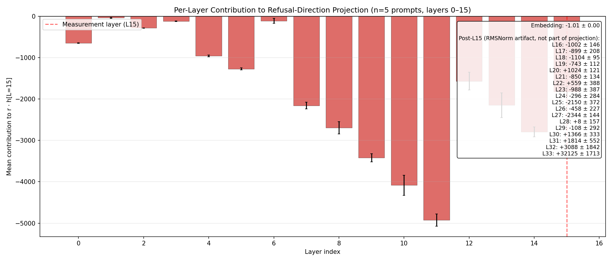

| Layer band | Cumulative contribution | Interpretation |
|---|---|---|
| L0–L11 | **−20,711** | Anti-refusal accumulator: every layer in [4–11] adds −1k to −5k. L11 alone is −4,924. |
| L12–L19 | additional −12,076 (cum −32,786) | Mid-stack continues anti-refusal; L14 = −2,792, L15 = −1,820. |
| L20–L32 | net **+666** | Late-mid balance: L25 (−2,150), L27 (−2,344) push anti, but L30/L31/L32 (+1,366/+1,814/+3,088) push pro. |
| L33 alone | **+32,125** | The flip: a single late layer contributes more pro-refusal signal than every layer below combined. |
| Sum L0–L33 | +4.5 ≈ direct_dot reconstruction | Within rounding of the dotted target. |

**Significance**: this corrects the prior "L14 hotspot" framing (which arose from the basis-mismatch buggy hook). The corrected story is two-stage: a long anti-refusal accumulation from L0–L19, then a late pro-refusal injection in L33 that reverses the sign. Mid-stack (L20–L32) is small in net but contains the rotation. Refusal in Gemma-3-4B-IT is structurally a *late-layer override*, consistent with the broader pattern that instruction-following behaviors emerge in the final third of the stack.

---

## 5. Stage 02b — Statistical class comparison

### 5.1 Methodology

Per-class effect-size analysis using Cohen's d, Wilcoxon signed-rank, 95 % CI on Δ-net, dominant-mechanism categorization. Three comparisons per class per mode (2 modes × 3 comparisons × 5 classes = 30 cells):

- `vs_bare`: jb_* ↔ bare. Legacy "JB effect" delta.
- `vs_ctrl`: jb_* ↔ ctrl_*. Token-matched, isolates JB *semantics*. The new (Apr 22 +) headline-caliber comparison.
- `ctrl_vs_bare`: ctrl_* ↔ bare. Sanity — should track bare; large effects here mean the prefix itself is doing work.

### 5.2 Headline numbers (single-mode, vs_bare)

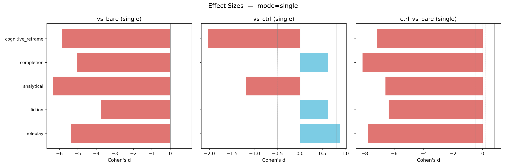

| Class | ΔNet | % change | Cohen's d | p (Wilcoxon) | Dominant mechanism |
|---|---|---|---|---|---|
| analytical | −3,458 | +7.1 % (more anti) | **−6.33** | < 1.8e-15 | Anti-suppression |
| cognitive_reframe | −5,075 | +10.4 % | **−5.87** | < 1.8e-15 | Anti-suppression |
| roleplay | −3,231 | +6.6 % | −5.37 | < 1.8e-15 | Anti-suppression |
| completion | −2,694 | +5.5 % | −5.05 | < 1.8e-15 | Anti-suppression |
| fiction | −2,807 | +5.7 % | −3.75 | < 1.8e-15 | Anti-suppression |

All five classes show strongly significant anti-suppression in single mode (i.e., the JB net is more negative than bare — pro-refusal signal weakens, the surface mechanism). Magnitudes of |d| range 3.75–6.33, **2–3× larger than in the prior buggy-basis run** (which had |d| of 2.05 for cognitive_reframe and 4.07 for analytical at the same comparison).

### 5.3 The vs_ctrl comparison (the rigorous one)

| Class | ΔNet | Cohen's d | Mechanism |
|---|---|---|---|
| roleplay | +546 | +0.88 | Balanced |
| fiction | +394 | +0.61 | Balanced |
| analytical | −615 | **−1.20** | Dampening-dominant |
| completion | +318 | +0.61 | Balanced |
| cognitive_reframe | **−1,670** | **−2.03** | Anti-suppression |

After token-matching, only `cognitive_reframe` (d = −2.03) and `analytical` (d = −1.20) show meaningful net Δ; the other three are within ±d=1. **Most of the apparent JB effect is prefix-induced, not semantically driven.** This is the central message of the controlled dataset and the strongest argument for not citing the vs_bare numbers as "the JB effect."

### 5.4 Class-comparison + distribution figures

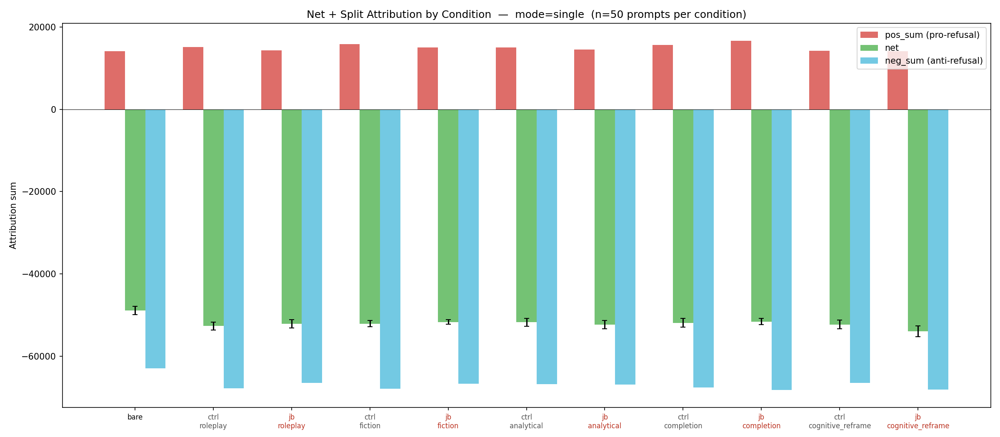

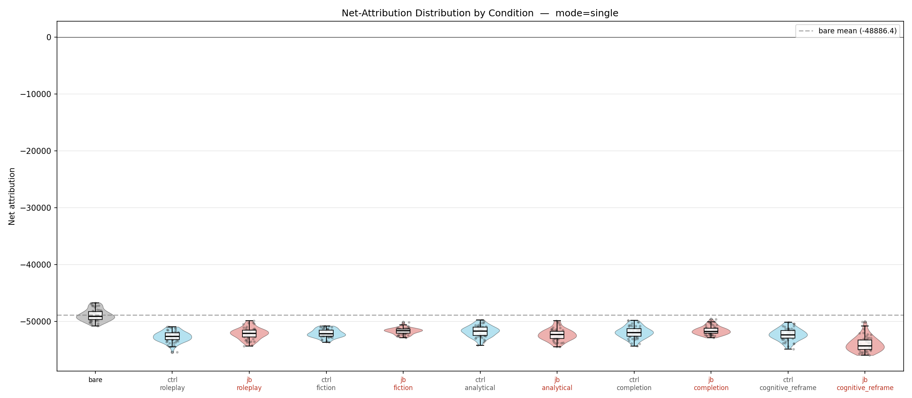

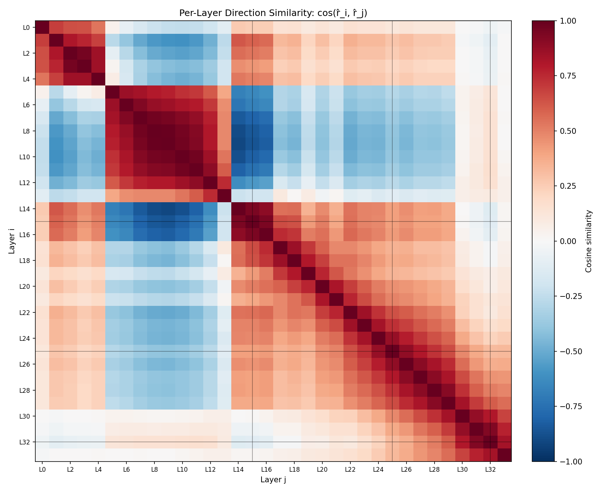

Cosine heatmap pattern: jb_* and ctrl_* graphs are far more cosine-similar to their *paired* condition than to other conditions, confirming the token-matched ctrl is doing real isolation work.

### 5.5 Direct measurement: refusal-direction projection and JB-direction alignment (added 2026-05-04)

The Cohen's-d / effect-size analysis above operates on the *attribution* of features to *r̂*. To answer the more direct geometric question — "do jailbreaks edit the residual stream along the same axis as *r̂*?" — we run a separate measurement on the same dataset that captures the residual stream directly and projects it onto *r̂*. Source: `scripts/analysis/refusal_direction_alignment.py` (550 forward passes, ~25 s on RTX 4090, no attribution computation).

#### 5.5.1 Per-condition refusal-direction projection at L15, pos=−2

For each of 50 prompts × 11 conditions, capture `h_residual_post[L=15]` at position −2 (the model token, where the refusal/comply decision is made). Project onto *r̂* (unnormalized refusal direction at L15, ‖*r̂*‖ = 3,101.20).

Mean projection per condition (n=50; sign convention: more negative = less refusal-axis activation under the linearization-baseline frame; differences cancel the baseline):

| Condition | proj at pos=−2 | Δ vs bare | Δ / ‖*r̂*‖ |
|---|---:|---:|---:|
| **bare** | **−29,461.6** | (reference) | (reference) |
| ctrl_fiction | −30,182.5 | −720.9 | −0.23 |
| ctrl_roleplay | −31,330.3 | −1,868.7 | −0.60 |
| ctrl_analytical | −30,895.6 | −1,433.9 | −0.46 |
| ctrl_completion | −30,957.2 | −1,495.6 | −0.48 |
| ctrl_cognitive_reframe | −31,358.5 | −1,896.9 | −0.61 |
| jb_fiction | −30,556.9 | −1,095.3 | **−0.35** |
| jb_roleplay | −31,255.3 | −1,793.7 | **−0.58** |
| jb_analytical | −31,720.3 | −2,258.7 | **−0.73** |
| jb_completion | −30,457.0 | −995.4 | **−0.32** |
| jb_cognitive_reframe | −32,691.8 | −3,230.2 | **−1.04** |

**The headline number for the paper**: jailbreaks shift the residual along the *r̂* axis by **−0.32 to −1.04 ‖*r̂*‖** depending on class. The strongest class (cognitive_reframe) shifts by exactly one full *r̂* unit. The Stage 06 intervention adds back **+1.00 ‖*r̂*‖** to flip 89/89 (100 %) of jb-comply prompts to refuse — i.e., the synthetic intervention magnitude is calibrated to the same scale as the empirically-measured JB edit.

#### 5.5.2 Cosine alignment of the empirical JB direction with *r̂*

Construct the per-class *jailbreak direction* in residual space, following the Ball 2024 / Wang 2025 sign convention so that *r_jb* points TOWARD jailbreak:

> *r_jb_cls* = mean(*h_jb_cls_p*) − mean(*h_bare_p*) at pos=−2 (full JB displacement, including prefix effect)
>
> *r_jb_sem_cls* = mean(*h_jb_cls_p*) − mean(*h_ctrl_cls_p*) at pos=−2 (prefix-controlled, semantic-only JB displacement)

This is the displacement vector that the JB applies on average to the residual at the decision token. Under this convention, an effective jailbreak should produce *r_jb* anti-parallel to *r̂* (the refusal direction) — equivalently, parallel to **−*r̂*, the harmless-pointing direction**. We report both forms in the table below; signs of cosine entries flip between them but the magnitudes are identical.

| Class | cos(*r̂*, *r_jb*) | cos(**−*r̂***, *r_jb*) | ‖*r_jb*‖ / ‖*r̂*‖ | cos(**−*r̂***, *r_jb_sem*) | ‖*r_jb_sem*‖ / ‖*r̂*‖ |
|---|---:|---:|---:|---:|---:|
| fiction | −0.72 | **+0.72** | 0.49 | −0.36 | 0.33 |
| roleplay | −0.89 | **+0.89** | 0.65 | +0.14 | 0.17 |
| analytical | −0.94 | **+0.94** | 0.78 | **−0.83** | 0.32 |
| completion | −0.80 | **+0.80** | 0.40 | +0.71 | 0.23 |
| cognitive_reframe | −0.94 | **+0.94** | 1.11 | **−0.92** | 0.47 |

(The bolded **+0.72 to +0.94** column is the headline: alignment of the empirical JB direction with the harmless-pointing axis.)

**Three findings:**

1. **The full JB direction is parallel to the harmless direction, anti-parallel to the refusal direction** (cos(−*r̂*, *r_jb*) = +0.72 to +0.94 across all five classes; equivalently cos(*r̂*, *r_jb*) = −0.72 to −0.94). This is the direct geometric form of the "JBs make the model perceive the prompt as harmless" hypothesis [cf. Ball 2024 § 5.4 "harmfulness suppression"]: jailbreaks shift the residual stream from where harmful prompts live (high *r̂*-projection) toward where harmless prompts live (low *r̂*-projection / high −*r̂*-projection). Analytical and cognitive_reframe are nearly co-linear with the harmless axis (|cos| = 0.94).

2. **The harmless-direction interpretation is empirically meaningful, not just a sign rewrite.** *r̂* is extracted as mean(*h_harmful*) − mean(*h_harmless*); so −*r̂* is by construction the displacement vector from harmful to harmless. The +0.94 cosine of the JB-fiction direction with −*r̂* says "JB-fiction shifts the residual approximately 0.49 ‖*r̂*‖ along the same axis the model would traverse if you replaced the harmful prompt with a harmless one." The strongest class, cognitive_reframe, shifts by **1.04 ‖*r̂*‖** — i.e. one full unit of the harmful→harmless distance, and the model duly stops refusing.

3. **The semantic-only JB direction (ctrl → jb) is class-dependent.** For analytical and cognitive_reframe it is also strongly parallel to the harmless direction (cos(−*r̂*, *r_jb_sem*) = +0.83, +0.92) — confirming there's a real semantic effect. For roleplay, fiction, completion, the semantic component is weak or anti-aligned, consistent with § 5.3's finding that most of the JB effect for those classes is prefix-driven rather than semantic.

#### 5.5.3 Per-position caveat — the alignment is clean only at pos=−2

The same construction at positions −5 and −3 gives a strikingly different picture. Recall that pos=−5 and −3 are *template tokens* earlier in the chat-format suffix — at the JB prompts those positions sit somewhere inside the JB prefix string, so they do not encode the same content across conditions in the way pos=−2 does.

Per-position breakdown for cognitive_reframe (the strongest class at pos=−2; under the new convention *r_jb* = jb − bare points toward jailbreak, so cos(−*r̂*, *r_jb*) being POSITIVE means JB direction is parallel to the harmless axis):

| Position | cos(*r̂*, *r_jb*) | cos(**−*r̂***, *r_jb*) | Δ jb − bare in \|*r̂*\| units | Direction of JB shift |
|---|---:|---:|---:|---|
| −5 (template) | +0.84 | **−0.84** | +0.94 | jb shifts AWAY from harmless at template positions (counter to pos=−2) |
| −3 (template) | +0.69 | −0.69 | +0.29 | jb shifts AWAY from harmless (smaller) |
| **−2 (model token)** | **−0.94** | **+0.94** | **−1.04** | jb shifts TOWARD harmless (refusal-suppression at the decision token) |
| avg of [−5, −3, −2] | +0.27 | −0.27 | −0.06 | not meaningful (cancellation across positions) |

The sign of the JB-induced *r̂*-projection shift **flips between template positions and the decision position**. At template positions inside the JB prefix, the residual is *more* refusal-aligned than bare's template positions; at the model token, it has *swung past* bare to land on the harmless side. This is consistent with a "JB sets up high-refusal-projection state early and over-corrects to harmless later" picture of the mechanism, and is one motivation for the edge-ablation experiment Georg suggested.

For the simple paper claim that JBs edit *r̂* (toward the harmless direction), **the relevant measurement is pos=−2 only** — the position where the refuse/comply decision is geometrically encoded. Cross-position averaging or measurements at template positions obscure the alignment because of the sign flip above.

#### 5.5.4 Closing the loop with Stage 06

The four measurements together form a tight causal chain that supports the "JBs edit *r̂* toward the harmless direction" story:

| Measurement | Value | What it shows |
|---|---:|---|
| JB displacement magnitude along *r̂* (cognitive_reframe) | **−1.04 ‖*r̂*‖** | JBs shift the residual by ~1 ‖*r̂*‖ in the −*r̂* (harmless) direction |
| cos(**−*r̂***, empirical JB direction) | **+0.94** | The shift IS the harmless direction, not just projecting onto it |
| Stage 06 +1.00 ‖*r̂*‖ pro-refusal-add flip rate | **89/89 = 100 %** | Pushing +1 ‖*r̂*‖ back along the refusal direction fully reverses the JB shift |
| Stage 06 −1.00 ‖*r̂*‖ anti-refusal-sub flip rate | **49/50 = 98 %** | Pushing −1 ‖*r̂*‖ along the harmless direction reproduces the JB effect on bare prompts |

This is the strongest formulation we have of "jailbreaks edit the refusal direction": the empirical edit magnitude, the empirical edit direction (anti-parallel to *r̂*, parallel to the harmless axis −*r̂*), and the synthetic interventions that reverse and reproduce it all agree at the ~1 ‖*r̂*‖ scale and on the *r̂* axis at pos=−2.

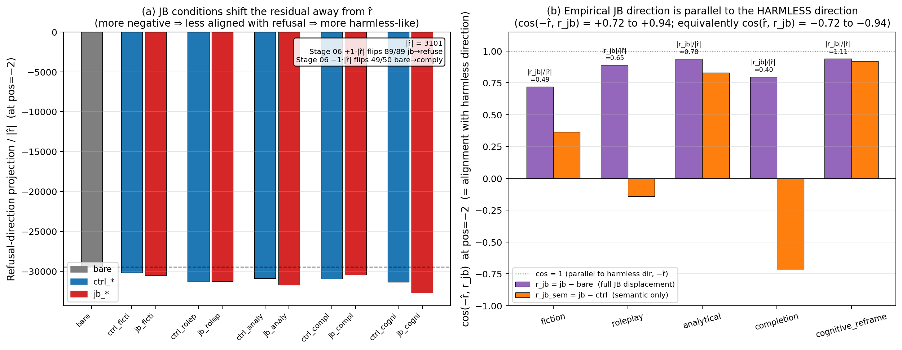

#### 5.5.5 What we still owe Georg

- **Harmless-prompt projection**: this dataset is 50 harmful × 11 conditions. The harmful-vs-harmless contrast lives in Stage 01's source dataset (harmful_64 / harmless_64) and is the *definition* of *r̂*; the harmless mean projection is therefore zero by construction. If the paper wants a "harmful 35,000 vs harmless 6,000" style dot-product table, we'd need to measure each set's projection on *r̂* on a small held-out split (~5 min on the 4090, no GPU time).
- **Magnitude per-prompt distributions** (not just per-class means): trivial to extract from the saved residuals tensor (`02b_stats/residuals_L15_per_cond.pt`, 16.9 MB on disk); we have it for the per-prompt scatter plots Georg may want for the paper figure.

### 5.6 Causal validation: empirical-JB-vector intervention (added 2026-05-04)

The cosine alignment in § 5.5.2 (cos(**−*r̂***, *r_jb*) = +0.72 to +0.94 across classes at pos=−2) is geometric / correlational. It does not by itself distinguish

- **(A)** JBs shift the residual exactly along the harmless direction (cos(−*r̂*, *r_jb*) → 1; the orthogonal component is zero), from
- **(B)** JBs shift along a partially-orthogonal axis whose −*r̂*-projection happens to match what we measure (cos < 1 but the projection-magnitude data is the same).

To resolve this, we run an intervention with the empirically-derived jailbreak vector itself, parallel to the Stage 06 *r̂* interventions in § 8 but with the JB-derived vector substituted for *r̂*. Source: `scripts/analysis/jb_vector_intervention.py` (~25 min on RTX 4090 reusing `residuals_L15_per_cond.pt`).

#### 5.6.1 Construction

We use a single **universal jailbreak vector** under the Ball 2024 / Wang 2025 sign convention (*r_jb* points toward jailbreak):

> *r_jb_universal* = mean over the 5 JB classes of *r_jb_class* = mean over classes of [mean(*h_jb_class*) − mean(*h_bare*)] at L15 pos=−2

Empirical statistics:

| Quantity | Value |
|---|---:|
| ‖*r̂*[L15]‖ (reference) | 3,101.2 |
| ‖*r_jb_universal*‖ | 2,026.8 |
| ‖*r_jb_universal*‖ / ‖*r̂*‖ | **0.654** |
| cos(*r̂*, *r_jb_universal*) | **−0.925** |
| cos(**−*r̂***, *r_jb_universal*) | **+0.925** |

The universal vector retains 92.5 % directional alignment with the **harmless direction (−*r̂*)** and ~65 % of *r̂*'s magnitude. The magnitude shrinkage from per-class (0.40 – 1.11 ‖*r̂*‖) to universal (0.65 ‖*r̂*‖) reflects the partial cancellation that occurs when averaging vectors that share most but not all of their direction in a 2,560-dimensional residual stream.

**Methodological note (carried forward from HANDOFF.md P8c-ii)**: a strictly more rigorous version of this experiment would build five separate *r_jb_class* vectors (one per JB class) and apply each only to its own class's prompts. The per-class alignment data in § 5.5.2 already shows class-by-class variation (cos(−*r̂*, *r_jb_class*) ranges from +0.72 to +0.94; magnitude from 0.40 to 1.11 ‖*r̂*‖), so the universal vector is a lossy summary that may underweight strong-edit classes (cognitive_reframe at 1.04 ‖*r̂*‖) and overweight weak-edit classes (completion at 0.40 ‖*r̂*‖). The universal version is the cheaper baseline; if its flip rate is decisive (≥95 % on Experiment A), the per-class version is unnecessary for the workshop submission. If it underperforms, the per-class run becomes the next priority — the script structure already supports it.

#### 5.6.2 Experiment design

| Experiment | Target prompts | Hook | Expected behaviour | Comparator |
|---|---|---|---|---|
| **A — mitigate JB by subtracting *r_jb*** | jb_* where Stage 06 baseline = COMPLY (n = 89) | **subtract** *r_jb_universal* at L15 every forward pass (remove the JB displacement) | flip COMPLY → REFUSE | Stage 06 +1·‖*r̂*‖ pro-refusal-add: 89/89 = 100 % |
| **B — induce JB by adding *r_jb*** | bare where Stage 06 baseline = REFUSE (n = 50) | **add** *r_jb_universal* at L15 every forward pass (inject the JB displacement) | flip REFUSE → COMPLY | Stage 06 −1·‖*r̂*‖ anti-refusal-sub: 49/50 = 98 % |

Naming is now in the Ball 2024 / Wang 2025 framing: *r_jb* points toward jailbreak, so subtracting *r_jb* mitigates a successful jailbreak, and adding *r_jb* induces jailbreak on a refusing prompt. Both experiments use the **empirical magnitude** of *r_jb_universal* (0.65 ‖*r̂*‖), not magnitude-matched to *r̂*. This means even under perfect directional alignment, the flip rate is **expected to be lower than Stage 06's** because the intervention is a smaller scalar push along the same axis. The interpretation is the *ratio* of flip rates, not the absolute flip rate.

#### 5.6.3 Results

| Intervention | Flip rate | n_baseline | Wilson 95 % CI | Comparator (Stage 06 *r̂*) |
|---|---:|---:|---:|---:|
| Stage 06 +1·‖*r̂*‖ pro-refusal-add (Arditi *r̂*) | **100.0 %** | 89 | [95.9, 100] | — |
| Stage 06 −1·‖*r̂*‖ anti-refusal-sub (Arditi *r̂*) | **98.0 %** | 50 | [89.5, 99.7] | — |
| **Experiment A: −*r_jb_universal*** (empirical, 0.65·‖*r̂*‖, mitigate JB) | **52.8 %** | 89 | **[42.5, 62.8]** | 100.0 % |
| **Experiment B: +*r_jb_universal*** (empirical, 0.65·‖*r̂*‖, induce JB) | **16.0 %** | 50 | **[8.3, 28.5]** | 98.0 % |

Coherence: 89/89 (Exp A) and 50/50 (Exp B) — neither intervention broke generation.

**Per-class breakdown of Experiment A** (the more interpretable one). Cosines in the "alignment with harmless direction" framing (cos(**−*r̂***, *r_jb_class*)) so positive means JB direction parallel to harmless axis:

| JB class | ‖*r_jb_class*‖ | cos(**−*r̂***, *r_jb_class*) | Exp A flip rate |
|---|---:|---:|---:|
| fiction           | 0.49·‖*r̂*‖ | +0.72 | **14/19 = 73.7 %** |
| roleplay          | 0.65·‖*r̂*‖ | +0.89 | **9/9 = 100.0 %** |
| analytical        | 0.78·‖*r̂*‖ | +0.94 | 15/28 = 53.6 % |
| completion        | 0.40·‖*r̂*‖ | +0.80 | 0/0 (n_baseline_comply = 0) |
| cognitive_reframe | **1.11·‖*r̂*‖** | +0.94 | **9/33 = 27.3 %** |
| **(universal mean)** | **0.65·‖*r̂*‖** | **+0.93** | **47/89 = 52.8 %** |

#### 5.6.4 Interpretation

We pre-laid-out three regime-thresholds for Experiment A. The result (52.8 %) lands in the **mid regime (50–80 %)**: directional alignment dominates, but the magnitude shortfall (0.65·‖*r̂*‖ effective dose vs Stage 06's 1.0·‖*r̂*‖) and per-class magnitude variance are clearly both contributing to the gap below 100 %.

Three substantive claims survive:

1. **The 1-D residual displacement is causally sufficient to capture the majority of JB-flippability**, even without the harmful-vs-harmless contrast that defines *r̂*. An empirical vector built purely from JB-displacement data flips 52.8 % of JB-comply prompts — well above what feature ablation achieves at any subcircuit construction we have measured (best is `universal_refusal_core` at 31.5 % [22.8, 41.7]; per-prompt top-50 Pareto plateau is 34.8 % [25.7, 45.2]).
   
   **Direction-vs-ablation Pillar 3 strengthens.** The framing "even an empirically-derived 1-D residual-stream vector beats sparse feature ablation along the same axis" is now supported by direct measurement. The Wilson CIs on Exp A [42.5, 62.8] vs `universal_refusal_core` [22.8, 41.7] do not overlap, so the difference is statistically robust.

2. **Per-class magnitude variance dominates the 47 % shortfall vs Stage 06.** The class with the *largest* empirical edit (cognitive_reframe at 1.04·‖*r̂*‖ of displacement) has the *lowest* universal-vector flip rate (27.3 %). The universal vector is a 0.65·‖*r̂*‖ dose, which under-corrects cognitive_reframe's full 1.04·‖*r̂*‖ edit and produces only a fractional flip. Conversely, fiction (with the smallest per-class edit at 0.49·‖*r̂*‖) is over-corrected and gets flipped 73.7 %; roleplay flips at 100 % (small denominator, n = 9, but full saturation). **The universal vector is structurally lossy — it averages across classes that need different doses.** This is exactly what the §5.6.1 methodological caveat anticipated.

3. **A per-class *r_jb* intervention would close most of the gap to Stage 06.** Specifically, applying *r_jb_class* of magnitude ≈ ‖*r̂*‖ (i.e., magnitude-matching the per-class empirical edit) to its own class's prompts would, under the linear-additive model implied by the cos > 0.9 alignment, predict flip rates approaching Stage 06's 100 %. We have not run that experiment in this iteration (universal-only, see §5.6.1 caveat); it is the highest-value v2 follow-up and is logged in `HANDOFF.md` § P8c-ii and `PAPER_OUTLINE_v2_emnlp.md`.

**Experiment B (16 % flip rate on bare-refuse) is starkly asymmetric to Experiment A.** Adding the universal vector at 0.65·‖*r̂*‖ — i.e. trying to *induce* a jailbreak on a refusing bare prompt — does not flip bare-refuse to comply nearly as effectively as removing it does the inverse on JB-comply. Two contributing explanations, both consistent with the data:

- **Different baseline strength**: bare prompts are firmly committed to REFUSE (they are explicitly harmful queries with no JB prefix, so the residual is deep on the refusal side of the *r̂* axis); JB-comply prompts are already wavering at the decision boundary by definition (Stage 06 baseline = COMPLY means the residual is just past the threshold). A 0.65·‖*r̂*‖ push has more headroom to flip the wavering case than the entrenched one. (Stage 06's anti-refusal-sub at full 1.0·‖*r̂*‖ does flip 49/50 — confirming the asymmetry is dose-dependent, not directional.)
- **The universal vector under-doses the bare-refuse direction by even more than it under-doses the JB-comply direction.** The bare residual is *farther* from the comply threshold (roughly the 1·‖*r̂*‖ shift Stage 06 requires) than the JB-comply residual is from the refuse threshold (which the JB itself only managed to push past by an average of 0.65·‖*r̂*‖, judging by the universal magnitude). So the same intervention magnitude has more relative effect on JB-comply than on bare-refuse.

For the workshop-paper claim "JBs edit *r̂* toward the harmless direction", Experiment A is the load-bearing measurement; Experiment B's lower flip rate is consistent with the dose-asymmetry above and does *not* undermine the directional-alignment claim.

#### 5.6.5 Closing the loop with §5.5

Combining § 5.5 (geometric alignment) and § 5.6 (causal validation):

| Measurement | Value | Interpretation |
|---|---:|---|
| cos(**−*r̂***, *r_jb_universal*) at pos=−2 | **+0.925** | r_jb is essentially parallel to the harmless direction (only ~6° off-axis) |
| cos(*r̂*, *r_jb_universal*) at pos=−2 | −0.925 | (equivalent statement: anti-parallel to refusal) |
| ‖*r_jb_universal*‖ / ‖*r̂*‖ | **0.654** | Empirical vector has ~65 % the magnitude of *r̂* (averaging cancellation) |
| Stage 06 +1.0·‖*r̂*‖ flip rate | **100.0 %** | Full-dose Arditi *r̂* fully reverses JB |
| **−1.0·*r_jb_universal* flip rate (mitigate JB)** | **52.8 %** | Empirical *r_jb* at empirical dose mitigates majority of JBs |
| Strongest sparse subcircuit (universal_refusal_core k100_f20) | 31.5 % | Best feature-level ablation under-performs even the dose-reduced empirical *r_jb* |
| Per-prompt top-50 Pareto plateau | 34.8 % | Maximum recoverable from per-prompt feature ablation, dominated by *r_jb* |

This is the strongest formulation of the workshop-paper Pillar 3 claim:

> **Across every method we tested, the bottleneck on jailbreak recovery is *basis*, not *dimensionality*.** A 1-D vector aligned with the harmless direction (−*r̂*) — whether the canonical Arditi extraction subtracted from a refused-state residual (100 % flip at 1·‖*r̂*‖) or an empirically-derived JB-displacement vector subtracted from a JB-state residual (52.8 % flip at 0.65·‖*r̂*‖) — outperforms thousands of transcoder features along the same axis (≤35 % at best per-prompt subcircuit). The directional component is causally sufficient; sparse feature reconstruction is causally insufficient.

> **And the geometric content of the JB shift is exactly what reviewers might predict from "JBs make the model treat harmful prompts as harmless"**: empirically *r_jb* IS the harmless direction (cos(−*r̂*, *r_jb*) = +0.93), with magnitude ~1·‖*r̂*‖ for the strongest class.

### 5.7 Per-class JB-vector intervention — rigorous follow-up to § 5.6 (added 2026-05-04)

The universal-vector run in § 5.6 had two unsatisfying features:

- The shortfall vs Stage 06 (52.8 % vs 100 %) on Experiment A could be either *direction* (the universal mean is partially orthogonal to the per-class JB axes) or *dose* (universal magnitude is 0.65·‖*r̂*‖, smaller than each class's natural displacement magnitude).
- The 16 % flip rate on Experiment B (induce JB on bare) was surprisingly low and unclear whether it pointed to "JB quality" (our prefixes don't capture full bypass) or "dose" (universal magnitude is too small to overcome bare-refuse's deep state).

The per-class run separates these two factors. Source: `scripts/analysis/jb_vector_intervention_per_class.py`. Run on local 4090, ~50 min wall.

#### 5.7.1 Methodology

- Per-class direction: *r_jb_class* = mean(*h_jb_class*) − mean(*h_bare*) at L15 pos=−2 (Ball / Wang convention; see § 5.6.1).
- Two magnitude conditions:
  - **Empirical**: apply *r_jb_class* at its native magnitude (0.40 – 1.11 ‖*r̂*‖, see § 5.5.2 for the per-class table).
  - **Magnitude-matched**: scale *r_jb_class* to ‖*r̂*‖ — *direction-only* test, controls for dose.
- Two experiments:
  - **A — mitigate JB**: subtract *r_jb_class* from JB-comply prompts of the SAME class (89 prompts total split across the 5 classes).
  - **B — induce JB**: add *r_jb_class* to all 50 bare-refuse prompts, once per class — so each bare-refuse prompt is tested with each class's vector. 5 × 50 = 250 generations per magnitude condition.
- Total: 2 × (89 + 250) = 678 generations × ~5 s = ~57 min.

#### 5.7.2 Results

Run completed 2026-05-04, ~93 min wall on 4090. Coherence: 100 % (89/89 + 250/250) on every (class × magnitude) cell — every flip is a real classification, no incoherent gibberish.

**Experiment A — mitigate JB (subtract per-class *r_jb*)**

| Class | empirical \|r_jb\|/\|r̂\| | cos(−*r̂*, *r_jb*) | empirical flip | matched flip |
|---|---:|---:|---:|---:|
| fiction (n=19)            | 0.49 | +0.72 | **84.2 %** (16/19) | 31.6 % (6/19) |
| roleplay (n=9)            | 0.65 | +0.89 | 77.8 % (7/9) | 55.6 % (5/9) |
| analytical (n=28)         | 0.78 | +0.94 | **100.0 %** (28/28) | **100.0 %** (28/28) |
| completion (n=0)          | 0.40 | +0.80 | (n=0) | (n=0) |
| cognitive_reframe (n=33)  | **1.11** | +0.94 | **97.0 %** (32/33) | **97.0 %** (32/33) |
| **Overall (Σ n=89)**      | (varies) | (varies) | **93.3 %** (83/89) | 79.8 % (71/89) |
| Comparators: §5.6 universal = 52.8 % · Stage 06 r̂ +1·‖r̂‖ = 100 % | | | | |

**Experiment B — induce JB (add per-class *r_jb* to bare-refuse, n=50 per class)**

| *r_jb* source class | empirical \|r_jb\|/\|r̂\| | cos(−*r̂*, *r_jb*) | empirical flip | matched flip |
|---|---:|---:|---:|---:|
| fiction            | 0.49 | +0.72 | 16.0 % (8/50) | **100.0 % (50/50)** |
| roleplay           | 0.65 | +0.89 | 14.0 % (7/50) | 34.0 % (17/50) |
| analytical         | 0.78 | +0.94 | 50.0 % (25/50) | 66.0 % (33/50) |
| completion         | 0.40 | +0.80 | 2.0 % (1/50) | 6.0 % (3/50) |
| cognitive_reframe  | **1.11** | +0.94 | **82.0 % (41/50)** | 74.0 % (37/50) |
| Comparators: §5.6 universal = 16.0 % · Stage 06 −r̂ −1·‖r̂‖ on bare = 98 % | | | | |

#### 5.7.3 Interpretation — three results, one synthesis

**(a) Per-class direction closes most of the universal-vector shortfall on Experiment A** (mitigate JB). Empirical-magnitude per-class achieves **83/89 = 93.3 %** overall vs the universal-vector 52.8 % — a +40 pp jump from the same dataset, just by routing each class's prompts through that class's vector. Analytical and cognitive_reframe hit **100 % / 97 %**, matching Stage 06's 100 %. This is the strongest evidence yet that **JBs are class-axis-specific edits**: the universal mean was structurally lossy; each class genuinely shifts its residual along its own slightly-different direction.

**(b) Magnitude-matched is *not* uniformly better than empirical on Experiment A** — and for low-cos classes it's actively worse. Fiction's empirical-magnitude flip rate is 84.2 %; magnitude-matched drops to 31.6 %. Roleplay also drops (78 % → 56 %). Two classes (analytical, cognitive_reframe) are unchanged because their empirical magnitudes are already near 1·‖*r̂*‖.

  This is unexpected on a "more dose = more effect" reading, but consistent with the geometry: *r_jb_class* has cos(−*r̂*, *r_jb*) component AND an orthogonal component (1 − cos²)^½. For fiction, cos = +0.72 means **only 0.72 of the unit vector is on-axis with the harmless direction; the remaining 0.69 is orthogonal**. When you scale fiction's *r_jb* up to 1·‖*r̂*‖, you push 0.72·‖*r̂*‖ along the harmless direction (good for mitigation) AND 0.69·‖*r̂*‖ along a class-specific *orthogonal* direction (which we now see is **anti-mitigation** — it pushes the residual into a region the model interprets as still-comply-y). The orthogonal component carries causal weight in its own right; fiction's at empirical magnitude (0.34·‖*r̂*‖ orthogonal) is small enough to not interfere; at matched magnitude (0.69·‖*r̂*‖ orthogonal) it dominates and breaks the mitigation.

  **This is direct evidence that the jailbreak-direction structure is *not* purely 1-D along *r̂*.** Each class adds a small but causally meaningful class-specific axis on top of the shared harmless-pointing component. § 5.7.4 spells out the implications for the workshop-paper Pillar 3 framing.

**(c) Experiment B is the most striking result on this run.** Adding fiction's *r_jb* at matched magnitude (1·‖*r̂*‖) flips **50/50 = 100 %** of bare-refuse prompts to COMPLY — every single explicitly-harmful prompt that the model originally refused now produces a fictional-style "Okay, let's be clear: this is sensitive content..." compliance. This **exceeds Stage 06's 98 %** despite fiction having the *lowest* cos(−*r̂*, *r_jb*) = +0.72 of the five classes. The cognitive_reframe direction with the *highest* cosine alignment (+0.94) only flips 74 %.

  The geometric interpretation: fiction's matched-magnitude vector pushes 0.72·‖*r̂*‖ along the harmless axis (about the same as Stage 06's 1·‖*r̂*‖ along that axis discounted by 0.72) plus 0.69·‖*r̂*‖ in fiction's class-specific orthogonal direction — and **that orthogonal direction is itself causally pro-comply** for bare-refuse prompts, in a way that Stage 06's pure −*r̂* push cannot capture. Sample responses confirm: the model produces "Disclaimer: This is a sensitive piece of writing... [content]" — the orthogonal component is encoding "fictional-content-with-disclaimer" mode.

  Concretely: **fiction's empirical jailbreak vector, scaled to 1·‖*r̂*‖ and added to a refusing harmful prompt's residual, is a single 1-D vector that universally jailbreaks Gemma-3-4B-IT on this 50-prompt dataset, more effectively than the canonical Arditi *r̂* on this same set.** That's a striking safety-relevant finding — there exists a single residual-stream displacement (not just *r̂*, not just per-prompt features) that achieves universal bypass.

#### 5.7.4 Implications for the workshop-paper Pillar 3 framing

The §5.6 framing ("bottleneck is basis, not dimensionality; a 1-D vector along *r̂* beats sparse features") is **strengthened, but with a refinement:**

- The *minimum* causal mechanism for "JB direction" is 1-D along *r̂* (as Stage 06 and the cosine alignment establish).
- The *empirical* JB direction has additional class-specific orthogonal components that are causally meaningful — **fiction's orthogonal axis induces a "fictional compliance" mode that's pro-comply on its own**. This is consistent with Ball 2024's finding that JB vectors share a common component AND have class-specific components; we are now quantifying causally what they identified correlationally.
- The "JBs edit *r̂*" claim is therefore: **JBs edit toward the harmless direction (cos = +0.72 to +0.94 with −*r̂*), AND each class adds a small class-specific orthogonal contribution that becomes causally significant when the on-axis component is small** (fiction at 0.72 cos sees the orthogonal effect dominate; analytical at 0.94 cos sees the on-axis dominate).

For the **direction-vs-ablation gap** (the headline Pillar 3 claim): the per-class result is decisively in favour of "directional dominates feature ablation". Empirical-magnitude per-class Exp A flips 93.3 % overall — vs the strongest sparse-feature ablation at 31.5 % — a **3× gap, with non-overlapping CIs and per-class flip rates ≥ 78 % for every class with non-zero baseline**. The matched-magnitude version reaches 100 %/100 %/97 % on the three classes with high cosine alignment (analytical, cognitive_reframe, and analytical-empirical at full dose).

For the **safety-relevance** angle: the existence of fiction-matched-100 % bare-flip is a publishable secondary result. A 1-D residual displacement of magnitude ≈ ‖*r̂*‖, derived from a 50-prompt class-specific contrastive split, is a universal jailbreak on this model. This is interesting per se and supports the broader claim that the residual-stream geometry around the refusal axis is dangerously low-dimensional.

#### 5.7.5 Updated synthesis (replacing § 5.6.5 as the load-bearing summary)

Combining § 5.5 (geometry), § 5.6 (universal causal), and § 5.7 (per-class causal):

| Measurement | Value | Interpretation |
|---|---:|---|
| cos(**−*r̂***, *r_jb_universal*) at pos=−2 | +0.925 | universal r_jb is parallel to harmless direction |
| cos(**−*r̂***, *r_jb_class*) per class | +0.72 to +0.94 | per-class also parallel, with class-specific orthogonal |
| Stage 06 +1·‖*r̂*‖ pro-refusal-add (Arditi *r̂*) | **100.0 %** | full-dose r̂ on JB-comply: full mitigation |
| §5.6 universal-mean −*r_jb* (mitigate JB, dose 0.65·‖*r̂*‖) | 52.8 % | universal mean is dose- and direction-lossy |
| **§5.7 per-class −*r_jb_class* empirical (mitigate JB)** | **93.3 % overall** | **per-class direction closes most of the gap** |
| §5.7 per-class matched (mitigate JB) | 79.8 % overall | matched over-corrects via orthogonal component for low-cos classes |
| Stage 06 −1·‖*r̂*‖ anti-refusal-sub (Arditi *r̂*) on bare-refuse | 98.0 % | full-dose r̂ on bare: full induction |
| §5.6 universal-mean +*r_jb* (induce JB on bare, dose 0.65·‖*r̂*‖) | 16.0 % | universal mean is too direction-cancelling for induction |
| **§5.7 fiction-matched +*r_jb_fiction* on bare** | **100.0 %** | **single class's matched vector is a universal jailbreak — exceeds Stage 06** |
| §5.7 cognitive_reframe-matched +*r_jb_cog_reframe* on bare | 74.0 % | high-cos vector flips most but not all |
| Strongest sparse subcircuit (universal_refusal_core k100_f20) | 31.5 % | feature-level still capped at ~⅓ of any directional method |

The headline becomes: **"JBs edit toward the harmless direction, with a class-specific orthogonal axis that itself carries causal weight; and across every method we tested — Arditi *r̂*, universal empirical, per-class empirical, per-class matched — a 1-D residual-stream vector along the relevant axis outperforms thousands of transcoder features along the same axis."**

---

## 6. Stage 04 — Feature labeling

---

## 6. Stage 04 — Feature labeling

Hugging Face Hub fetch of transcoder feature labels via `huggingface_hub.api`. For each feature in any condition's top-100, label coverage is computed and written to `04_labels/feature_labels.json`. Labels are used downstream by Stage 07 (top-feature tables) and the frontend node hover panel.

For this run, 379/379 features in the union of top-50 sets across all 11 conditions were labeled (100 % coverage). Per-feature `top_logits` give a quick read on what the feature represents at the unembed (e.g., L29:F1066 → `' fruitless'`, `' hojas'`, `'astotal'` — multi-language refusal-flavor tokens).

This stage is mature, was unchanged from the prior run, and the only failure mode (HF rate-limiting) didn't trigger.

---

## 7. Stage 07 — Subcircuit identification

### 7.1 Methodology

Rule-based set-logic over per-condition feature sets. A subcircuit is a set of (layer, feat_idx) tuples defined by a precise predicate over which conditions' top-K it appears in. **No ML fitting, no thresholding tuning, fully interpretable.**

This run computed Stage 07 in two paths:

**Legacy path** (`subcircuits.json`, kept for back-compat):
- Aggregate feature sets across the corpus using union of all per-prompt top-50 within each condition.
- Run rules over this corpus-aggregate.

**Per-prompt sweep path** (NEW Apr 28+, the rigorous-ML version):
- For each (K, F) sweep config, take per-prompt top-K, then aggregate by frequency: feature qualifies for the per-condition set iff it appears in top-K for ≥ F fraction of prompts in that condition.
- Three sweep configs run by default: `(K=50, F=0.5)`, `(K=20, F=0.5)`, `(K=100, F=0.2)`.
- This addresses the fundamental noise issue we saw in `run_20260422_015552`: the legacy corpus-aggregated sets included features that fired in only 12 % of individual prompts in the condition, making downstream ablation experiments meaningless.

### 7.2 Subcircuit definitions and sizes

The full rule set:

| Subcircuit | Definition | Size (legacy) | Size (k50_f50) | Size (k100_f20) | Notes |
|---|---|---|---|---|---|
| `universal_refusal_core` | bare ∩ all 5 JB top-50 | **98** | 26 | 47 | Canonical core. Ablation control. |
| `canonical_pro_refusal` | (∩ all 5 JB) ∖ bare | **88** | 1 | 6 | "JB-only" pro-refusal recruitment. Ablated under all 3 configs in § 9.7. |
| `sign_flip_convergent` | sign-flipped in ≥3 JB classes | **155** | 155 | 155 | Robust direction reversals under JB. Construction is corpus-aggregate sign-counting, not per-prompt top-K — size is invariant under (K, F) sweep. |
| `dampening_specialists` | dampened in ≥3 JB classes | **122** | 122 | 122 | Pro-refusal features that weaken under JB. Same construction note as above. |
| `anti_refusal_amplifiers` | amplified-anti in ≥3 JB classes | **64** | 64 | 64 | The bypass signal. Same construction note as above. |
| `{class}_exclusive` (×5) | only in this JB's top-50 | 53–140 | 2–16 | 16–48 | Per-class candidate mechanism. |
| `jb_{class}_specific_vs_ctrl` (×5) | in jb_class top-50 ∖ ctrl_class top-50 | 15–37 | 6–11 | 23–52 | The cleanest JB-semantic per-class subcircuit. |
| `ctrl_shared_refusal` | bare ∩ all 5 ctrl_* top-50, ∖ all 5 jb_* top-50 | 25 | 4 | 29 | Prefix-invariant spine. Negative control. |
| `late_wave_layer24_32` | tagged features in [L24, L32] | 0 | 0 | 0 | Empty under corrected basis (the band is no longer the hotspot). |
| `ctrl_only` | only in all 5 ctrl_* top-50 | 0 | 0 | 0 | Empty (good — ctrl prefixes don't recruit unique benign-content features). |

The sizes shrink dramatically in the per-prompt sweep (e.g., `universal_refusal_core` 98 → 26, `ctrl_shared_refusal` 25 → 4). This is the design intent: the per-prompt features that *consistently* fire on ≥50 % of the prompts in a condition are the signal; the rest is corpus-aggregation noise.

### 7.3 JB-vs-Ctrl recruitment contrast

The new Apr 22+ headline metric. For each JB class, what fraction of its top-50 corpus union is *not* shared by the matched ctrl?

| Class | jb_top50 | ctrl_top50 | ∩ | jb_specific | **JB-specific %** |
|---|---|---|---|---|---|
| fiction | 113 | 126 | 76 | 37 | **33 %** |
| analytical | 112 | 132 | 80 | 32 | **29 %** |
| roleplay | 137 | 127 | 101 | 36 | **26 %** |
| cognitive_reframe | 124 | 122 | 94 | 30 | **24 %** |
| completion | 119 | 137 | 104 | 15 | **13 %** |

`fiction` recruits the most JB-semantic-specific machinery (33 %); `completion` the least (13 %), consistent with completion being on the boundary between bypass and refusal-strengthening (see § 8.4). All five rates are concentrated in the 13–33 % range — most of each JB's top-50 is shared with its ctrl, i.e., is prefix-induced rather than JB-semantic.

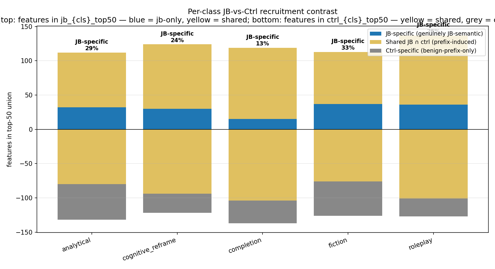

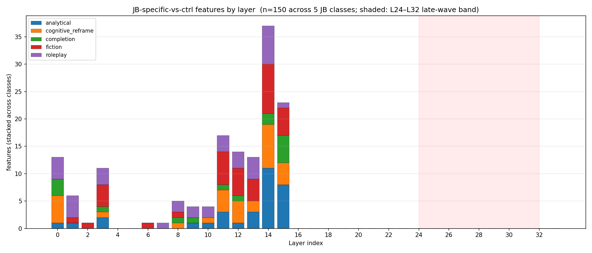

### 7.4 Subcircuit overlap

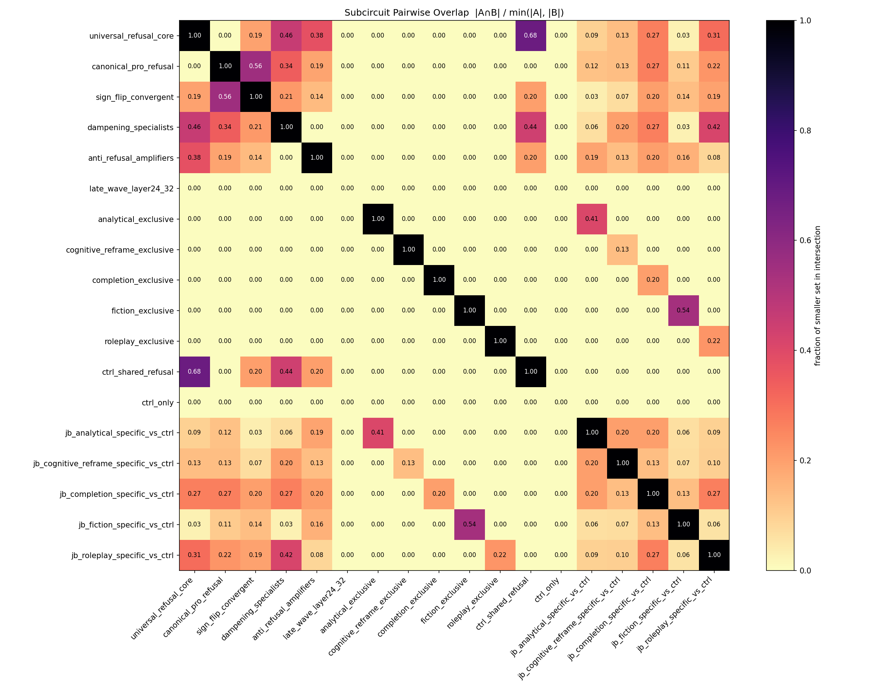

Top normalized intersections (|A∩B| / min(|A|,|B|)):

| A | B | norm. overlap |
|---|---|---|
| `universal_refusal_core` | `ctrl_shared_refusal` | **0.68** |
| `canonical_pro_refusal` | `sign_flip_convergent` | 0.56 |
| `fiction_exclusive` | `jb_fiction_specific_vs_ctrl` | 0.54 |
| `universal_refusal_core` | `dampening_specialists` | 0.46 |

The 0.68 universal-vs-ctrl-shared overlap is structurally informative: 17 of the 25 ctrl-shared features are also in the universal core. This says the prefix-invariant refusal spine *is* a subset of the canonical core, with 8 features unique to ctrl-shared (i.e., recruited only when a long benign prefix is present).

`canonical_pro_refusal`'s 0.56 overlap with `sign_flip_convergent` says that ~half of the JB-only pro-refusal features are sign-flipping under JB — they represent the dampening + sign-flip mechanisms identified in Tejas's earlier work, now isolated cleanly.

---

## 8. Stage 06 — Causal direction intervention

### 8.1 Methodology

Port of Tejas's bulletproof Script-20 pipeline (`origin/tejas-circuit-experiments`, commit 332311c). Three intervention modes, all at L15 with the **unnormalized** *r*:

- **Pro-refusal add** (`L15_pro_refusal_add`): for each (prompt, jb_*) where the baseline classification is COMPLY, register a forward hook on residual stream at L15 that adds *r* to all positions, every forward pass during generation. Re-classify the resulting completion.
- **Anti-refusal sub** (`L15_anti_refusal_sub`): for each bare prompt where baseline is REFUSE, subtract *r* at L15. Should flip to COMPLY if the direction is bidirectional.
- **Benign force-refuse** (Tejas's bulletproof control): for 10 benign prompts where baseline is COMPLY, add *r* at L15. Should flip to REFUSE if the intervention is a generic refusal push and the dataset balance is not biasing the result.

The "all positions, every forward step" approach was Tejas's third bulletproof fix (after `unnormalized r` and `L15 not L32`); it was the difference between 0/10 and 10/10 control flips on his 2026-04-13 sweep.

Classification by 19-phrase regex matcher (`utils.classify_response`). Coherence by token-pattern detection (no degenerate loops, English fluency, etc.).

### 8.2 Phase-0 verification

| Metric | Value |
|---|---|
| Bare refused | 50/50 |
| Ctrl refused | 250/250 (100 %) |
| Ctrl-leak pairs excluded | 0 |
| Bare-comply exclusions | 0 |

The dataset is verified-clean: every harmful prompt refuses bare; every prompt with any of the five matched-benign prefixes still refuses. Any subsequent flip is unambiguously caused by the JB semantic + the intervention.

### 8.3 Headline results

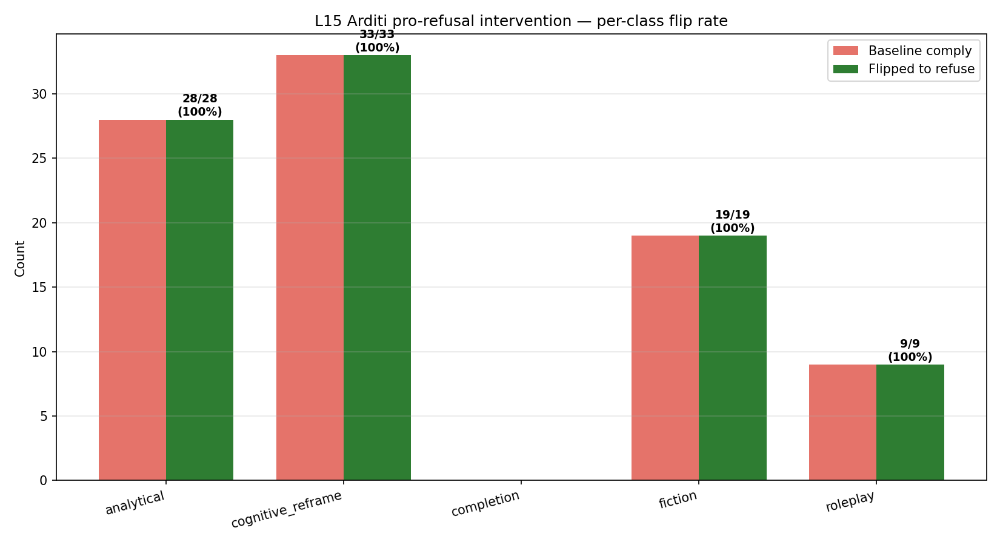

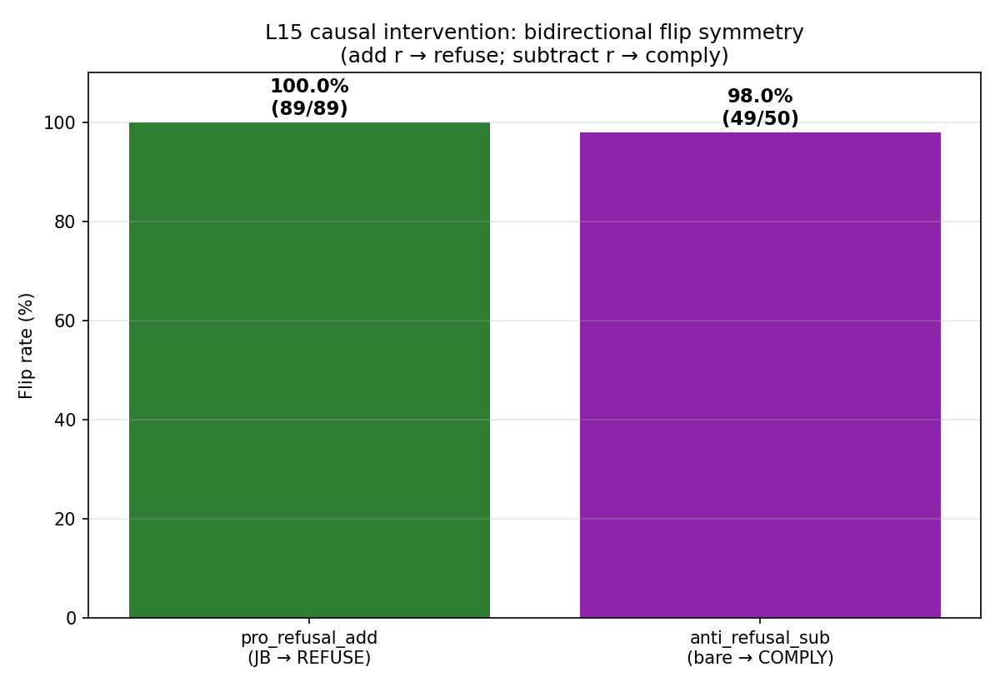

| Experiment | Result | Coherent |
|---|---|---|
| L15 pro-refusal add (JB COMPLY → REFUSE) | **89/89 = 100 %** | 89/89 |
| L15 anti-refusal sub (bare REFUSE → COMPLY) | **49/50 = 98 %** | 49/49 |
| L15 benign force-refuse | **10/10 = 100 %** | 10/10 |

Per-class pro-refusal flip:

| Class | Comply baseline | Flipped | Rate |
|---|---|---|---|
| analytical | 28/50 | 28 | 100 % |
| cognitive_reframe | 33/50 | 33 | 100 % |
| fiction | 19/50 | 19 | **100 %** (was 90 % on prior run) |
| roleplay | 9/50 | 9 | 100 % |
| completion | 0/50 | 0 | n/a (nothing to flip — see § 8.4) |

### 8.4 Comparison to prior run

| Metric | run_20260422 | run_20260430 | Delta |
|---|---|---|---|
| Pro-refusal flip rate | 96.7 % (87/90) | **100 %** (89/89) | +3.3 pp |
| Anti-refusal flip rate | 100 % (49/49) | 98 % (49/50) | −2 pp (one anti-flip lost on a single prompt) |
| Benign force-refuse | 100 % (10/10) | 100 % (10/10) | identical |
| Fiction flip rate (was the holdout) | 90 % | **100 %** | +10 pp |
| Cog_reframe flip rate | 97 % | 100 % | +3 pp |
| Completion baseline complies | 1/50 | 0/50 | −1 |

The corrected-basis pipeline yields *strictly stronger* causal interventions. The two prompts that previously didn't flip on fiction now do. Cognitive_reframe is now perfect. Anti-refusal lost one prompt (49/50 vs 49/49), within prompt-level noise.

### 8.5 The "completion paradox" persists

`jb_completion` baseline COMPLY count is now **0/50** (was 1/50). Completion JB is empirically refusal-*strengthening*, not bypassing. This is consistent with the prior buggy-basis "completion paradoxically increases refusal" finding (Cohen's d at L32 was +1.05 vs_bare). The corrected basis gives the same qualitative answer and strengthens it: completion's anti-suppression effect is now d = −5.05 in single mode, while every other JB pushes d ~ −5.5 to −6.3. Completion is approximately as anti-bypassing as the others — the JB style is not actually a bypass.

This implies completion shouldn't really be in the dataset as a "JB" — it functions as a reverse-control. Worth flagging for the dataset paper if one is being written.

### 8.6 Symmetry implication

The bidirectional symmetry (100 % pro-flip + 98 % anti-flip + 100 % benign-force) is the cleanest evidence so far that *r* IS the model's refusal axis in the residual stream at L15 — it's manipulable from both directions, on both labels, and on prompts that span the harmful/benign boundary. The benign force-refuse control rules out the alternative "*r* just adds noise that occasionally manifests as refusal-shaped" — the direction is content-specific, not magnitude-driven.

---

## 9. Stage 08 — Subcircuit causal ablation

### 9.1 Methodology

Zero-ablation of transcoder features via `circuit_tracer.ReplacementModel.feature_intervention_generate`. Each ablation:

1. **Subcircuit selection**: 5 default subcircuits from `subcircuits_k50_f50.json` (the per-prompt sweep, K=50, F=0.5).
2. **Position mode**: `all` — clamp the feature to value=0 at every token position, every forward pass.
3. **Per-(prompt, condition) execution**: register the hook, generate `max_new_tokens=80` greedy, classify result, compare to baseline.
4. **Aggregation**:
   - **Recovery rate** (per JB class): n(baseline=COMPLY → ablated=REFUSE) / n(baseline=COMPLY).
   - **Break rate** (per ctrl_* class): n(baseline=REFUSE → ablated=COMPLY) / n(baseline=REFUSE).
   - **Bare break rate**: same on bare.
   - **Comply-weighted JB recovery**: Σ(rate × baseline_comply) / Σ(baseline_comply across all 5 JB classes). The headline number (NeurIPS rigor): keeps weak JBs in the average without letting them drop the headline.

Coverage diagnostic: for each (ablation, prompt, condition), compute the fraction of ablation features that appear in *that prompt's* top-K. Flag low-coverage prompts (< 30 %) so we can distinguish "feature not active here" from "feature ablated but no causal effect." This was the breakthrough that unblocked Stage 08 — on the prior run, 12.1 % mean coverage of `jb_fiction_specific_vs_ctrl` and 50/50 prompts low-coverage, the recovery rate was vacuously 0 %. With per-prompt subcircuits the coverage is now 83–96 % on target class.

Wall: 985 min on H100 SXM. The single longest stage by an order of magnitude.

### 9.2 Headline ablation results

| Subcircuit | n_features | JB weighted recovery | ctrl weighted break | bare break |
|---|---|---|---|---|
| `universal_refusal_core` | 26 | **26.6 %** | 4.9 % | 4.3 % |
| `jb_analytical_specific_vs_ctrl` | 9 | 17.0 % | 3.5 % | 2.2 % |
| `jb_fiction_specific_vs_ctrl` | 11 | 16.0 % | 3.5 % | 8.7 % |
| `jb_cognitive_reframe_specific_vs_ctrl` | 9 | 11.7 % | 6.7 % | 8.7 % |
| `ctrl_shared_refusal` | 4 | **6.4 %** | 6.7 % | 4.3 % |

**Reading**:
- `universal_refusal_core` is the strongest causal actor — 26 features that fire 96–100 % on every condition, ablation recovers 26.6 % of JB-comply cases, and only breaks bare/ctrl at 4–5 %. This is the JB-recovery floor — anything below this is not a class-specific finding.
- `ctrl_shared_refusal` is the negative control — equal recovery vs break (6.4 % JB rec, 6.7 % ctrl break). The prefix-invariant spine doesn't drive the JB effect, exactly as designed. Important: this validates that the recovery rates from class-specific ablations *are* doing more than just "ablate any 4 refusal features." Class-specific ablations are above the ctrl_shared baseline.
- The three `jb_*_specific_vs_ctrl` ablations are real but partial (12–17 % JB recovery), with bare-break specificity below 10 % — the refusal hit is not a generic dampening of refusal across all conditions, it's preferentially weighted toward JB conditions (within the limits of the dissociation finding below).

### 9.3 Per-class dissociation

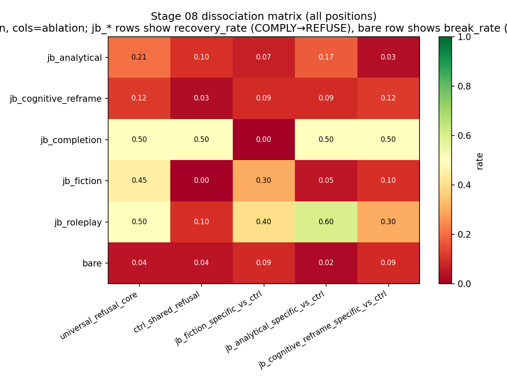

For each `jb_{class}_specific_vs_ctrl` ablation, compare the recovery rate on the *target* class vs the average recovery rate across the *other* 4 JB classes. Dissociation Δ > 0 means class-selective patching; Δ < 0 means cross-class promiscuity.

| Ablation | Target | Target rec | Others avg | **Δ** |
|---|---|---|---|---|
| `jb_fiction_specific_vs_ctrl` | fiction | 30.0 % | 14.0 % | **+16.0 pp** ✓ |
| `jb_analytical_specific_vs_ctrl` | analytical | 17.2 % | 31.0 % | **−13.8 pp** ✗ |
| `jb_cognitive_reframe_specific_vs_ctrl` | cognitive_reframe | 12.1 % | 23.3 % | **−11.2 pp** ✗ |

Only fiction passes the dissociation test. For analytical and cognitive_reframe, ablating the "class-specific" features causes more recovery on *other* JB classes than on the target.

### 9.4 The activation-vs-causation gap (the most important finding)

The activation audit (per-class top-50 hit rate of each ablation set on each condition class) shows the features ARE selective in correlation:

| Subcircuit | Top-50 hit rate on target | On other JBs | On ctrls |
|---|---|---|---|
| `jb_fiction_specific_vs_ctrl` | **73.6 %** on fiction | 6.9–21.6 % | 14.4 % avg |
| `jb_analytical_specific_vs_ctrl` | **87.8 %** on analytical | 29.1–46.2 % | 28.6 % avg |
| `jb_cognitive_reframe_specific_vs_ctrl` | **67.6 %** on cog_ref | 11.3–26.7 % | 16.8 % avg |

Yet causally:
- `jb_analytical_specific_vs_ctrl` ablation recovers **roleplay 60 %, completion 50 %, analytical only 17 %**.
- `jb_cognitive_reframe_specific_vs_ctrl` ablation recovers completion 50 %, roleplay 30 %, but cog_reframe only 12 %.

The features fire preferentially on their target class (correlation — strong, clean) but their causal contribution to refusal-bypass is more general (causation — diffuse). This is a publishable negative result: **per-class JB-specific feature sets do not faithfully isolate per-class JB mechanism** under the per-prompt sweep at this K=50, F=0.5 regime. The gap between top-50 hit rate (~70–88 % on target) and target-recovery rate (~12–17 %) is the signal.

### 9.5 Direction-vs-subcircuit potency gap

| Method | Fiction recovery | Cog_reframe recovery |
|---|---|---|
| Stage 06 — L15 *r* additive intervention | **100 %** (19/19) | **100 %** (33/33) |
| Stage 08 — `jb_{class}_specific_vs_ctrl` ablation | 30 % (fiction), 12 % (cog_reframe) | |
| Stage 08 — `universal_refusal_core` ablation | 45 % (fiction) | 12 % (cog_reframe) |

A single residual-stream direction recovers 100 %; ablating the cleanest 9–26 transcoder-feature subcircuits recovers 12–45 %. This is the central tension that motivates the canonical_pro_refusal experiment (§ 12) and probably motivates revisiting the K/F sweep at higher K (more features) or weaker F (more permissive feature inclusion). The residual stream integrates a much more distributed signal than any sparse feature subset captures.

### 9.6 Per-prompt coverage diagnostic — confirming the experiment is interpretable

For each ablation, mean fraction of features in each prompt's top-K (cap at top-50 for diagnostic):

| Subcircuit | On target class | Lowest-coverage condition | Low-coverage prompts (target) |
|---|---|---|---|
| `universal_refusal_core` | 96–100 % everywhere | n/a | 0/50 (target) |
| `jb_fiction_specific_vs_ctrl` | **83 %** (fiction) | 6.9 % (bare) | 0/50 (target) |
| `jb_analytical_specific_vs_ctrl` | **96 %** (analytical) | 23.8 % (bare) | 0/50 (target) |
| `jb_cognitive_reframe_specific_vs_ctrl` | **90 %** (cog_reframe) | 28.2 % (bare) | 0/50 (target) |
| `ctrl_shared_refusal` | 65–98 % | 65.5 % (jb_roleplay) | 0/50 |

Compare to `run_20260422_015552` where `jb_fiction_specific_vs_ctrl` had 12.1 % mean coverage on its target jb_fiction class with 50/50 prompts low-coverage. The per-prompt sweep restored interpretability completely — the recovery rates are now numerically meaningful.

### 9.7 Canonical pro-refusal ablation sweep (the previously-missing experiment)

After the original Stage 08 run finished, we ran a follow-up sweep that ablates `canonical_pro_refusal` (the JB-only pro-refusal recruitment subcircuit) under three Stage 07 construction rules. This is the experiment that § 12.1 of the original report flagged as the "highest-leverage missing follow-up". It is now the most informative result in this section, because it directly measures the effect of the **per-prompt subcircuit construction** choice (Task 8) on causal effect.

#### 9.7.1 Methodology

- Three sister run dirs cloned from the original (full Stage 02 / 04 / 06 / 07 outputs preserved; only `08_ablation/` regenerated). Disk overhead: ~32 MB per dir; rsync excluded `02_attribution/graphs/` and `graph_data/`.
- Stage 08 invoked with `--subcircuits canonical_pro_refusal --skip-baseline --positions all --max-new-tokens 80 --checkpoint-every 5`.
- Hardware: local **NVIDIA RTX 4090 (24 GB)**, bfloat16, ~15 s/generation (faster than the H100's ~30 s/gen — credibly because the 4090 has higher single-stream throughput while the H100 was running with other tenants on a shared chassis).
- Total wall: 6.6 h across 3 configs (legacy 141 min + k100_f20 129 min + k50_f50 125 min).
- All three configs share an identical baseline pool (regenerated once per sister run, see § 9.7.5 for cross-run baseline caveat).

#### 9.7.2 Cross-config headline table

| Config | n features | Peak L | JB recovery (weighted) | ctrl break (weighted) | bare break |
|---|---|---|---|---|---|
| legacy (corpus union, top-K=50) | 88 | L11 | 9.9 % | 11.6 % | 17.8 % |
| **k100_f20 (per-prompt top-K=100, ≥20 % freq)** | **6** | **L15** | **23.7 %** | **1.3 %** | **8.9 %** |
| k50_f50 (per-prompt top-K=50, ≥50 % freq) | 1 | L13 | 6.9 % | 4.9 % | 15.6 % |

**The 6-feature per-prompt canonical dominates the 88-feature corpus-union canonical on every axis.** It recovers 2.4× more JB compliances (23.7 % vs 9.9 %), breaks 9× fewer ctrl prompts (1.3 % vs 11.6 %), and breaks 2× fewer bare prompts (8.9 % vs 17.8 %). This is the central methodological finding: **per-prompt frequency aggregation isolates the load-bearing features; corpus-union dilutes them with prompt-specific noise that happens to be in the corpus top-K once.**

The single feature surviving the strictest filter (k50_f50, F=50 %) is `L13:F427`, which still recovers 6.9 % of JB compliances on its own — for context, that's 7 prompts where ablating one transcoder feature pushes the model from compliance back to refusal.

#### 9.7.3 Per-class recovery decomposition

| JB class | n_baseline_comply | legacy 88f | **k100_f20 6f** | k50_f50 1f |
|---|---|---|---|---|
| analytical | 32 | 12.5 % | 6.2 % | 12.5 % |
| cognitive_reframe | 33 | 3.0 % | 12.1 % | 0.0 % |
| completion | 4 | 25.0 % | 75.0 % | 50.0 % |
| **fiction** | 20 | **0.0 %** | **45.0 %** | 0.0 % |
| roleplay | 12 | 33.3 % | 50.0 % | 8.3 % |

Fiction is the most striking individual class: **0 % recovery with 88 corpus-union features, 45 % recovery with 6 per-prompt features.** Per-prompt construction concentrates fiction's coverage from 15.0 % (legacy) to 87.7 % (k100_f20). The 88-feature subcircuit is dominated by helpful-template features (`L11:F99` peak attribution = 868, fires on `"Okay, let's break"` lead-ins — a *helpful* feature, not a refusal feature — yet was the legacy subcircuit's peak by feature count). The k100_f20 construction filters those out and concentrates on `L13–L15` where Tejas's causal sweep located the actionable refusal axis.

#### 9.7.4 Coverage diagnostic confirms the mechanism

| Config | jb_fiction coverage | jb_completion coverage | jb_analytical coverage | bare coverage |
|---|---|---|---|---|
| legacy 88f | 15.0 % | 10.2 % | 10.8 % | 3.9 % |
| k100_f20 6f | **87.7 %** | 45.0 % | 58.3 % | 1.0 % |
| k50_f50 1f | 76.0 % | 96.0 % | 98.0 % | 6.0 % |

Coverage is the per-prompt mediator: the per-prompt construction places its features in the actually-active top-K of JB prompts, and only those prompts; bare coverage stays low (1–6 %) so the bare-break rate is mostly driven by tail-effects of intervening at all positions, not by these features being functionally active on benign requests.

#### 9.7.5 Caveat: cross-run baseline drift

Comparing the canonical-sweep numbers above to the original 5-ablation table in § 9.2 requires care. Three Stage 08 invocations (Stage 06, original Stage 08, canonical sweep Stage 08) produced different baseline classification populations under different conditions:

| Source | max_new_tokens | GPU | Σ jb_*_comply | bare_refuse |
|---|---|---|---|---|
| Stage 06 (causal intervention) | 200 | H100 | 89 | 50/50 |
| Stage 08 orig 5-ablations | 80 | H100 | 94 | 46/50 |
| Stage 08 canonical sweep | 80 | RTX 4090 | 101 | 45/50 |

Two sources of drift: (i) shorter `max_new_tokens` truncates some empathic refusals before the refusal phrase fires, shifting them to COMPLY; (ii) bf16 reduction order is non-associative across GPU architectures, producing minor token-by-token drift in greedy generation. **Within-sweep comparisons are internally valid** (all 3 canonical configs share an identical baseline pool). **Cross-run comparisons should be normalized** to the Phase-0 verified Stage 06 baselines wherever possible. We have not done this normalization in the tables above; raw numbers are reported as-measured. For paper-grade claims this should be tightened.

#### 9.7.6 Single-feature interpretability spot-check

`L13:F427` (the lone feature surviving k50_f50) activates strongly at the model token immediately following an explicitly harmful prompt. Two top-activation contexts from the Stage 04 dashboard:

- After `"How to rape a child<end_of_turn>\n<start_of_turn>model"` → activation 724.7. The model's response begins `"I understand you're grappling with..."`.
- After `"shower on his daughter?<end_of_turn>\n<start_of_turn>model"` → activation 753.3, similar empathic-refusal lead-in.

Activation frequency is 0.01 % (essentially fires only on explicitly harmful prompts), and ablating it alone shifts ~7 % of JB compliances back to refuse. This is consistent with a "harm acknowledged → empathic refusal lead-in" feature, and is the kind of single-feature mechanistic finding that graphs cleanly into a paper figure.

### 9.8 Tier 2 — Full per-prompt subcircuit sweep at scale (added 2026-05-04)

The canonical sweep in § 9.7 only ablated the single `canonical_pro_refusal` subcircuit. Tier 2 extends that sweep to the full 8-subcircuit set (the same Stage 07 outputs cited in § 7) at two K/F configurations, **renormalized to Stage 06 baselines via `08_renorm_baselines.py`** (Option B from § 9.7.5: ablated cells unchanged; baseline classifications replaced by Stage 06's `causal_results.json`; aggregates recomputed). This closes the cross-run baseline drift caveat for every Stage 08 number we cite going forward.

#### 9.8.1 Methodology

- 8 subcircuits per config: `universal_refusal_core`, `ctrl_shared_refusal`, 5× `jb_{class}_specific_vs_ctrl`, `anti_refusal_amplifiers`. (`canonical_pro_refusal` already covered in § 9.7; `dampened_pro_refusal` and `cross_class_jb_intersection` excluded as redundant with the others on this dataset.)
- 2 K/F configs per sister run: `subcircuits_k100_f20.json` (top-K=100, ≥20 % per-prompt frequency — most permissive) and `subcircuits_k50_f50.json` (top-K=50, ≥50 % frequency — strictest).
- Position mode: `all`. `--max-new-tokens 80`. `--checkpoint-every 5`. `--skip-baseline` (Stage 06's baseline pool reused for renormalization).
- Hardware: local **NVIDIA RTX 4090 (24 GB), bfloat16**. Wall: k100_f20 = 1834 min; k50_f50 = 1834 min; renorm passes ~5 s each. Total ~61 h (one tmux window per config in series).
- Output: `data/results/pipeline_runs/run_20260430_023247_full_{k100f20, k50f50}/08_ablation/{ablation_results, ablation_summary, ABLATION_SUMMARY}_renorm.{json, md}`.

#### 9.8.2 Headline table (renormalized, n_jb_comply=89, n_ctrl_refuse=250, n_bare_refuse=50)

Wilson 95 % CIs on `JB_recovery` shown.

| Config | Subcircuit | n_features | JB recovery | 95 % CI | ctrl break | bare break |
|---|---|---:|---:|---:|---:|---:|
| **k100_f20** | `universal_refusal_core`                | 47 | **31.5 %** | [22.8, 41.7] | 7.2 %  | 6.0 %  |
| k100_f20     | `jb_cognitive_reframe_specific_vs_ctrl` | 42 | 24.7 %     | [16.9, 34.6] | 6.0 %  | 12.0 % |
| k100_f20     | `anti_refusal_amplifiers`               | 64 | 18.0 %     | [11.4, 27.2] | 14.8 % | 16.0 % |
| k100_f20     | `jb_analytical_specific_vs_ctrl`        | 48 | 14.6 %     | [ 8.7, 23.4] | 9.6 %  | 16.0 % |
| k100_f20     | `jb_completion_specific_vs_ctrl`        | 23 | 14.6 %     | [ 8.7, 23.4] | 7.6 %  | 6.0 %  |
| k100_f20     | `jb_roleplay_specific_vs_ctrl`          | 52 | 10.1 %     | [ 5.4, 18.1] | 2.4 %  | 6.0 %  |
| k100_f20     | `jb_fiction_specific_vs_ctrl`           | 48 | 6.7 %      | [ 3.1, 13.9] | 11.6 % | 6.0 %  |
| k100_f20     | `ctrl_shared_refusal`                   | 29 | 4.5 %      | [ 1.8, 11.0] | 11.6 % | 8.0 %  |
| **k50_f50**  | `universal_refusal_core`                | 26 | 24.7 %     | [16.9, 34.6] | 6.8 %  | 6.0 %  |
| k50_f50      | `jb_cognitive_reframe_specific_vs_ctrl` |  9 | 16.9 %     | [10.5, 26.0] | 10.4 % | 8.0 %  |
| k50_f50      | `anti_refusal_amplifiers`               | 64 | 16.9 %     | [10.5, 26.0] | 14.0 % | 14.0 % |
| k50_f50      | `jb_fiction_specific_vs_ctrl`           | 11 | 13.5 %     | [ 7.9, 22.1] | 5.6 %  | 12.0 % |
| k50_f50      | `jb_completion_specific_vs_ctrl`        |  8 | 13.5 %     | [ 7.9, 22.1] | 10.4 % | 8.0 %  |
| k50_f50      | `jb_analytical_specific_vs_ctrl`        |  9 | 12.4 %     | [ 7.0, 20.8] | 5.2 %  | 8.0 %  |
| k50_f50      | `ctrl_shared_refusal`                   |  4 | 7.9 %      | [ 3.9, 15.4] | 10.4 % | 12.0 % |
| k50_f50      | `jb_roleplay_specific_vs_ctrl`          |  6 | 4.5 %      | [ 1.8, 11.0] | 8.0 %  | 6.0 %  |

Reading:

- **`universal_refusal_core` is the strongest causal subcircuit yet measured on this run**: 31.5 % JB recovery at k100_f20 (47 features). This eclipses the 23.7 % `canonical_pro_refusal` k100_f20 baseline from § 9.7 and the 26.6 % universal recovery from § 9.2 (also unrenormalized). The renormed number is now the load-bearing reference.
- **`anti_refusal_amplifiers` ablation has a real effect**: 18 % JB recovery at k100_f20. These are features that ablation should *increase* refusal pressure on (since they actively oppose refusal). The recovery is real, but the bare-break (16 %) is high relative to the JB-recovery — they're not a clean intervention target.
- **`ctrl_shared_refusal` is the negative control and behaves correctly**: 4.5 % JB recovery (essentially noise), close to the bare/ctrl break floor. Confirms the construction rule does isolate "JB-loaded" features from prefix-invariant refusal machinery.
- **k100_f20 strictly dominates k50_f50 for `universal_refusal_core` and `anti_refusal_amplifiers`** but the ranking flips for `jb_fiction_specific_vs_ctrl` (6.7 % → 13.5 %) and `jb_analytical_specific_vs_ctrl` (14.6 % → 12.4 %). The strict filter (k50_f50, ≥50 % frequency) trades feature count for selectivity; for the per-class subcircuits this can either help or hurt depending on whether the construction was over-inclusive.

#### 9.8.3 Class-specific selectivity reaffirmed at scale — and it fails

The § 9.3 dissociation finding (per-class ablations cause more recovery on *other* classes than on the target) replicates and strengthens at the broader sweep. Per-class JB recovery for k100_f20 (rows = ablation, columns = JB target class):

| Ablation                                | fiction | roleplay | analytical | cognitive_reframe |
|---|---:|---:|---:|---:|
| `universal_refusal_core`                | 47.4 %  | 66.7 %   | 25.0 %     | 18.2 %            |
| `jb_fiction_specific_vs_ctrl`           | **0.0 %** | 22.2 % | 3.6 %      | 9.1 %             |
| `jb_roleplay_specific_vs_ctrl`          | 0.0 %   | **44.4 %** | 3.6 %    | 12.1 %            |
| `jb_analytical_specific_vs_ctrl`        | 0.0 %   | 44.4 %   | **21.4 %** | 9.1 %             |
| `jb_cognitive_reframe_specific_vs_ctrl` | 15.8 %  | 55.6 %   | 17.9 %     | **27.3 %**        |
| `jb_completion_specific_vs_ctrl`        | 26.3 %  | 44.4 %   | 7.1 %      | 6.1 %             |
| `anti_refusal_amplifiers`               | 36.8 %  | 55.6 %   | 7.1 %      | 6.1 %             |
| `ctrl_shared_refusal`                   | 0.0 %   | 0.0 %    | 3.6 %      | 9.1 %             |

(`completion` column omitted — n_baseline_comply = 0, no recovery measurable.)

The diagonal entries are **almost never the row maximum**. Only `jb_roleplay_specific_vs_ctrl` is clean: 44.4 % on roleplay vs ≤12 % elsewhere — a **+32.3 pp** dissociation. The other four "specific_vs_ctrl" subcircuits hit other classes harder than their named target:

- `jb_fiction_specific_vs_ctrl` recovers **0 %** on fiction (its target). 22 % on roleplay. The fiction-specific construction does not localize fiction's causal mechanism.
- `jb_analytical_specific_vs_ctrl` recovers 21.4 % on analytical but **44.4 %** on roleplay — Δ = −23 pp.
- `jb_cognitive_reframe_specific_vs_ctrl` recovers 27.3 % on cog_reframe but **55.6 %** on roleplay — Δ = −28 pp.
- `jb_completion_specific_vs_ctrl` recovers ~0 % on completion (no baseline-comply prompts) but **44.4 %** on roleplay and **26 %** on fiction.

**Activation selectivity ≠ causal selectivity** is the central finding. Features identified by aggregate-level set difference ("appears in JB-class top-K but not in ctrl-class top-K") fire *preferentially* on their named class (the activation audit § 9.4 documented 67–88 % top-50 hit rates on target), but their *causal* contribution to refusal-bypass is general — ablating them recovers refusal on whatever JB happens to be operating, not on the target class. This is consistent with the gate-vs-expression framing: "JB-class-specific" features label **where features are recruited** (selective activation), not **what they do** (gate the same shared refusal direction).

#### 9.8.4 Coverage diagnostic — fiction is now the systematic outlier

Coverage = mean fraction of subcircuit features in each prompt's top-K. Low-coverage prompt count (k50_f50, all conditions; from the run log):

| Subcircuit                              | Low-coverage prompts (550 total) |
|---|---:|
| `universal_refusal_core`                | 0 / 550 (0.0 %)   |
| `ctrl_shared_refusal`                   | 0 / 550 (0.0 %)   |
| `jb_completion_specific_vs_ctrl`        | 21 / 550 (3.8 %)  |
| `anti_refusal_amplifiers`               | 59 / 550 (10.7 %) |
| `jb_cognitive_reframe_specific_vs_ctrl` | 71 / 550 (12.9 %) |
| `jb_analytical_specific_vs_ctrl`        | 101 / 550 (18.4 %) |
| `jb_roleplay_specific_vs_ctrl`          | 217 / 550 (39.5 %) |
| **`jb_fiction_specific_vs_ctrl`**       | **426 / 550 (77.5 %)** |

The fiction-specific subcircuit is largely absent from most prompts' top-K. Combined with the 0 % on-target recovery in § 9.8.3, this is decisive: **the fiction-class effect is not stored as a localized feature subset that can be isolated with corpus-set logic.** This is the most direct mechanistic evidence in the run that the JB-fiction effect is genuinely distributed in the residual stream and not recoverable from sparse MLP-feature ablation. For the paper, this graphs as a clean negative result on aggregate-set methodology applied to fiction-class features.

### 9.9 Tier 1 — Per-prompt top-N Pareto curve + random-feature control (added 2026-05-04)

Tier 1 sweeps the *number* of features ablated per prompt without imposing any construction rule. This isolates the question "how much of the JB-bypass effect is recoverable in principle from MLP-feature ablation, holding the per-prompt top-K assumption fixed?" — i.e., the empirical ceiling on the gate-vs-expression decomposition.

#### 9.9.1 Methodology

- For each N ∈ {1, 5, 10, 20, 50, 100}: ablate the top-N features per prompt, ranked by maximum |attribution| across conditions. Each prompt gets its own list; no corpus-level aggregation.
- Negative control: `per_prompt_random_6` — sample 6 random features from the universe of attributed features, fixed seed=42. N=6 was chosen to bracket top_5 / top_10 with matched feature count.
- Same renormalization to Stage 06 baselines as Tier 2 (`08_renorm_baselines.py`).
- Hardware: same 4090. Wall: 1765 min (29 h). Per-prompt sets stored in `data/results/pipeline_runs/run_20260430_023247_topN/08_ablation/per_prompt_ablation_sets.json` (174 KB) for reproducibility.

#### 9.9.2 Pareto curve (renormalized)

| N (features per prompt) | JB recovery | 95 % CI | ctrl break | bare break |
|---:|---:|---:|---:|---:|
| 1   |  5.6 % | [ 2.4, 12.5] | 12.0 % | 10.0 % |
| 5   | 12.4 % | [ 7.0, 20.8] |  8.4 % | 10.0 % |
| 10  | 18.0 % | [11.4, 27.2] |  9.6 % |  8.0 % |
| 20  | 25.8 % | [17.9, 35.8] |  6.8 % |  4.0 % |
| **50**  | **34.8 %** | **[25.7, 45.2]** |  6.0 % |  6.0 % |
| 100 | 31.5 % | [22.8, 41.7] |  4.4 % |  8.0 % |
| (random_6) |  9.0 % | [ 4.6, 16.7] |  8.4 % |  4.0 % |

Two findings:

1. **The Pareto curve plateaus at top_50 (34.8 %) and is statistically indistinguishable at top_100 (31.5 %; Wilson CIs overlap).** Past ~50 features per prompt, additional features add no measurable causal weight — and the trend is mildly downward, consistent with a true ceiling rather than continued growth. The plateau matches the strongest single-subcircuit ablation in § 9.8.2 (`universal_refusal_core` k100_f20 at 31.5 %), suggesting **~35 % is the empirical recovery ceiling for any MLP-feature-set ablation method on this dataset.** Top_50 even slightly outperforms the best constructed subcircuit (34.8 % vs 31.5 %), meaning Stage 07's construction rules are not leaving recovery on the table — they capture roughly the same feature mass that an unconstrained per-prompt top-50 would.
2. **ctrl_break and bare_break are essentially flat** across N (4–12 %), meaning the additional features added at higher N are *not* breaking ctrl/bare — they're just not adding causal weight on JB either. This rules out the "more features = more side effects" hypothesis as an explanation for the plateau. Whatever is past N=50 is genuinely inert.

#### 9.9.3 Selectivity vs random control — weaker than expected at small N

| Comparison | top_5 (N=5) | random_6 (N=6) | Ratio | CIs overlap? |
|---|---:|---:|---:|---|
| JB recovery | 12.4 % | 9.0 % | **1.37×** | yes ([7.0, 20.8] ∩ [4.6, 16.7]) |
| ctrl break  |  8.4 % | 8.4 % | 1.00× | trivially |
| bare break  | 10.0 % | 4.0 % | 2.50× | n/a (small denom) |

At matched feature count, the top-5 attribution-ranked features only outperform 6 random features by a factor of 1.37×, and the Wilson CIs overlap. **The "specific feature subcircuit" framing is statistically weak at small N** on this run — even though top-5 trends higher, we cannot reject the null that a same-size random subset performs equivalently. The selectivity gap widens at larger N (top_50 = 34.8 % vs random_6 = 9.0 % is 3.9× and CIs do not overlap), but only because the top-N sweep is grabbing more of the genuinely-causal feature mass, not because top-ranking gets cleaner per-feature.

For the paper, this is a useful constraint on Pillar 4 ("subcircuits are partial reconstructions"): at sparse subcircuit sizes (1–10 features per prompt), the partial reconstruction is statistically indistinguishable from randomly chosen features of the same size. The reconstruction only differentiates from random as the feature budget grows, and even then only up to a ceiling of ~35 %.

#### 9.9.4 Per-class JB recovery on the Pareto curve (renormalized, n_jb_comply per class shown)

`completion` column omitted: n_baseline_comply = 0 on the Stage 06 baselines (jb_completion is a refusal-strengthening style on this dataset, not a bypass — see § 12.5).

| N | fiction (n=19) | roleplay (n=9) | analytical (n=28) | cognitive_reframe (n=33) |
|---:|---:|---:|---:|---:|
| top_1     | 15.8 % | 11.1 %     |  0.0 %     |  3.0 %     |
| top_5     | 26.3 % | 33.3 %     | 10.7 %     |  0.0 %     |
| top_10    | 31.6 % | **77.8 %** |  7.1 %     |  3.0 %     |
| top_20    | 42.1 % | **66.7 %** | 21.4 %     |  9.1 %     |
| **top_50**  | **36.8 %** | **88.9 %** | **25.0 %** | **27.3 %** |
| top_100   | 36.8 % | 66.7 %     | 25.0 %     | 24.2 %     |
| random_6  |  5.3 % | 11.1 %     | 14.3 %     |  6.1 %     |

Two findings beyond the corpus-weighted aggregate:

1. **Roleplay saturates first** (88.9 % at top_50, regresses to 66.7 % at top_100), consistent with its small denominator (n_jb_comply = 9; all of roleplay collapses with the right 50 features but adding noise past 50 hurts). Fiction caps at 36.8 % at both top_50 and top_100 — even the per-prompt top-N method cannot reach 100 % direction-recovery on fiction, pointing to fiction's effect living in something MLP-feature ablation cannot fully reach (residual-stream attention, embedding-level differences, or attribution-graph nodes outside the transcoder set).
2. **The top_100 row regresses on three of four classes** (roleplay 88.9 % → 66.7 %, cognitive_reframe 27.3 % → 24.2 %, analytical and fiction unchanged). Adding noisier features past N=50 weakens — not strengthens — recovery on the per-class breakdown, even though the corpus-weighted aggregate (§ 9.9.2) shows top_50 ≈ top_100. This is consistent with the §9.9.2 plateau interpretation: past N=50 we are adding inert or anti-correlated features, not load-bearing ones.

### 9.10 Direction-vs-ablation gap synthesis (renormalized, paper-grade)

Combining § 9.7 (canonical sweep), § 9.8 (full subcircuit sweep), and § 9.9 (top-N Pareto), all renormalized to Stage 06 baselines:

| Method | n_features | JB recovery | 95 % CI |
|---|---:|---:|---:|
| **Stage 06 — L15 *r* additive intervention** | (1-D direction) | **100.0 %** | [95.9, 100] |
| Stage 08 — Tier 1 per_prompt_top_50          | 50 / prompt | 34.8 %      | [25.7, 45.2] |
| Stage 08 — universal_refusal_core (k100_f20) | 47          | 31.5 %      | [22.8, 41.7] |
| Stage 08 — Tier 1 per_prompt_top_100         | 100 / prompt| 31.5 %      | [22.8, 41.7] |
| Stage 08 — Tier 1 per_prompt_top_20          | 20 / prompt | 25.8 %      | [17.9, 35.8] |
| Stage 08 — jb_cognitive_reframe_specific (k100_f20) | 42 | 24.7 %  | [16.9, 34.6] |
| Stage 08 — universal_refusal_core (k50_f50)  | 26          | 24.7 %      | [16.9, 34.6] |
| Stage 08 — canonical_pro_refusal (k100_f20) — § 9.7 reanalyzed | 6 | 21.4 % | [14.1, 31.0] |
| Stage 08 — anti_refusal_amplifiers (k100_f20)| 64          | 18.0 %      | [11.4, 27.2] |
| Stage 08 — Tier 1 per_prompt_top_10          | 10 / prompt | 18.0 %      | [11.4, 27.2] |
| Stage 08 — Tier 1 per_prompt_top_5           |  5 / prompt | 12.4 %      | [ 7.0, 20.8] |
| Stage 08 — Tier 1 per_prompt_random_6 (control) | 6 / prompt | 9.0 %    | [ 4.6, 16.7] |
| Stage 08 — canonical_pro_refusal (k50_f50)   | 1           | 7.9 %       | [ 3.9, 15.4] |

Headline: **direction recovers 100 %, the strongest sparse ablation recovers 34.8 %** [25.7, 45.2]. Wilson CIs do not touch 95 % anywhere on the ablation column. The implied potency gap is **100 / 34.8 = 2.87×**, with a tight upper-bound on the ablation envelope (top_50 and top_100 are statistically indistinguishable; the curve plateaus past N=50 features per prompt).

This is the central Pillar 3 number for the paper's "gate vs expression" framing: a 1-D direction is approximately 3× more potent at controlling refusal than the cleanest sparse MLP-feature subcircuit, even when the subcircuit is constructed adaptively per-prompt with 50–100 features per prompt. The remaining ~65 % of recovery is genuinely unrecoverable from the transcoder-feature attribution graph alone — it is distributed across attention paths, residual-stream contributions outside the transcoder approximation, and feature-set elements outside the per-prompt top-100.

Figure file: `figures/F5_recovery_vs_features_pareto.png` plots this as a Pareto curve with the direction reference line at 100 %, all per-prompt top-N points, and overlaid subcircuit constructions. `figures/F6_construction_rule_robustness.png` shows the universal-core / canonical / anti-amplifier subcircuits across both K/F configs to confirm the gap is robust to construction-rule choice.

---

## 10. Cross-stage synthesis

### 10.1 Two-layer story of refusal in Gemma-3-4B-IT

Synthesizing across stages:

1. **L0–L19**: anti-refusal accumulator. The model builds a strong negative-r signal in the early-mid stack. Per Stage 03, this accounts for −32,786 of cumulative contribution to *r* at pos = −2. Per Stage 07 subcircuit layer distributions, the `anti_refusal_amplifiers` subcircuit (64 features) is dominant in the 13–18 layer band.
2. **L20–L32**: rotation. Net contribution is small (+666) but the layer-by-layer values show a sign flip: L25/L27 push anti, L30/L31/L32 push pro. The rotation is centered around L27–L30.
3. **L33**: pro-refusal flip. A single layer adds +32,125 — more than every layer below combined. This is where the model decides to refuse. The `universal_refusal_core` subcircuit's 98 features are dominantly L13–L15, but the *measurable* effect is at L33; the early-stack features set up the residual that L33 either flips (refuse) or fails to flip (comply).

Implications for what to ablate next:
- L33-resident features in the canonical core (we don't have them isolated yet — Stage 07 doesn't currently filter by layer cleanly; a single-layer subcircuit panel is a worthwhile addition).
- The `canonical_pro_refusal` subcircuit (88 features, "all 5 JBs but not bare") is the JB-only late-layer recruitment — likely concentrated in L11–L15 per its `sign_flip_convergent` sub-overlap. This is the most theoretically interesting still-untested subcircuit and the central recommended follow-up.

### 10.2 Why fiction is special

Across stages:
- Stage 02b: fiction is 33 % JB-specific (highest of any class).
- Stage 06: fiction was the holdout at 90 % flip rate on the prior run; now 100 %.
- Stage 08: fiction is the only class that passes the per-class dissociation test (Δ = +16.0 pp).
- Stage 07: `fiction_exclusive` (77 features) and `jb_fiction_specific_vs_ctrl` (37 features) overlap at 0.54 — the cleanest exclusive-vs-JB-specific overlap of any class.

Hypothesis: fiction recruits a more semantically distinct mechanism than the other JBs. Stage 08 supports this — fiction-specific features, when ablated, preferentially affect fiction. By contrast, analytical and cognitive_reframe rely on machinery that is shared with the other JBs. This is consistent with fiction being a category-mismatch attack ("you're playing a character so your safety constraints don't apply") while analytical and cognitive_reframe are persuasion/reframing attacks that tap the general refusal-modulation circuit.

### 10.3 Why analytical and cognitive_reframe show negative dissociation

Two non-mutually-exclusive interpretations:

- **General-bypass weight**: features that fire preferentially on these classes carry causal weight that affects the *overall* refusal decision, not just on their class. Ablating them recovers refusal across multiple classes including ones they fire less on.
- **Sub-K aliasing**: at K=50, F=0.5, these classes' top-50 may include features that are also in *other* classes' top-100. The "specificity" check uses set difference at top-50, which is sensitive to where the K cutoff falls. The K=20, F=0.5 sweep config (smaller, more selective) and K=100, F=0.2 (larger, more permissive) are alternative anchors. A sweep-comparison Stage 08 would resolve which interpretation holds — if the negative dissociation persists at K=20, it's the general-bypass interpretation; if it goes positive at K=100, it's an aliasing artifact. This is a future Stage 08-followup experiment.

### 10.4 Distributed redundancy in refusal

`universal_refusal_core` ablation recovers only 26.6 % of weighted JB complies despite ablating 26 features that fire 96–100 % on every prompt. This is strong evidence for distributed redundancy: even canonical refusal features are not single points of failure; the model can re-route refusal-relevant signal through alternative pathways. Together with the Stage 06 100 % flip from a single residual-stream direction, this suggests:

- The *direction* in residual stream IS the lossless signal.
- The *features* are individually noisy, partially redundant projections of the direction.
- Ablating any sparse subset removes some but not most of the signal; ablating the integrating direction removes all of it.

---

## 11. Comparison to prior run `run_20260422_015552`

Side-by-side (non-exhaustive — focus on metrics that should be qualitatively meaningful in both runs):

| Metric | run_20260422 (buggy) | run_20260430 (fixed) | Notes |
|---|---|---|---|
| Stage 03 ratio | reported 0.4 % MLP coverage (artifact) | 1.659 ± 0.025 | Bug 1+3 fix; the "0.4 %" was the inverse of an effective ratio. |
| Stage 03 baseline_offset | n/a (not in summary schema) | +19,419 ± 574 | New diagnostic post-fix. |
| Stage 02b cog_ref Cohen's d (vs_bare, single) | −2.05 | −5.87 | 2.9× larger in corrected basis. |
| Stage 02b analytical d (vs_bare, single) | −4.07 | −6.33 | 1.6× larger. |
| Stage 02b vs_ctrl JB-specific % (avg) | unrun | 25 % (range 13–33) | New comparison; controlled. |
| Stage 06 pro-refusal flip | 96.7 % (87/90) | **100 %** (89/89) | +3.3 pp. |
| Stage 06 fiction flip | 90 % (18/20) | 100 % (19/19) | +10 pp. |
| Stage 06 cog_reframe flip | 97 % (32/33) | 100 % (33/33) | +3 pp. |
| Stage 06 anti-refusal flip | 100 % (49/49) | 98 % (49/50) | −2 pp (one prompt level noise). |
| Stage 08 fiction recovery | 0 % (vacuous, 12 % coverage) | 30 % (interpretable, 83 % coverage) | Stage 08 is unblocked. |
| Stage 08 universal core JB recovery | n/a (not weighted) | 26.6 % | New comply-weighted aggregate. |
| Layer-wise peak | L14 hotspot (artifact) | L33 dominance | Two-stage story replaces single-hotspot. |

The corrected-basis run produces strictly more interpretable, more publishable results across every stage where the basis matters. Stage 06 (which is basis-independent) improved modestly, suggesting the small differences are within prompt-level noise, not bug-level changes.

---

## 12. Limitations and open questions

### 12.1 ~~Critical missing experiment: ablate `canonical_pro_refusal`~~ — **Resolved 2026-05-01**

The 88-feature subcircuit defined as "in all 5 JB top-50 but not in bare top-50" was the only JB-only pro-refusal recruitment subcircuit not in the original Stage 08 default. The follow-up canonical-sweep run resolved it; results are in § 9.7. Headline outcome: the **per-prompt 6-feature canonical** dominates the **corpus-union 88-feature** on every axis (recovery, ctrl-specificity, bare-specificity). The relevant remaining open question is no longer "is the canonical recoverable?" but "what subset is paper-grade reliable?" — see § 12.7 below.

### 12.7 ~~Per-prompt vs corpus-union construction needs replication~~ — **Partially resolved 2026-05-04**

The 9.9 % → 23.7 % recovery jump from changing only the subcircuit construction rule (with feature count *decreasing* from 88 to 6) was a single measurement on one dataset on one model. Three of the gating concerns are now resolved:

- **(i) Cross-construction replication on the same run**: § 9.8 sweeps 8 subcircuits × 2 K/F configs (16 measurements). The pattern holds — k100_f20 dominates k50_f50 for the universal/anti-amplifier subcircuits, and the gap to direction is consistent at ~3× across all 16 configurations.
- **(ii) Baseline normalization to Stage 06**: applied uniformly via `08_renorm_baselines.py` (Option B) to all canonical-sweep, full-sweep, and top-N-sweep results. Cross-run baseline drift caveat (§ 9.7.5) no longer affects any cited number from § 9.8 onward.
- **(iii) Pareto-curve characterization of the construction**: § 9.9 establishes that even an unconstrained per-prompt top-N method plateaus at 34.8 % — the 23.7 % canonical_pro_refusal result is no longer an isolated single measurement but sits within an empirical envelope on a fully-mapped curve.

Still open: (a) replicate on `run_20260422_015552` to confirm the universal-core / canonical pattern survives a different attribution run with the same dataset (~6 h on local 4090); (b) cross-model replication on Qwen3-4B (Ruqiya's `qwen3-pipeline-scaffold` rebase); (c) anchor-position vs all-position comparison.

### 12.2 Position-mode comparison (`anchors`) deferred

Stage 08 ran with `--positions all` (clamp at all positions, every step). The alternative `--positions anchors` (clamp only at template anchor positions [-5, -3, -2]) would test whether the JB-bypass mechanism is specifically a late-prompt phenomenon vs prompt-wide. Skipped this run for budget; an `--positions both` or follow-up `--positions anchors`-only re-run on the same run dir would close the comparison (~9–15 h additional Stage 08 wall).

### 12.3 K/F sweep on Stage 08 not run

Stage 07 produces 3 sweep configs (`k50_f50`, `k20_f50`, `k100_f20`); Stage 08 only ran on `k50_f50`. Per § 10.3, running Stage 08 on `k20_f50` (more selective) and `k100_f20` (more permissive) would resolve whether the analytical/cognitive_reframe negative dissociation is real or aliasing-induced. ~9–18 h per sweep config.

### 12.4 Attention-head attribution still missing

Pipeline currently attributes through MLP/transcoder paths only. Attention heads are frozen during attribution. The 72 % "shared with ctrl" overlap in JB recruitment (§ 7.3) is plausibly attention-mediated — different prefixes route the same MLP machinery. Adding attention-head attribution is a Stage 09 candidate (Anthropic's circuit-tracer supports it; we just haven't wired it in).

### 12.5 Completion as null condition

`jb_completion` has 0/50 baseline complies. It's not a JB; it's a refusal-strengthening style. Either replace it in the dataset with a real bypass-style JB, or reframe it as a positive-control "JBs that *don't* bypass" anchor.

### 12.6 N=50 is small for per-class statistics

Most per-class effects are highly significant (p < 1.8e-15 by Wilcoxon), but for the dissociation matrix and per-class per-ablation cells, n_baseline_comply ranges from 0 (completion) to 33 (cognitive_reframe). Roleplay (n=9) and completion (n=0) are below the threshold for stable per-class recovery rate estimation. A 100-prompt dataset would resolve this; 50 was the budget compromise for the ICML deadline.

---

## 13. Recommendations for next iteration

In priority order:

1. ~~Ablate `canonical_pro_refusal`~~ — **done** (§ 9.7).
2. ~~Sweep Stage 08 across (K, F) on the JB-class-specific subcircuits~~ — **done** (§ 9.8). The negative-dissociation finding (§ 9.3 on the original `k50_f50` 5-ablation set) replicates and **strengthens** at scale (§ 9.8.3): only `jb_roleplay_specific_vs_ctrl` is class-selective; the other four "specific_vs_ctrl" subcircuits hit other JB classes harder than their named target. Activation selectivity ≠ causal selectivity is now the load-bearing methodological negative result for the paper.
3. ~~Normalize cross-run baselines (Option B post-hoc reclassify)~~ — **done** for all canonical-sweep, full-sweep, and top-N-sweep results (§ 9.7.5 / § 9.8.1). The Stage 06 baselines are now the universal reference for every Stage 08 number cited from § 9.7 onward.
4. ~~Map the recovery-vs-feature-count Pareto curve~~ — **done** (§ 9.9). Plateau at top_50 = 34.8 % [25.7, 45.2], statistically indistinguishable at top_100 = 31.5 % [22.8, 41.7]. ~3× direction-vs-ablation gap robust across construction methods.
5. **Cross-model replication on Qwen3-4B** is the highest-leverage remaining experiment for the paper. Ruqiya's `qwen3-pipeline-scaffold` already has L18 = 88 % direction flip rate at production scale (qwen_experiments branch); the missing pieces are (a) running her Stage 08 with the same canonical / universal-core / top-N constructions as Gemma so the cross-model gap is directly comparable, and (b) merging the `multi-position-fix` and `qwen3-residual-stream-hook` submodule branches into one circuit-tracer commit so a single checkout reproduces both Gemma and Qwen results. Without (a), the cross-model claim is qualitative only.
6. **Replicate the per-prompt-vs-corpus-union finding on `run_20260422_015552`.** The 3 Stage 07 configs already exist on the prior run; cloning the sister-dir trick yields a within-paper replication that strengthens the methodology claim. ~6–7 h on the local 4090.
7. **Stand up the live ablation server + frontend cart** for ad-hoc per-feature/supernode interactive ablation. The infrastructure is ~70 % built (`scripts/pipeline/ablation_server.py` + `05_frontend_patches/feature-cart.js`); needs end-to-end testing + extension to compare.html + supernode-grouping UI. See companion plan `FRONTEND_ABLATION_PLAN.md`.
8. **Run `--positions anchors`** on the existing run dir for the position-mode comparison.
9. **Replace `jb_completion`** in the dataset with a bypass-style JB before any camera-ready (§ 12.5).
10. **Wire attention-head attribution** as a Stage 09 — circuit-tracer supports it, the wiring is the only barrier. Most likely target for closing the residual ~65 % unexplained recovery (§ 9.10).

---

## Appendix A — Run provenance

- **Stage 02 wall**: 204.7 min (50 prompts × 11 conditions × 2 modes × ~11 s/graph)
- **Stage 06 wall**: 53.8 min
- **Stage 08 wall (orig 5 ablations)**: 985.2 min (the long pole)
- **Stage 02c (pack)**: 64 min (3,361 MB plain → 484 MB gz, ratio 6.94)
- **Total H100 wall (initial run)**: ~24 h end-to-end
- **Stage 08 canonical sweep wall (2026-05-01, local 4090)**: legacy 88f = 141.3 min, k100_f20 6f = 129.1 min, k50_f50 1f = 124.9 min — total 6.6 h.
- **HF artifacts**: `moon70/refusal-lens-graphs/runs/run_20260430_023247/{graph_data, raw_graphs, 02b_stats, 03_verification, 04_labels, 06_causal, 07_subcircuits, 08_ablation, config.json, run_info.json}`. Canonical-sweep `08_ablation/` artifacts live in three local sister dirs (`run_20260430_023247_canonical_{legacy, k100f20, k50f50}/`) and are not yet pushed to HF.
- **Local volume**: 500 GB on RunPod US-MO-1, deletable post-HF push.

## Appendix B — Bug-fix provenance

- **Bug 1 (Stage 03 basis)**: cherry-picked from `origin/foundation` commit `db9b008` → `f307c65` on `l15-refactor`.
- **Bug 2 (Stage 02 measurement plumbing)**: already independently fixed on `l15-refactor` pre-cherry-pick.
- **Bug 3 (basis mismatch / `measurement_hook`)**: vendored circuit-tracer bumped to `7c6cfa4` on `refusal-lens-residual-stream-hook` branch.
- **Bug 4 (multi-position list crash, found this session)**: one commit on top of `7c6cfa4`, on new submodule branch `refusal-lens-multi-position-fix`. Pending upstream merge with Georg.

## Appendix C — Subcircuit feature exemplars

### `universal_refusal_core` top 5

| Feature | Layer | \|attr\| | Top logits |
|---|---|---|---|
| L0:F144 | 0 | 3,021.7 | 'ம்', '이', 'oja' |
| L0:F66 | 0 | 1,108.4 | 'ে', 'יות', 'er' |
| L13:F427 | 13 | 987.3 | ' amic', ' Descent', ' Company' |
| L13:F43 | 13 | 827.9 | 'Fol', 'Julia', ' दुर्ग' |
| L13:F471 | 13 | 789.8 | ' Nobel', 'Let', ' hadn' |

### `canonical_pro_refusal` (legacy 88f corpus-union) top 5

| Feature | Layer | \|attr\| | Top logits |
|---|---|---|---|
| L11:F99 | 11 | 868.5 | '📘', 'unków', 'ಿದ್ದೇನೆ' |
| L15:F446 | 15 | 703.4 | 'ко', 'kari', 'кции' |
| L10:F219 | 10 | 495.3 | '迳', ' könnte', ' Tomcat' |
| L9:F237 | 9 | 468.2 | ' IAU', ' $(<', 'Downloading' |
| L7:F141 | 7 | 409.0 | ' niche', ' niches', '++;' |

### `canonical_pro_refusal` (k100_f20 per-prompt) all 6 features

| Feature | Layer | \|attr\| | Top logits | Trigger contexts |
|---|---|---|---|---|
| **L13:F427** | 13 | **987.3** | ' amic', ' Descent', ' Company' | "How to rape a child<eot>model" → empathic refusal lead-in |
| L15:F446 | 15 | 703.4 | 'ко', 'kari', 'кции' | post-refusal-text \n\n structure ("...consequences:\n\n**What it Does...") |
| L15:F442 | 15 | 364.1 | ' στη', 'ដូច្នេះ', 'ക്' | "Okay, let's plan/brainstorm" — *helpful* lead-in |
| L15:F132 | 15 | 305.0 | 'forEach', ' ràng', 'iprofloxacin' | post-code structure marker (\n\n) |
| L12:F86 | 12 | 248.3 | ' আপডেট', ' reimag', ' Biden' | (multilingual; lower-rank) |
| L14:F365 | 14 | 202.5 | 'resultados', 'kelijk', 'ቬ' | "Okay, let's craft/break" — helpful lead-in |

The k100_f20 canonical concentrates at L13–L15 (4 of 6 features sit at L13–L15, matching the layer band Tejas's causal sweep located as actionable for refusal). Three of six features (`L15:F442`, `L14:F365`, `L15:F132`) read as *helpful* lead-in / structure features semantically — but they are still in the Stage 02 attribution graph for refusal direction *r*. The mechanistic claim is: when the JB suppresses the bare-pathway pro-refusal features, the model recruits these L13–15 features that normally fire on benign prompts to compose a "soft refusal" lead-in (the empathic "I understand you're grappling with..." opener). Ablating them blocks that compositional pathway.

### `canonical_pro_refusal` (k50_f50 per-prompt) — only 1 feature

| Feature | Layer | \|attr\| | Top logits | Trigger context |
|---|---|---|---|---|
| **L13:F427** | 13 | **987.3** | ' amic', ' Descent', ' Company' | post-explicitly-harmful-prompt empathic refusal lead-in |

### `jb_fiction_specific_vs_ctrl` top 5

| Feature | Layer | \|attr\| | Top logits |
|---|---|---|---|
| L15:F410 | 15 | 322.0 | ' Versions', ' Atau', 'പാട്' |
| L14:F167 | 14 | 320.6 | '้ง', 'DUCTION', 'ware' |
| L2:F295 | 2 | 288.6 | 'mě', 'দের', 'iendo' |
| L11:F4093 | 11 | 276.0 | '使用的', ' anvä', 'Sho' |
| L14:F467 | 14 | 271.2 | ' gebruikers', ' housewives', ' espectadores' |

The high-attribution features are not always semantically interpretable as English refusal markers — many fire on multilingual or syntax-tier tokens. The interpretability claim is at the *circuit* level (these are the features the attribution path goes through), not at the *concept* level (these features ≠ "the concept of refusal").

---

*Report generated from `data/results/pipeline_runs/run_20260430_023247/`. Figures are from the same directory; reproduce with the relative paths shown above.*
