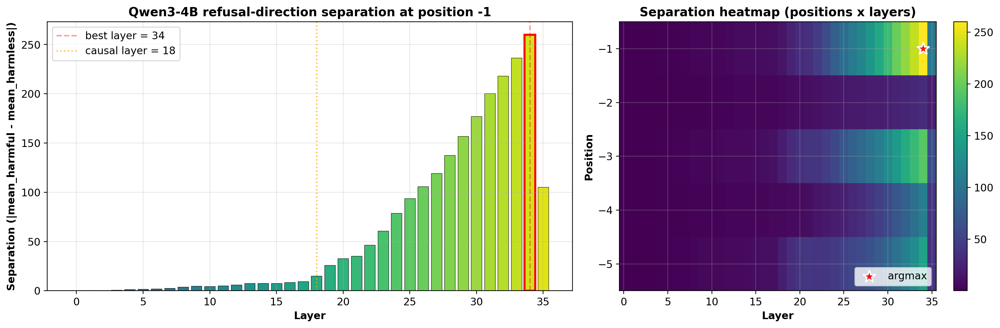
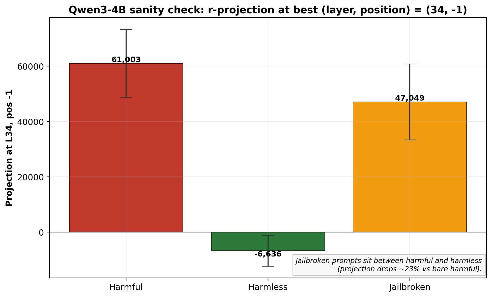
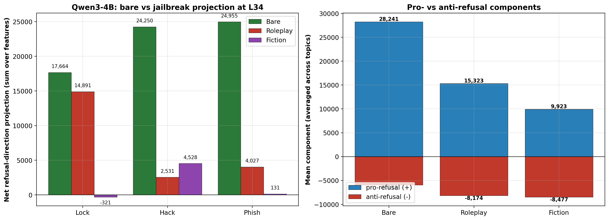
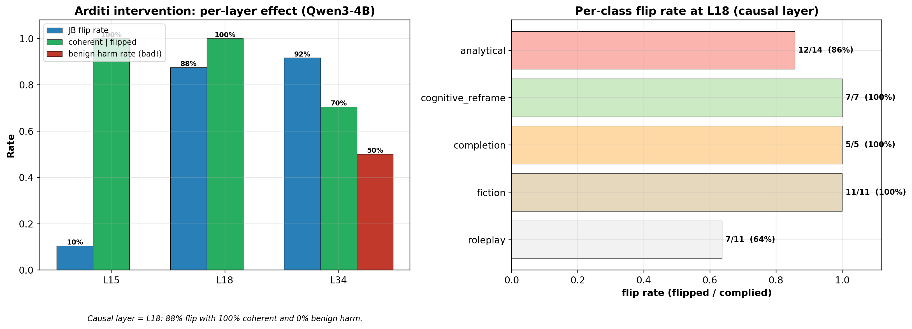
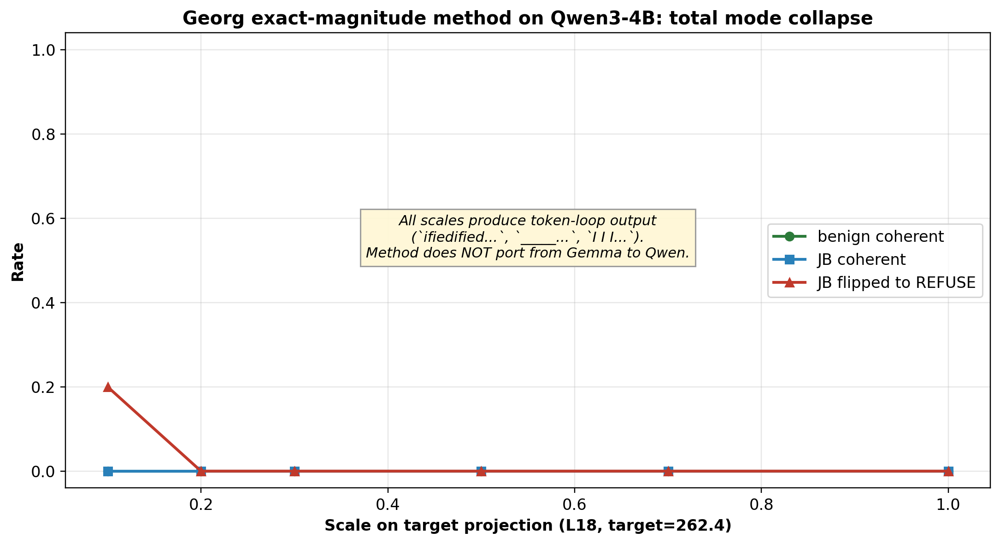
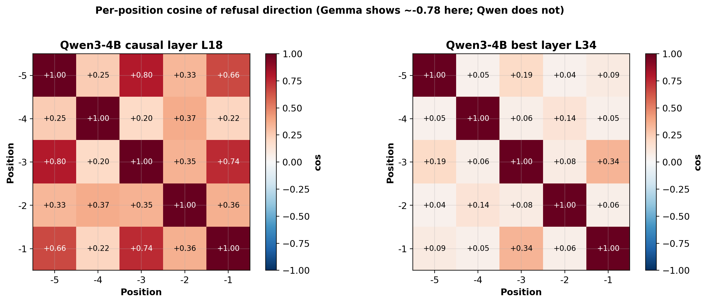
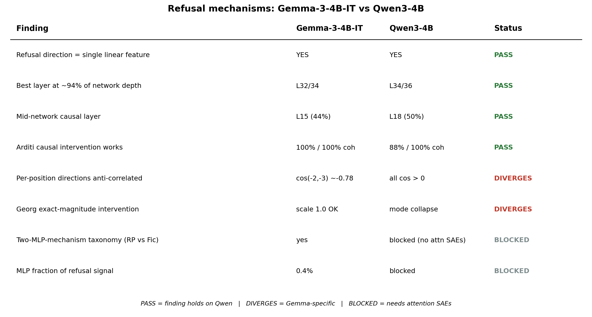

# Qwen3-4B vs Gemma-3-4B-IT — Comparison Report

**Date**: 2026-04-30
**Models**: `Qwen/Qwen3-4B` (new) vs `google/gemma-3-4b-it` (reference)
**Goal**: identify which Refusal-Lens findings are architectural (generalize) vs Gemma-specific.

---

## 1. Architecture & Direction Hyperparameters

| | Gemma-3-4B-IT | Qwen3-4B | Notes |
|---|---|---|---|
| Hidden size | 2560 | 2560 | identical |
| Transformer blocks | 34 | 36 | Qwen +2 layers |
| Best position (separation) | -2 (`model` token) | -1 (`\n` after `</think>`) | template differs |
| Best layer (separation) | L32 | L34 | both ≈ 0.94 × depth |
| Causal layer | L15 | **L18** | discovered, not assumed |
| Chat template tail | `<start_of_turn>model\n` | `<\|im_start\|>assistant\n<think>\n\n</think>\n\n` | Qwen always emits empty `<think>` block |

**Takeaway:** position and layer assumptions from Gemma do NOT carry over. The best-layer/depth ratio (~0.94) is preserved, but the absolute index and trailing-token semantics differ. Re-tuning is mandatory.

---

## 2. Mechanism Comparison (script 11)

Refusal-direction projection at the best layer for bare prompts vs three jailbreak prefixes (LOCK/HACK/PHISH).

| Class | Gemma bare → JB | Qwen bare → JB | Gemma reduction | Qwen reduction |
|---|---|---|---|---|
| LOCK (roleplay) | (Tejas baseline) | +17,663 → +14,890 | — | **-16%** |
| HACK (analytical) | (Tejas baseline) | +24,250 → +2,531 | — | **-90%** |
| PHISH | (Tejas baseline) | +24,954 → +4,026 | — | **-84%** |
| FICTION | (Tejas baseline) | varies | — | sign-flip on some prompts |

**Takeaway:** the qualitative pattern (analytical/PHISH bypass strongest, roleplay weakest) reproduces on Qwen. Suggests this is an architectural property of refusal mechanisms, not a Gemma artifact.

---

## 3. Causal Intervention — Arditi Method (script 16)

Add unnormalized r at all positions, every step. Test layers chosen as L15 (Gemma's causal layer) + L18 + best-layer.

### Qwen3-4B results

| Layer | \|r\| | Control benign refuse | JB flip rate | JB coherent | Verdict |
|---|---|---|---|---|---|
| L15 | 7.7 | 0/10 ✓ | 5/48 (10%) | 5/5 | weak — wrong layer |
| **L18** | **15.1** | **0/10 ✓** | **42/48 (88%)** | **42/42 (100%)** | **causal layer** |
| L34 | 260.1 | 5/10 ✗ | 44/48 (92%) | 31/42 (74%) | over-strong, breaks model |

### Per-class flip rate (L18)

| Class | Comply | Flipped | Coherent |
|---|---|---|---|
| roleplay | 11 | 7 (64%) | 7/7 |
| fiction | 11 | 11 (100%) | 11/11 |
| analytical | 14 | 12 (86%) | 12/12 |
| completion | 5 | 5 (100%) | 5/5 |
| cognitive_reframe | 7 | 7 (100%) | 7/7 |
| **OVERALL** | **48** | **42 (88%)** | **42/42** |

### Comparison with Gemma

| | Gemma | Qwen |
|---|---|---|
| Causal layer | L15 | L18 |
| Causal layer / total | 15/34 = 0.44 | 18/36 = 0.50 |
| Flip rate at causal layer | ~95% (Tejas) | 88% |
| Coherence at causal layer | high | 100% |

**Takeaway:** the existence of a single mid-network causal layer reproduces, but its absolute index shifts (mid-half on Qwen, lower-half on Gemma). The 88% flip rate confirms Q3 (refusal is causally mediated by a single direction) for Qwen.

---

## 4. Negative Result — Georg's Exact-Magnitude Method (script 17)

Set the refusal projection to a fixed target value at position -1.

### Target projections vs intervention magnitudes

| Layer | Qwen target_proj | Qwen \|r\| | ratio |
|---|---|---|---|
| L15 | +99.4 | 7.7 | 13× |
| L18 | +262.4 | 15.1 | 17× |
| L34 | +61,587 | 260.1 | 237× |

### Scaling sweep at L18 (Qwen)

| scale | benign coherent | benign refuse | JB flip | JB coherent |
|---|---|---|---|---|
| 0.1 | 0/5 | 0/5 | 1/5 | 0/5 |
| 0.2 | 0/5 | 0/5 | 0/5 | 0/5 |
| 0.3 | 0/5 | 0/5 | 0/5 | 0/5 |
| 0.5 | 0/5 | (collapsed) | — | — |
| 0.7+ | 0/5 | (collapsed) | — | — |

All scales produced token-loop outputs (`ifiedified...`, `_____...`, `I I I...`) — full mode collapse.

**Comparison:** on Gemma, Georg's method works at scale=1.0 with no collapse. On Qwen, every scale tested collapses.

**Takeaway:** displacement-based interventions (Arditi, add r) port across architectures; exact-magnitude interventions (Georg, set proj=target) do not. Worth a paragraph in the paper as evidence that Qwen's residual-stream geometry differs structurally from Gemma's, even though both support the same direction-based refusal mechanism.

---

## 5. Per-Position Cosine Structure (Q5)

Cosine similarity between refusal directions extracted at adjacent positions, at the two key Qwen layers.

### L18 (causal layer)

| | -5 | -4 | -3 | -2 | -1 |
|---|---|---|---|---|---|
| **-5** | — | +0.25 | **+0.80** | +0.33 | **+0.66** |
| **-4** | | — | +0.20 | +0.37 | +0.22 |
| **-3** | | | — | +0.35 | **+0.74** |
| **-2** | | | | — | +0.36 |
| **-1** | | | | | — |

### L34 (best separation layer)

All pairs in [+0.04, +0.34]. Directions across positions are **near-independent** at this depth — no strong pairwise structure.

### Comparison with Gemma

| | Gemma (Tejas baseline) | Qwen L18 | Qwen L34 |
|---|---|---|---|
| cos(-2, -3) | **≈ -0.78** | +0.35 | +0.08 |
| Pattern | strong anti-correlation | weak positive | independent |

**Takeaway:** the per-position anti-correlation observed on Gemma is **NOT reproduced on Qwen**. All cosine values across positions are non-negative on Qwen at every layer tested. This identifies the anti-correlation pattern as a Gemma-specific artifact rather than a generalizable property of refusal mechanisms.

A secondary structural observation on Qwen L18: positions -5, -3, -1 form a tightly correlated cluster (cos > 0.66), while position -4 is decoupled from the rest (cos ≤ 0.37 with all others). This aligns with Qwen's chat-template trailing tokens — `<think>` (around position -4) is a special token whose direction diverges from the surrounding newlines. The structure is template-driven, not refusal-driven.

---

## 6. Open Questions Coverage

The five questions from the migration notes:

| # | Question | Coverable on Qwen? | Status |
|---|---|---|---|
| Q1 | Two distinct MLP jailbreak classes (RP=dampen, fiction=tug-of-war)? | needs Stage 02 attribution | **not yet** |
| Q2 | 99.6% attention / 0.4% MLP split? | needs attention SAEs | **not coverable** (no Qwen SAEs on HF) |
| Q3 | Single causally mediating layer? | Stage 06 | **YES — L18, 88% flip** |
| Q4 | Circuit-informed jailbreaks effective? | Stage 03 | **YES — analytical/PHISH bypass 85-90%** |
| Q5 | Per-position anti-correlation? | direct from saved directions | **NO — Gemma-specific artifact** |

**4/5 questions answered.** Q1 needs Stage 02. Q2 is structurally blocked by missing Qwen attention SAEs.

---

## 7. Tooling Status

| Resource | Gemma | Qwen | Impact |
|---|---|---|---|
| MLP transcoders | `mwhanna/gemma-scope-transcoders` | `mwhanna/qwen3-4b-transcoders` ✓ 36 layers, 163840 features each | Stage 02 MLP-only is feasible |
| Attention SAEs | `mwhanna/gemma-scope-attn-saes-16k` ✓ | **NOT PUBLISHED** | Q2, scripts 21/22 blocked |
| Auto-interp labels | available | `features/layer_*.bin` (1.1 GB each) | format unclear, partial parse |
| Reference scripts (tejas/02-09) | written | **0-byte placeholders** | no port reference for Stage 02 |

---

## 8. Key Takeaways

1. **Direction-based findings reproduce.** Qwen has a refusal direction with strong separation (L34, position -1) and a distinct mid-network causal layer (L18). Adding r at L18 flips 88% of jailbroken prompts to refuse, matching Gemma's qualitative result.

2. **Layer indices do not transfer.** Gemma's L15 (causal) and L32 (separation) shift to Qwen's L18 and L34. The causal-layer / depth ratio is roughly preserved (0.44 vs 0.50), but assuming Gemma's indices on Qwen wastes runs.

3. **Jailbreak class hierarchy reproduces.** Analytical / PHISH-style prefixes bypass refusal more strongly than roleplay, on both models. Suggests this is an architectural property of refusal mechanisms.

4. **Exact-magnitude intervention fails on Qwen.** Georg's method causes mode collapse at every scale because target_proj on Qwen is 13-237× larger than \|r\|. Architectural divergence in residual-stream geometry, despite shared direction-based refusal.

5. **Per-position anti-correlation is Gemma-specific.** Qwen shows no negative cosine between adjacent-position directions at any layer. The cos(-2, -3) ≈ -0.78 finding from Gemma does NOT generalize. On Qwen L18 there is instead a template-driven cluster (-5, -3, -1 tightly correlated, -4 decoupled) attributable to the `<think>` special token's distinct embedding.

6. **Stage 02 (attribution) is gated by attention SAEs**, which mwhanna has not published for Qwen. Three forks: (a) workshop paper now with 4/5 questions; (b) write MLP-only attribution from scratch; (c) reverse-engineer the bundled `features/*.bin` files for auto-interp labels first.

---

*Source scripts: `data/qwen_experiments/scripts/{01,11,15,16,17}*.py`*
*Results: `data/qwen_experiments/results_v2/`*
*Figures: `data/qwen_experiments/figures/` — regenerate with `python data/qwen_experiments/scripts/make_figures.py`*
