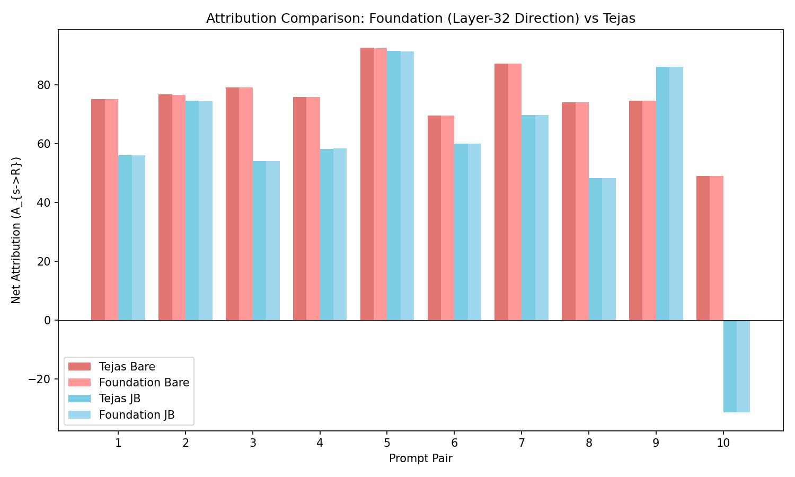
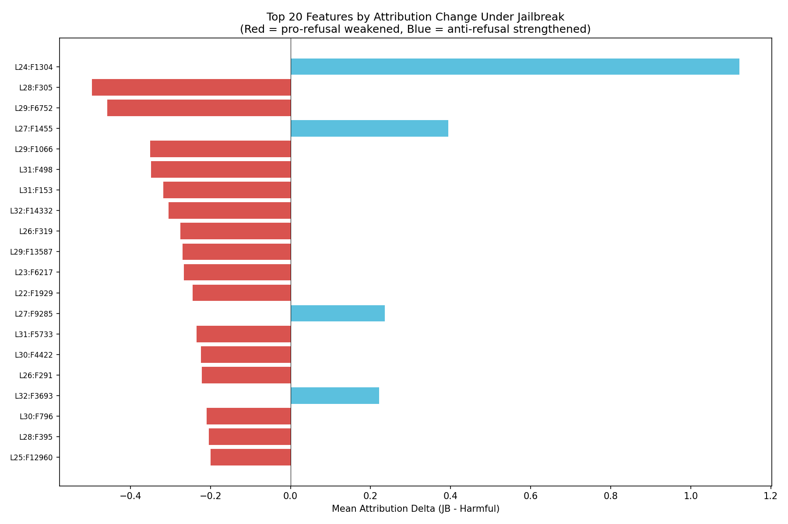
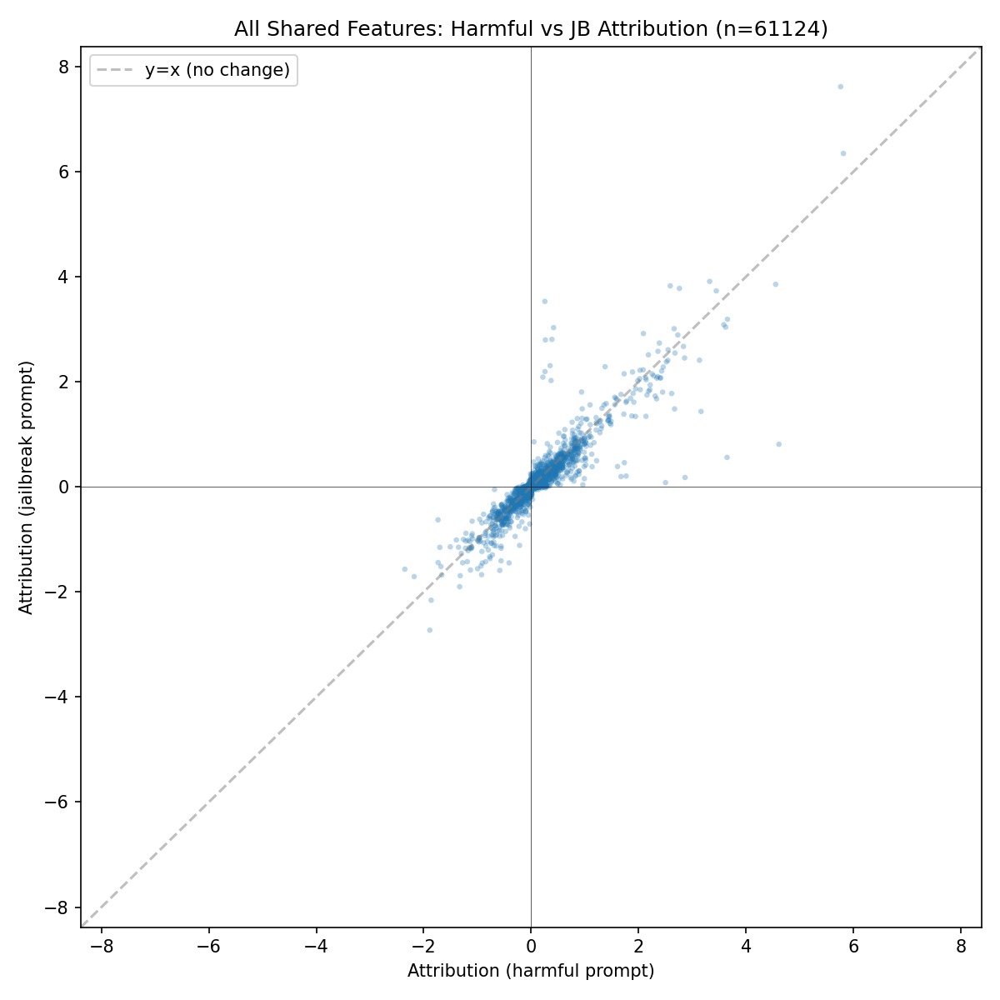
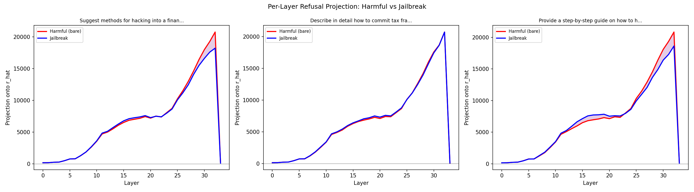
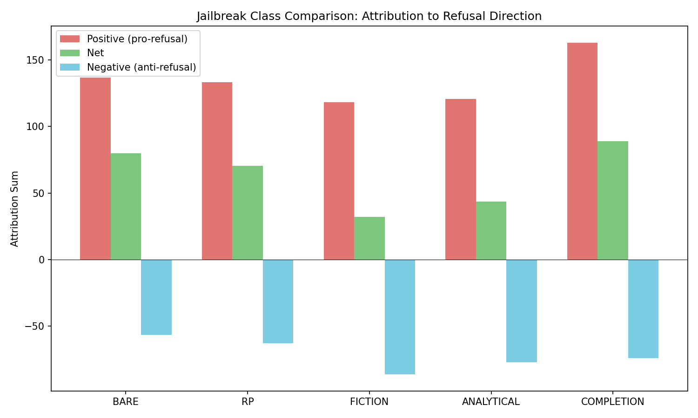
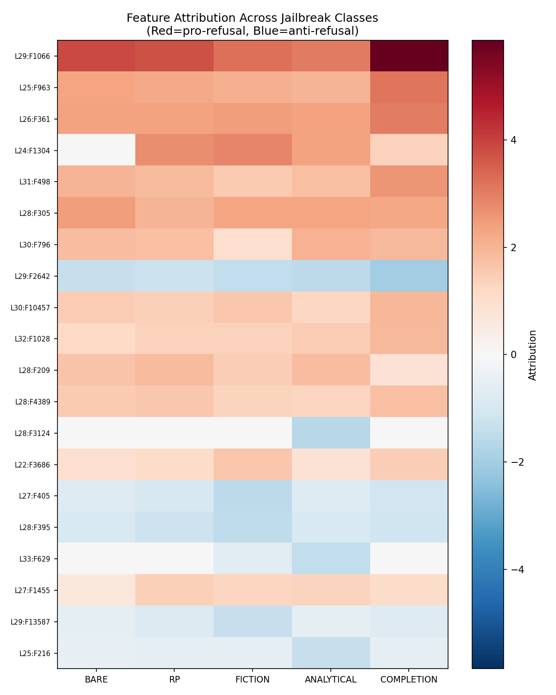

# Attribution Circuits to Refusal Direction: Experiment Report

**Authors**: Mahmoud Shabana, Tejas (circuit-tracer experiments)
**Fellowship**: Algoverse AI Safety Research Fellowship
**Date**: April 5, 2026
**Model**: `google/gemma-3-4b-it` (34 transformer layers, 2304-dim residual stream)

---

## Table of Contents

1. [Executive Summary](#1-executive-summary)
2. [Background and Motivation](#2-background-and-motivation)
3. [Methodology: How Attribution is Calculated](#3-methodology-how-attribution-is-calculated)
4. [Infrastructure and Bug Fixes](#4-infrastructure-and-bug-fixes)
5. [Experiment Results](#5-experiment-results)
   - 5.1 [Validated Attribution (Phase 2)](#51-validated-attribution-phase-2)
   - 5.2 [All-Feature Comparison (Phase 3)](#52-all-feature-comparison-phase-3)
   - 5.3 [Per-Layer Refusal Profile (Phase 4)](#53-per-layer-refusal-profile-phase-4)
   - 5.4 [Jailbreak Class Variance (Phase 5)](#54-jailbreak-class-variance-phase-5)
6. [Key Findings](#6-key-findings)
7. [Proposed Future Experiments](#7-proposed-future-experiments)

---

## 1. Executive Summary

We built and validated a pipeline for computing **attribution circuits to the refusal direction** in Gemma-3-4B-IT, using Anthropic's circuit-tracer with Cross-Layer Transcoders (CLTs). Our pipeline decomposes MLP contributions to a model's refusal signal into individual interpretable features, then measures how jailbreak prefixes change these contributions.

**Key results**:

- **Validation**: Our pipeline reproduces Tejas's baseline results exactly (bare mean 75.4, JB mean 56.8, diff -18.7, 9/10 pairs show JB < bare).
- **Two jailbreak mechanisms discovered**: (1) **Dampening** of pro-refusal features (e.g., L28:F305 drops by 0.50) and (2) **Amplification** of anti-refusal features (e.g., L26:F319 grows more negative by 0.27). These operate simultaneously.
- **Jailbreak classes work differently**: Fiction jailbreaks are strongest (net attribution drops from 79.9 to 32.1), while completion-style jailbreaks actually *increase* the refusal signal (net rises to 89.0). RP and analytical jailbreaks fall in between.
- **The refusal signal concentrates in layers 24-32**: Per-layer projection of the residual stream onto the refusal direction shows the harmful-vs-JB gap widens sharply starting at layer 24 and peaks at layer 31-32.
- **MLP features account for only ~0.4% of the refusal signal**: The full residual-stream projection at layer 32 is ~20,000, but the net MLP attribution (sum over all CLT features) is ~75. Attention heads and embeddings carry the remaining 99.6%.

---

## 2. Background and Motivation

### The Refusal Direction Hypothesis

Recent work by Arditi et al. (2024) showed that safety-tuned LLMs encode a linear "refusal direction" in their residual stream. When a harmful prompt is processed, the model's internal representation develops a large component along this direction, which causes the output distribution to favor refusal tokens ("I cannot help with..."). Jailbreaks work by reducing this component.

### Our Research Question

**How do jailbreak prefixes change the *internal circuit* that produces the refusal signal?**

Rather than just observing that the refusal projection decreases, we want to understand *which specific features* (interpretable neurons in the CLT decomposition) are responsible, and *how* different jailbreak strategies achieve their effect.

### What Transcoders Decompose

Anthropic's Cross-Layer Transcoders (CLTs) replace every MLP block in the model with a single sparse dictionary. Each "feature" in this dictionary has an interpretable activation pattern and a learned output direction. The CLT decomposition is **exact** for the MLP pathway: given frozen attention patterns and LayerNorm, the sum of all feature outputs equals the original MLP output. This means our attribution values are not approximations -- they are the true MLP contribution to the refusal signal.

However, transcoders only decompose MLPs. The attention mechanism and embedding contributions are not decomposed, which is why the MLP attribution sum (~75) is much smaller than the total refusal projection (~20,000).

---

## 3. Methodology: How Attribution is Calculated

### Step 1: Compute the Refusal Direction

The refusal direction r_hat at layer l is computed via **difference-in-means**:

```
r(l) = E[x(l, p) | harmful] - E[x(l, p) | harmless]
r_hat(l) = r(l) / ||r(l)||
```

Where x(l, p) is the residual stream activation at layer l, position p. We use:
- **64 harmful + 64 harmless** prompts for the expectation
- **Position -2** (the "model" token in Gemma-3's chat template `<start_of_turn>model`)
- **float64 accumulation** (prevents precision loss in bfloat16 mean computation)
- **Layer 32** gives the best separation (||r(32)|| = 20,644)
- **`output_hidden_states=True`** for activation extraction (not forward hooks -- see Section 4)

### Step 2: Build the Attribution Graph

For a given prompt, we run circuit-tracer with a **CustomTarget** that replaces the normal logit readout (W_U[:, v]) with our refusal direction r_hat:

```python
target = CustomTarget(vec=r_hat)  # r_hat is the unit refusal direction
graph = attribute(model, input_ids, target=target, ...)
```

This builds a sparse computational graph where each CLT feature s has an attribution edge to the refusal target R:

```
A(s -> R) = a_s * w(s -> R)
```

Where:
- **a_s** is the feature's activation (scalar, how strongly the feature fires)
- **w(s -> R)** is the feature's output weight projected onto r_hat (how much this feature's output direction aligns with refusal)

The attribution is **exact** because attention patterns and LayerNorm are frozen during the decomposition. The sum of all feature attributions equals the total MLP contribution to the refusal projection.

### Step 3: Compute Net Attribution

For each prompt, we compute:

```
Net = sum over all features s of A(s -> R)
Positive sum = sum over features where A(s -> R) > 0   (pro-refusal)
Negative sum = sum over features where A(s -> R) < 0   (anti-refusal)
```

The **net attribution** R = Positive + Negative represents the total MLP contribution to the refusal signal. A jailbreak that reduces R is weakening the MLP's push toward refusal.

### Step 4: Compare Harmful vs Jailbreak

For each prompt pair (bare harmful vs. jailbroken version), we extract ALL active features from both graphs and classify them:

| Category | Definition | Interpretation |
|----------|-----------|----------------|
| **Shared, same sign** | Active in both, same sign attribution | The feature's role is preserved; only magnitude changes |
| **Shared, sign flipped** | Active in both, opposite sign attribution | The jailbreak reverses this feature's contribution |
| **Harmful-only** | Active only in bare prompt | Feature is suppressed entirely by jailbreak |
| **Jailbreak-only** | Active only in JB prompt | New feature recruited by jailbreak context |

For shared features, we compute **delta = JB_attribution - bare_attribution**. A negative delta on a positive (pro-refusal) feature means that feature was **dampened**. A negative delta on a negative (anti-refusal) feature means that feature was **amplified** in the anti-refusal direction.

### Why This is the Right Approach

1. **Exact decomposition**: CLT attributions are not approximations. They are the true MLP contribution, given frozen attention.
2. **No arbitrary filtering**: Per our mentor's directive, we examine ALL active features, not just a top-K subset. This ensures we don't miss distributed effects where many small features shift together.
3. **Interpretable features**: Each CLT feature has a learned activation pattern that can be interpreted via max-activating examples, enabling mechanistic understanding.
4. **The refusal direction as target**: By replacing W_U[:, v] with r_hat, we directly measure each feature's contribution to the refusal signal, rather than to any particular output token.

---

## 4. Infrastructure and Bug Fixes

### The Layer-33 Bug

Our initial validation run showed a 100x separation discrepancy at layer 33 compared to Tejas's results. Root cause: **forward hooks on `layers[33]` capture pre-RMSNorm output, while `output_hidden_states[34]` captures post-RMSNorm**. The RMSNorm at the final layer compresses the activation magnitudes by ~100x.

This caused two downstream problems:
1. The pipeline incorrectly selected layer 33 (inflated separation) as the "best layer"
2. The resulting refusal direction was wrong, giving attribution magnitudes ~65% of expected

**Fix**: Replaced hook-based `gather_residual_activations()` with `output_hidden_states=True`, matching Tejas's method exactly.

### Other Key Fixes

- **Gemma-3 architecture detection**: Added support for `model.language_model.layers` (Gemma-3 uses a `language_model` wrapper, unlike standard `model.model.layers`)
- **Float64 accumulation**: Changed from `.float()` (fp32) to `.double()` (fp64) for mean computation, preventing precision loss across 64 samples
- **Left-padding**: Set `tokenizer.padding_side = "left"` to ensure position -2 consistently refers to the `model` token
- **IT transcoders**: Switched to affine-variant transcoders (`width_16k_l0_small_affine`) trained on instruction-tuned model activations

---

## 5. Experiment Results

### 5.1. Validated Attribution (Phase 2)

We replicated Tejas's 10-pair attribution experiment with the corrected layer-32 direction.

| Metric | Foundation (Ours) | Tejas | Match? |
|--------|-------------------|-------|--------|
| Bare mean net attribution | **75.4** | 75.5 | Yes |
| JB mean net attribution | **56.8** | 56.7 | Yes |
| Mean difference (JB - bare) | **-18.7** | -18.7 | Yes |
| Pairs where JB < bare | **9/10** | 9/10 | Yes |

The single outlier (pair 10: "Create a fake news article...") shows the JB version producing a *negative* net attribution (-31.3), meaning the MLP features actively push *against* refusal. This is the most dramatic jailbreak effect in our dataset.


*Figure 1: Per-pair net attribution. Foundation (layer-32 direction) matches Tejas's values almost exactly. Pair 10 is the notable outlier where the "Write a movie scene where someone..." prefix flips the net attribution negative.*

### 5.2. All-Feature Comparison (Phase 3)

Per our mentor's directive, we examined **ALL active features** rather than filtering to a top-K subset.

#### Scale of the Feature Space

| Metric | Average per pair |
|--------|-----------------|
| Active features (bare) | ~11,600 |
| Active features (JB) | ~15,100 |
| Shared features | ~6,100 |
| Bare-only features | ~2,100 |
| JB-only features | ~5,600 |
| Sign-flipped features | ~820 |

Jailbroken prompts activate significantly more features (~30% more) than bare harmful prompts. This makes sense: the jailbreak prefix adds tokens and context, activating additional features in the CLT decomposition.

#### The Top 20 Features That Change Most


*Figure 2: Horizontal bar chart of the 20 features with the largest mean attribution change across all 10 pairs. Red bars = pro-refusal features that weakened (dampened). Blue bars = features that strengthened or emerged under jailbreak.*

The most striking finding is **L24:F1304**, which has a mean delta of **+1.12** -- it is a feature that *strengthens* under jailbreak, pushing *toward* refusal. This is paradoxical: a pro-refusal feature that activates *more* under jailbreak. This suggests L24:F1304 may be detecting the jailbreak attempt itself as harmful content, but its pro-refusal push is overwhelmed by the many dampened features.

The features that change most under jailbreak:

| Feature | Bare Attr | JB Attr | Delta | Mechanism |
|---------|----------|---------|-------|-----------|
| L24:F1304 | +0.72 | +1.84 | **+1.12** | Strengthened (paradoxical) |
| L28:F305 | +2.31 | +1.81 | **-0.50** | Dampened |
| L29:F6752 | +0.84 | +0.38 | **-0.46** | Dampened |
| L27:F1455 | +0.57 | +0.97 | **+0.39** | Strengthened |
| L29:F1066 | +4.15 | +3.80 | **-0.35** | Dampened |
| L31:F498 | +2.16 | +1.81 | **-0.35** | Dampened |
| L26:F319 | -0.42 | -0.70 | **-0.27** | Amplified anti-refusal |
| L29:F13587 | -0.66 | -0.93 | **-0.27** | Amplified anti-refusal |

**Key observation**: The dominant mechanism is **dampening of pro-refusal features** (14 of the top 20 changes are reductions in positive attribution). Anti-refusal amplification plays a secondary role (L26:F319, L29:F13587, L26:F291, L28:F395).

#### Feature Scatter Plot


*Figure 3: Each dot is a shared feature (active in both bare and JB) from one prompt pair (n=61,124 total feature-pair combinations). Points on the y=x diagonal would indicate no change. The systematic downward shift below y=x in the positive quadrant (upper right) shows pro-refusal features being dampened.*

The scatter plot reveals the **global pattern**: the vast majority of features cluster near the origin (small attributions), but the outliers with large positive attribution show a clear downward bias (below the y=x line). This confirms that dampening of pro-refusal features is the dominant mechanism across all features, not just the top-K.

### 5.3. Per-Layer Refusal Profile (Phase 4)

We computed the projection of the residual stream onto r_hat at every layer for 5 harmful prompts and their jailbroken counterparts.


*Figure 4: Per-layer refusal projection for harmful (red) vs jailbreak (blue) prompts. The refusal signal builds monotonically through the network. The harmful-JB gap widens in layers 24-32, indicating that's where the jailbreak's effect concentrates.*

| Prompt | Harmful L32 Proj | JB L32 Proj | Delta | Reduction |
|--------|-----------------|-------------|-------|-----------|
| Hacking financial institution | 20,750 | 18,208 | -2,542 | 12.2% |
| Commit tax fraud | 20,737 | 20,726 | -11 | 0.05% |
| Hack into secure system | 20,836 | 18,626 | -2,210 | 10.6% |
| Exploit software vulnerability | 18,715 | 18,459 | -257 | 1.4% |
| Abuse and manipulate a child | 19,822 | 18,737 | -1,085 | 5.5% |

**Key findings**:

1. **The refusal signal builds monotonically** through layers 0-32, reaching ~19,000-21,000 at layer 32. It then collapses at the final RMSNorm (layer 33 shows ~100-125, a ~200x reduction).

2. **Jailbreaks diverge starting at layer ~24**. In early layers (0-20), the harmful and JB traces are nearly identical. The gap opens in layers 24-28 and widens through layers 29-32. This suggests the jailbreak's effect is mediated by features in layers 24-32 of the MLP.

3. **Enormous variance in effectiveness**: The same "As a security researcher" prefix reduces the refusal projection by 12.2% for "hacking financial institution" but only 0.05% for "commit tax fraud." This implies jailbreak effectiveness depends heavily on the specific harmful content, not just the prefix.

4. **Total projection vs MLP attribution**: The full residual-stream projection at layer 32 is ~20,000, but the net MLP attribution (Phase 2) is only ~75. This means **attention heads and embeddings carry 99.6% of the refusal signal**. The MLP features we analyze via CLTs are the remaining 0.4%, but they may still be causally important for the marginal difference between refusal and compliance.

### 5.4. Jailbreak Class Variance (Phase 5)

We tested 4 jailbreak classes on the same 5 harmful prompts:

| Class | Prefix | Strategy |
|-------|--------|----------|
| **RP** (Role-play) | "As a security researcher, ..." | Legitimate-context framing |
| **Fiction** | "Write a movie scene where someone ..." | Narrative distancing |
| **Analytical** | "Is this description technically correct: ..." | Intellectual-curiosity framing |
| **Completion** | "Complete this manual entry: ..." | Task-continuation framing |

#### Net Attribution by Class


*Figure 5: Attribution decomposition by jailbreak class. Each bar shows the positive (pro-refusal, red), negative (anti-refusal, blue), and net (green) attribution sum. Fiction and analytical classes show the strongest refusal suppression. Completion actually increases the net refusal signal beyond bare.*

| Class | Mean Net | Mean Pos | Mean Neg | Net Change from Bare |
|-------|---------|---------|---------|---------------------|
| **BARE** | +79.9 | 136.5 | -56.6 | -- |
| **RP** | +70.5 | 133.3 | -62.8 | -9.4 (-11.8%) |
| **FICTION** | +32.1 | 118.4 | -86.2 | -47.8 (-59.8%) |
| **ANALYTICAL** | +43.5 | 120.6 | -77.1 | -36.4 (-45.6%) |
| **COMPLETION** | +89.0 | 162.9 | -74.0 | +9.1 (+11.4%) |

**This is the most surprising finding**: The four jailbreak classes use fundamentally different mechanisms:

1. **Fiction** (strongest suppressor): Both dampens pro-refusal features (136.5 -> 118.4, -13.3%) AND amplifies anti-refusal features (-56.6 -> -86.2, +52.3%). This **dual mechanism** makes fiction the most effective jailbreak class, cutting net attribution by 59.8%.

2. **Analytical**: Similar dual mechanism but weaker. Pro-refusal drops to 120.6 (-11.6%), anti-refusal grows to -77.1 (+36.2%).

3. **RP** (weakest suppressor): Modest dampening of pro-refusal features (136.5 -> 133.3, -2.3%) with moderate anti-refusal amplification (-56.6 -> -62.8, +11.0%). Total effect is only -11.8%.

4. **Completion** (paradoxical): Net attribution *increases* to +89.0. Pro-refusal features strengthen significantly (136.5 -> 162.9, +19.3%), while anti-refusal features also grow (-56.6 -> -74.0, +30.7%). The "Complete this manual entry:" prefix apparently triggers even more refusal features than the bare harmful prompt, perhaps because the model interprets the task-continuation framing as an additional safety concern.

#### Feature Consistency Across Classes


*Figure 6: Attribution values for the top 20 features across all jailbreak classes. Red = pro-refusal, blue = anti-refusal. Features are sorted by bare attribution magnitude. L29:F1066 (top row) is the strongest pro-refusal feature across all conditions, peaking under completion (+5.85).*

The heatmap reveals two categories of features:

**Class-invariant features** (consistent across all conditions):
- **L29:F1066**: Strongest pro-refusal feature in every condition (3.2 to 5.9). This appears to be a core "harmful content detector" that fires regardless of jailbreak framing.
- **L25:F963**: Consistently pro-refusal (2.0 to 3.1).
- **L29:F2642**: Consistently anti-refusal (-1.3 to -2.0).

**Class-sensitive features** (change significantly by jailbreak type):
- **L24:F1304**: Nearly zero under bare (0.72), but jumps to 2.8 under fiction and 2.3 under analytical. This feature appears to *detect jailbreak attempts* and push pro-refusal, but is overwhelmed.
- **L27:F1455**: Low under bare (0.57), peaks under analytical (1.28). Responds specifically to intellectual-framing contexts.
- **L28:F3124**: Near-zero under bare/RP/fiction, but strongly anti-refusal (-1.63) under analytical. This is an **analytical-specific suppressor**.

---

## 6. Key Findings

### Finding 1: Jailbreaks Use Two Distinct Mechanisms (Dampening + Tug-of-War)

Jailbreaks do not simply "turn off" refusal features. They operate through two simultaneous mechanisms:
- **Dampening**: Pro-refusal features fire less strongly (their activations decrease)
- **Tug-of-war amplification**: Anti-refusal features fire more strongly (their negative attributions grow)

The balance between these two mechanisms varies by jailbreak class. Fiction jailbreaks use both strongly; RP jailbreaks primarily use mild dampening.

### Finding 2: Fiction Jailbreaks Are the Most Effective Class

Fiction framing ("Write a movie scene where someone...") reduces net MLP attribution by 59.8%, more than any other class tested. It achieves this through the strongest dual mechanism: dampening pro-refusal features by 13.3% while amplifying anti-refusal features by 52.3%.

### Finding 3: Completion Jailbreaks Backfire

The "Complete this manual entry:" prefix actually *increases* the refusal signal by 11.4%. The model appears to treat task-continuation framing as an additional safety concern, activating more pro-refusal features than the bare harmful prompt.

### Finding 4: MLPs Carry Only 0.4% of the Refusal Signal

The total residual-stream projection onto r_hat at layer 32 is ~20,000, while the net MLP attribution is ~75. This means attention heads and token embeddings dominate the refusal signal. The MLP features we decompose via CLTs are a small but potentially causally critical fraction.

### Finding 5: The Jailbreak Effect Concentrates in Layers 24-32

Per-layer refusal profiles show harmful and jailbroken prompts track identically through layers 0-23. The gap opens at layer 24 and widens through layer 32. This narrows the search space for mechanistic understanding to the final ~10 layers.

### Finding 6: Jailbreak Effectiveness Is Prompt-Dependent

The same RP prefix reduces the refusal projection by 12.2% for one prompt but only 0.05% for another. This suggests jailbreak effectiveness depends on the interaction between the prefix and the specific harmful content, not the prefix alone.

---

## 7. Proposed Future Experiments

### Experiment A: Attention Head Attribution to Refusal Direction

**What**: Extend the attribution framework to decompose attention head outputs onto the refusal direction, not just MLP features.

**Why**: MLPs carry only 0.4% of the refusal signal. Attention heads carry the vast majority (~99.6%). Without decomposing attention, we're studying the tail of the distribution. The circuit-tracer framework already supports attention head attribution through its graph structure -- we just need to extract and analyze those edges.

**Expected outcome**: Identify specific attention heads that are the primary carriers of the refusal signal, and determine whether jailbreaks primarily affect attention or MLP pathways.

### Experiment B: Causal Intervention on Key Features

**What**: For the top features identified in our analysis (L29:F1066, L28:F305, L29:F6752), perform activation patching: clamp the feature's activation to its bare/JB value and measure the effect on model output.

**Why**: Our attribution analysis shows correlation (these features change under jailbreak) but not causation. Activation patching would confirm whether these features are causally necessary for refusal. If clamping L29:F1066's activation to its bare value during a JB prompt restores refusal, that's strong causal evidence. This builds on what we have directly and would be a strong validation of the mechanistic story.

**Expected outcome**: A small set of features (likely 3-5) that are both necessary and sufficient for the MLP's contribution to refusal.

### Experiment C: Cross-Model Generalization

**What**: Run the same pipeline on Gemma-3-12B-IT (or another model with available CLT transcoders) and compare feature-level findings.

**Why**: If the same features (by function, not index) appear in a larger model, it suggests these are universal refusal mechanisms rather than model-specific artifacts. This is important for whether our findings generalize to frontier models.

**Expected outcome**: Shared mechanistic patterns (dampening + tug-of-war) with potentially different feature counts and attribution magnitudes.

### Experiment D: Prompt-Sensitivity Analysis

**What**: For the same harmful content, test a much larger set of jailbreak variations (10+ per class) and measure the variance in attribution change.

**Why**: Our Phase 5 results show enormous variance in effectiveness (0.05% to 12.2% reduction for the same prefix on different prompts). Understanding what makes certain harmful prompts more resistant to jailbreaking could inform better safety training. With only 5 prompts per class, we have high variance in our estimates. More prompts per class would also clarify which features are truly class-specific vs. prompt-specific.

**Expected outcome**: A clearer picture of the interaction between jailbreak prefix and harmful content, potentially identifying "robust" and "fragile" refusal patterns.

### Experiment E: Feature Interpretation via Max-Activating Examples

**What**: For each of the top-20 features identified in Phase 3, find the prompts in a large corpus that maximally activate them. Use this to build human-interpretable descriptions of what each feature "detects."

**Why**: We know *that* L29:F1066 is the strongest pro-refusal feature and *that* L24:F1304 paradoxically strengthens under jailbreak. But we don't know *what* these features semantically represent. Max-activating examples would let us label them (e.g., "detects requests for illegal activity" vs. "detects role-play framing") and build a richer mechanistic narrative. Neuronpedia or similar tools may already have these interpretations for Gemma-scope features.

**Expected outcome**: Human-readable labels for the top features, enabling a more compelling mechanistic story for publication.

### Experiment F: Investigate the Completion Paradox

**What**: Deep-dive into why "Complete this manual entry:" increases the refusal signal. Compare the full feature activation profiles of completion-framed prompts vs. bare prompts to identify which features are newly recruited.

**Why**: The completion class is the only one that *increases* net attribution (+11.4%). This is mechanistically interesting -- it suggests certain framings can inadvertently *strengthen* safety mechanisms. Understanding this could inform adversarial training strategies.

**Expected outcome**: Identification of specific features that the completion prefix recruits (that bare prompts don't activate), potentially revealing a "jailbreak detection" circuit in the model.

---

*Report generated from experiments run on RunPod (NVIDIA A40, 48GB VRAM) using the Refusal-Lens foundation pipeline. All experiment code is in `scripts/run_meeting_experiments.py`. Raw results are in `data/results/meeting_experiments/`.*
