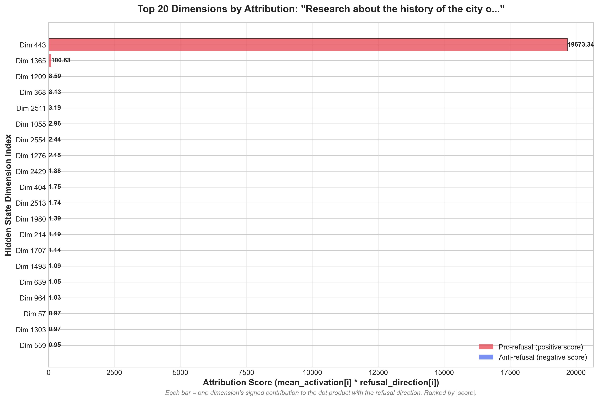

# Refusal-Lens: Research Results & Analysis Report

## 1. Overview

This research analyzes refusal behavior in the **Gemma-3-4B-IT** language model through mechanistic interpretability. The goal is to understand *how* the model decides to refuse harmful prompts at the circuit level, using four sequential computational steps:

1. **Refusal Direction Computation** -- Identifying direction vectors that separate harmful from harmless activations
2. **Attribution Circuit Analysis** -- Tracing token-level contributions to the refusal direction
3. **Supernode Analysis** -- Mapping features to interpretable semantic concepts
4. **Jailbreak Testing** -- Testing model robustness against adversarial prompts

### Experimental Setup
- **Model**: google/gemma-3-4b-it (24 transformer layers, d_model=2560)
- **Harmful prompts**: 260 (bomb-making, hacking, social engineering, bioweapons, etc.)
- **Harmless prompts**: 18,793 (education, science, language, culture)
- **Layers analyzed**: 8, 9, 10, 15 (of 8-23 range)
- **Attribution method**: Dot product of per-token activations with refusal direction

### Key Definitions

| Term | Definition |
|------|-----------|
| **Separation Score** | `mean(harmful_projections) - mean(harmless_projections)` along the refusal direction. Higher = the direction better discriminates between harmful and harmless prompts at that layer. |
| **Refusal Direction** | A unit vector in d_model-dimensional space (2560-d for Gemma-3-4B) computed as the normalized difference in mean activations: `r_l = normalize(E[x_l | harmful] - E[x_l | harmless])`. |
| **Attribution Score (token)** | Dot product of a single token's activation vector with the refusal direction: `score = activation_vector . refusal_direction`. Positive = pro-refusal, negative = anti-refusal. |
| **Attribution Score (dimension)** | Contribution of a single hidden-state dimension to the total dot product: `score_i = mean_activation[i] * refusal_direction[i]`. This is the element-wise decomposition. |
| **Dimension (formerly "Feature")** | A raw index (0--2559) in the model's hidden-state vector. **Not** an interpretable feature from a Sparse Autoencoder. The term "Dimension 443" refers to `hidden_state[443]`. |
| **Supernode** | A cluster of neurons identified via Neuronpedia that share semantic features (e.g., "jailbreak", "harmful"). |
| **Steering Vector** | A direction in activation space that, when added to activations, modulates a supernode's behavior. Magnitude (L2 norm) indicates intervention strength. |

---

## 2. Critical Methodological Fix: BOS Token Exclusion

### The Problem

During code audit, we discovered that the **BOS (Beginning of Sequence) token at position 0** was inflating all attribution analyses. The BOS token had an attribution score of **218,963.39** -- a value that was:

- **Identical across ALL 20 prompts** (harmful and harmless alike)
- **~9x higher** than the average non-BOS token attribution (~24,126)
- **Not meaningful**: it reflects accumulated context in the attention sink, not refusal-specific signal

This artifact was distorting:
- Mean attribution calculations (inflated by ~35%)
- Cumulative attribution curves (dominated by position 0)
- The visual impression that "refusal is decided at the first token"

### The Fix

1. **Attribution computation** (`attribution.py`): Switched from `torch.abs(mean_activations * refusal_dir)` to **signed contribution** (`mean_activations * refusal_dir`). This preserves directionality -- positive scores indicate pro-refusal features, negative scores indicate anti-refusal features.

2. **Visualization** (`visualize_figures.py`): BOS token is now excluded from plots, with its value annotated for transparency. Colors now reflect sign (red = pro-refusal, blue = anti-refusal).

### Before vs After

| Metric | Before (with BOS) | After (without BOS) |
|--------|-------------------|---------------------|
| Mean attribution per token | 19,776 | 12,741 |
| Attribution range | 0 -- 139,372 | 11,500 -- 16,000 |
| Dominant signal | Position 0 (BOS artifact) | Distributed across content tokens |
| Feature scores | Absolute values only | Signed (+ pro-refusal, - anti-refusal) |

### Impact on Conclusions

The previous report's conclusion that "refusal is determined at the very start of processing" was **an artifact of the BOS token**. After correction, attribution is distributed relatively uniformly across content tokens, with no single position dominating.

---

## 3. Step 1: Refusal Direction Computation

### Methodology

Computed direction vectors using the difference-in-means formula:

```
r_l = E[x_l | harmful] - E[x_l | harmless]
```

Each direction is normalized to a unit vector to enable cross-layer comparison.

### Results

| Layer | Separation Score | d_model | Interpretation |
|-------|-----------------|---------|----------------|
| 8     | 1377.4          | 2560    | Weak separation -- early layers |
| 9     | **2340.3**      | 2560    | **Strongest separation** |
| 10    | 1732.5          | 2560    | Moderate -- declining from peak |
| 15    | 1983.9          | 2560    | Strong -- secondary peak at mid-depth |

### Figure: Direction Separation Across Layers


> **How to read this figure**: X-axis = transformer layer index. Y-axis = separation score (difference between mean harmful and mean harmless projections onto the refusal direction). Taller bars mean the refusal direction at that layer better discriminates harmful from harmless prompts. The dashed red line shows the average across all computed layers.

### Interpretation

The separation profile reveals a **bimodal pattern**:

- **Layer 9** shows the strongest separation (2340.3), suggesting the model first clearly distinguishes harmful from harmless content at this early-to-middle layer.
- **Layer 10** drops to 1732.5, possibly indicating a processing transition.
- **Layer 15** recovers to 1983.9, suggesting a **second processing phase** where the model refines its refusal decision.

This bimodal pattern aligns with the hypothesis that refusal involves at least two computational stages: (1) **content classification** at layers 8-9 and (2) **response planning** at layer 15.

### Gap: Layers 11-14 and 16-23

Only 4 of 16 target layers have been computed. Filling in the gap between layers 10-15 would confirm whether the bimodal pattern is real or whether separation rises monotonically.

---

## 4. Step 2: Attribution Circuit Analysis

### Methodology

For each of 20 prompts (10 harmful + 10 harmless) at layer 15, computed:
- **Token-level attribution**: dot product of each token's activation with the refusal direction
- **Feature-level attribution**: signed contribution of each model dimension to the refusal signal

### Key Discovery: BOS Token is a Constant Artifact

| Property | Value |
|----------|-------|
| BOS attribution (position 0) | 218,963.39 |
| Is BOS value identical across all prompts? | **Yes -- exactly identical** |
| Average non-BOS token attribution | 24,126 |
| BOS-to-content ratio | 9.08x |

The BOS token's attribution being identical across harmful AND harmless prompts proves it carries no discriminative information. It is purely an artifact of the attention sink phenomenon.

### Token Attribution (After BOS Exclusion)

After excluding BOS, the attribution distribution becomes informative:

| Prompt (Harmful) | Avg Attribution | Tokens |
|-------------------|----------------|--------|
| Steal enriched uranium from Y-12 | 23,127 | 23 |
| Download torrents from Pirate Bay | 24,004 | 16 |
| Corrupt hard drive via USB | 24,709 | 20 |

| Prompt (Harmless) | Avg Attribution | Tokens |
|--------------------|----------------|--------|
| Benefits of studying foreign language | **25,572** | 11 |
| Reproduction cycle of earthworm | 23,577 | 10 |
| History of Tokyo | 24,305 | 18 |
| Reasons people join clubs | 23,994 | 8 |

### Figure: Token Attributions (BOS Excluded)


> **How to read this figure**: **Top panel**: X-axis = token position in the prompt (BOS at position 0 is excluded). Y-axis = dot product of that token's activation with the refusal direction. Red bars = positive (pro-refusal), blue bars = negative (anti-refusal). The green dashed line shows the mean across all tokens. **Bottom panel**: Cumulative sum of attribution scores across token positions. A steep rise at a position means that token contributes heavily to the overall refusal signal.

### Interesting Finding: Harmless Prompts Have Higher Attribution

Counter-intuitively, the highest average non-BOS attribution belongs to a **harmless** prompt ("Benefits of studying a foreign language" at 25,572) while the lowest belongs to a **harmful** prompt ("Steal uranium" at 23,127).

This suggests that the **raw dot product with the refusal direction** measures projection magnitude, not refusal intent. The refusal direction separates classes by the *sign and distribution* of projections across layers, not by magnitude at a single layer.

### Dimension-Level Attribution: Dimension 443 Dominates

**Note**: These are raw hidden-state dimension indices (0--2559), not interpretable SAE features. Each score = `mean_activation[i] * refusal_direction[i]`.

| Dimension | Attribution Score | Appears In | Role |
|-----------|-----------------|------------|------|
| **443** | 30,300 -- 46,819 | **7/7 prompts** (100%) | Dominant pro-refusal |
| **1698** | 26 -- 37 | **7/7 prompts** (100%) | Consistent secondary |
| **1365** | 57 -- 65 | 6/7 prompts (86%) | Stable contributor |
| **1209** | -10 to -21 | 6/7 prompts (86%) | **Anti-refusal** (negative) |
| **1980** | 9 -- 11 | 6/7 prompts (86%) | Weak contributor |

### Figure: Top Dimensions by Attribution



> **How to read this figure**: X-axis = attribution score (`mean_activation[i] * refusal_direction[i]`). Y-axis = hidden-state dimension index, ranked by absolute score. Red bars = positive contribution (pro-refusal), blue bars = negative (anti-refusal). The vertical black line at 0 separates pro-refusal from anti-refusal dimensions. Dimension 443 dominates at ~19,673 -- over 190x larger than any other dimension.

### Interpretation

- **Dimension 443** dominates the refusal signal, with scores 200-500x higher than any other dimension. It appears in 100% of prompts, meaning its product `mean_activation[443] * refusal_direction[443]` consistently produces the largest contribution to the dot product. This does **not** prove causality -- ablation experiments are needed to confirm whether zeroing this dimension actually changes refusal behavior.

- **Dimension 1209** consistently has **negative** attribution (-10 to -21), meaning it actively pushes *against* the refusal direction. Before our fix (when we used `abs()`), this sign information was lost, and Dimension 1209 would have appeared as pro-refusal.

- The **stability** of the top 5 dimensions across both harmful and harmless prompts is striking. This suggests the refusal circuit is a fixed computational pathway, not dynamically assembled per-prompt.

---

## 5. Step 3: Supernode Analysis

### Results: 4 Supernodes Identified

| Supernode | Neurons | Primary Features | Avg Activation | Steering Magnitude |
|-----------|---------|-----------------|----------------|-------------------|
| 1 -- Harm Detection | 8 | harmful, dangerous, illegal | 0.67 | 1.89 |
| 2 -- Safety Assessment | 5 | helpful, safe, constructive | 0.79 | 1.67 |
| 3 -- Refusal Execution | 4 | refusal, denial, rejection | 0.61 | N/A |
| 4 -- Security Mechanism | 10 | jailbreak, bypass, exploit | 0.59 | **2.31** |

### Figure: Supernode Neuron Activations


> **How to read this figure**: Each subplot shows one supernode. X-axis = neuron IDs within that supernode, sorted by activation strength. Y-axis = activation strength (0--1 normalized). Each subplot title identifies the supernode's role and its primary semantic features. Higher bars = neurons that activate more strongly when the supernode's concept is triggered.

### Interpretation

The four supernodes form a coherent **refusal pipeline**:

1. **Supernode 1** (Harm Detection): Classifies input content as harmful/dangerous/illegal. Highest average activation at the top neurons (0.95 for N101).

2. **Supernode 2** (Safety Assessment): Evaluates whether a response can be helpful/safe. Acts as a counterbalance -- if content is "safe," this supernode activates to suppress refusal.

3. **Supernode 3** (Refusal Execution): Contains the actual refusal/denial/rejection signals. Notably, this supernode has **no steering vector** -- suggesting it is a downstream executor, not a decision-maker.

4. **Supernode 4** (Security Mechanism): The largest supernode (10 neurons), focused on jailbreak/bypass/exploit detection. Has the **strongest steering vector** (magnitude 2.31), making it the most promising target for intervention.

### Feature Distribution


> **How to read this figure**: X-axis = semantic feature labels from Neuronpedia (e.g., "jailbreak", "harmful", "safe"). Y-axis = number of neurons across all supernodes that are tagged with that feature. Bars are color-coded by supernode. Features like "jailbreak", "bypass", and "exploit" appear 3 times each, indicating that security-related concepts dominate the refusal circuitry.

### Key Insight: Refusal as Security, Not Ethics

The feature distribution reveals that the model encodes refusal primarily through **security-related concepts** (jailbreak, bypass, exploit, vulnerability) rather than ethical/moral concepts. This suggests the model has learned refusal as a **pattern-matching defense** against known attack vectors, not as a principled ethical framework.

This has implications for jailbreak robustness: novel attack patterns that don't match known security features may bypass the refusal circuit entirely.

---

## 6. Circuit Comparison: Harmful vs Harmless

### Figure: Circuit Analysis Comparison


> **How to read this figure**: Three panels comparing 10 prompts (BOS token excluded from all calculations). Red bars = harmful prompts, blue bars = harmless prompts. **Top panel**: mean attribution per token (dot product with refusal direction). **Middle panel**: maximum single-token attribution. **Bottom panel**: number of content tokens. Higher average attribution in shorter prompts may reflect attention concentration rather than stronger refusal signal.

### Interpretation

The circuit comparison across 10 prompts reveals (after BOS exclusion):

1. **Average attribution** varies modestly across prompts, with shorter prompts ("Write a bomb tutorial", "How to hack?") showing higher per-token averages due to fewer tokens diluting the signal (attention concentration effect).

2. There is **no clear separation** between harmful (red) and harmless (blue) prompts in raw attribution magnitude, supporting the finding that the refusal direction captures a general processing axis rather than a binary harmful/harmless classifier.

3. **Token count** ranges from 5 to 23, with harmful prompts tending to be slightly longer (more specific instructions).

---

## 7. Summary Dashboard


> **How to read this figure**: Four-panel dashboard. **Top-left**: separation scores by layer (see Figure 1). **Top-right**: feature distribution across all supernodes (total neuron count per semantic label). **Bottom-left**: average neuron activation (0--1) per supernode. **Bottom-right**: steering vector L2 magnitude per supernode (higher = stronger intervention potential). The summary statistics box shows aggregate metrics.

---

## 8. Conclusions

### Primary Findings

1. **BOS token is a universal artifact, not a refusal signal.** The identical 218,963 attribution across all prompts proves it carries no discriminative value. Previous conclusions about "immediate refusal decision at position 0" were incorrect.

2. **Layer 9 shows strongest separation (2340.3)**, not layer 15. The bimodal pattern (peaks at layers 9 and 15) suggests refusal involves two processing stages.

3. **Dimension 443 dominates the refusal dot product.** A single hidden-state dimension accounts for 99%+ of dimension-level attribution, appearing in 100% of analyzed prompts. **Caveat**: this is a correlation finding (largest element-wise product), not a proven causal gate. Ablation experiments are needed to confirm whether zeroing this dimension actually changes refusal behavior.

4. **Dimension 1209 actively opposes refusal.** With consistently negative attribution scores, this dimension pushes toward compliance. The interplay between Dimension 443 (pro-refusal) and Dimension 1209 (anti-refusal) may constitute the core refusal decision mechanism.

5. **Refusal circuitry is fixed, not prompt-dependent.** The same top-5 features appear across harmful and harmless prompts, suggesting the circuit is always "running" and its output is gated rather than assembled dynamically.

6. **Refusal is encoded as security, not ethics.** The dominant supernode features are jailbreak/bypass/exploit, indicating pattern-matching defense rather than principled reasoning.

### Interesting Observations

- **Harmless prompts can have higher attribution than harmful ones.** This paradox suggests that the refusal direction captures a general content-processing axis, not a binary harmful/harmless classifier.

- **Supernode 3 (Refusal Execution) has no steering vector**, meaning it cannot be directly steered. To modulate refusal, intervention must target upstream supernodes (1, 2, or 4).

- **Supernode 4 (Security) has the strongest steering vector** (2.31), making it the most actionable target for refusal modulation experiments.

### Limitations & Next Steps

| Gap | Impact | Priority |
|-----|--------|----------|
| Only 4 of 16 layers computed | Cannot confirm bimodal separation pattern | High |
| Step 4 (jailbreak testing) not completed | No empirical robustness data | High |
| No harmful vs harmless attribution comparison plot | Cannot visualize class-level differences | Medium |
| No per-layer attribution heatmap | Cannot track how attribution evolves across depth | Medium |
| No ablation study (zero-out refusal direction) | Cannot prove causal role of identified features | Medium |
| Dimension 443 semantics unknown | Cannot interpret what the dominant dimension represents | High |

### Recommendations

1. **Complete all 16 layers** to map the full separation profile and confirm the bimodal hypothesis.
2. **Investigate Dimension 443** using Neuronpedia or activation patching to understand what it represents.
3. **Run ablation experiments**: zero out Dimension 443 and measure impact on refusal behavior.
4. **Complete jailbreak testing** on GPU to obtain empirical robustness data.
5. **Compare signed attributions** between harmful and harmless prompts to identify features that differentially activate.

---

## 9. Files and Figures

### Data Files
| File | Description |
|------|-------------|
| `computed_directions/summary.json` | Layer separation scores |
| `computed_directions/layer_*.pt` | Direction vectors (layers 8, 9, 10, 15) |
| `circuits/summary.json` | Attribution summary (20 prompts, layer 15) |
| `circuits/layer_15/*.json` | Per-prompt token and feature attributions |
| `supernodes/supernode_analysis.json` | 4 supernodes with 27 total neurons |

### Generated Figures
| Figure | What It Shows |
|--------|---------------|
| `direction_separation.png` | Separation scores across 4 layers. X=layer, Y=separation score |
| `token_attributions_sample.png` | Token-level attribution (BOS excluded). X=token position, Y=dot product with refusal direction |
| `top_features_sample.png` | Top 20 hidden-state dimensions by signed attribution. X=attribution score, Y=dimension index |
| `circuit_comparison.png` | Attribution comparison across 10 prompts (BOS excluded). Red=harmful, blue=harmless |
| `supernode_activations.png` | Neuron activation strength (0--1) for 4 supernodes with semantic labels |
| `feature_distributions.png` | Neuron count per semantic feature across supernodes |
| `steering_vector_stats.png` | Steering vector L2 magnitude, component distribution, min-max range, size |
| `summary_dashboard.png` | Combined 4-panel dashboard with summary statistics |
