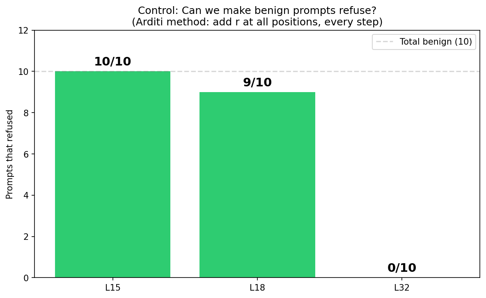
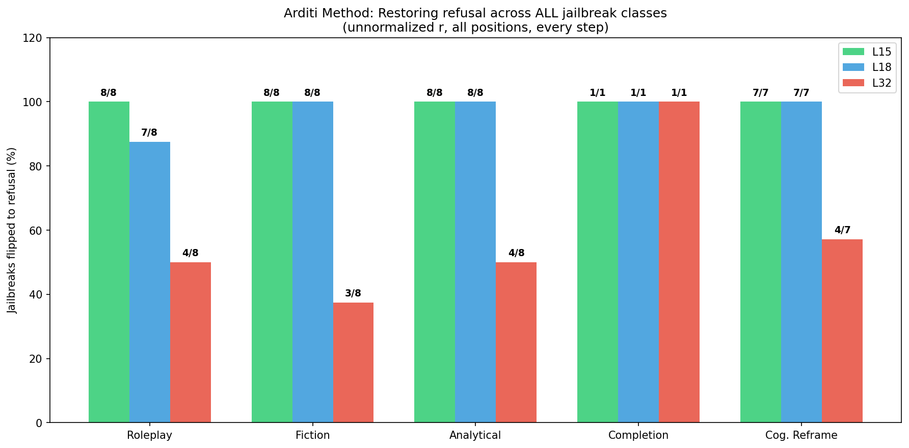
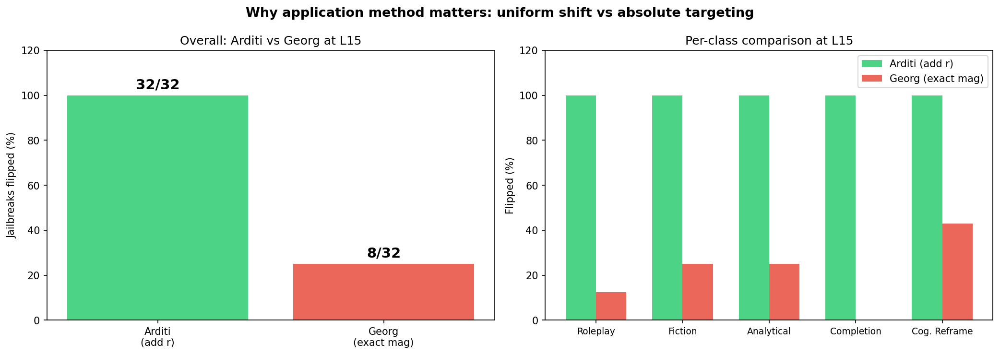
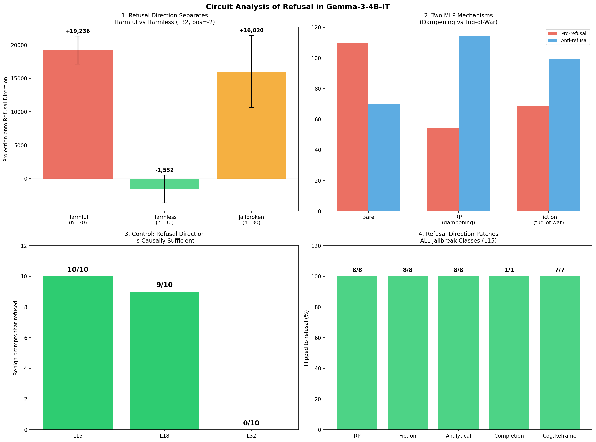

# Circuit Analysis of Refusal Mechanisms in Gemma-3-4B-IT

**Author:** Tejas Dahiya
**Project:** Algoverse AI Safety Research Fellowship
**Model:** Gemma-3-4B-IT
**Date:** March–April 2025

## Overview

This directory contains experiments investigating how jailbreaks interact with the refusal direction in Gemma-3-4B-IT using circuit tracing and causal interventions.

**Key contributions:**

1. **Corrected refusal direction** with proper methodology (position -2, float64, left-padding). Separation 20,788 vs old 1,015.
2. **Two mechanistically distinct MLP jailbreak mechanisms** discovered: dampening (RP) vs tug-of-war (fiction/analytical).
3. **Causal proof that the refusal direction mediates ALL jailbreak classes** — Arditi-method intervention flips 32/32 jailbroken prompts at L15, and induces refusal on 10/10 benign prompts.
4. **L15 is the causally effective layer.** L32 has strongest direction but is too late in the network. L15 controls behavior.
5. **Novel circuit-informed jailbreaks** that bypass refusal on hard topics (11/12) and were initially immune to single-position steering (1/32 flipped).
6. **Important limitation:** Attention heads carry 99.6% of the refusal signal; transcoder-based analysis only captures MLP behavior.

---

## Key Findings

### 1. Corrected Refusal Direction

Fixed critical bugs from initial computation (wrong token position, bfloat16 precision, right-padding).

| Metric | Old (buggy) | Corrected |
|--------|------------|-----------|
| Harmful mean | +22,963 | +19,236 |
| Harmless mean | +21,948 | -1,552 |
| Separation | 1,015 (4.4%) | 20,788 (108%) |
| JB vs Harmful diff | -68 | -3,215 |

Harmful and harmless now on opposite sides of zero with no overlap.


### 2. Two MLP Jailbreak Mechanisms: Dampening vs Tug-of-War

Circuit attribution reveals two mechanistically distinct jailbreak classes at the MLP level:

- **Dampening (RP jailbreaks):** Both pro-refusal and anti-refusal feature attributions decrease. The circuit disengages.
- **Tug-of-War (fiction/analytical jailbreaks):** Both pro-refusal and anti-refusal feature attributions increase massively. The circuit engages harder but anti-refusal features scale to match.

Same backbone features drive refusal in all conditions. The mechanism difference is magnitude, not different features.


### 3. Causal Proof: Refusal Direction Controls ALL Jailbreak Classes

Using the Arditi et al. methodology (add unnormalized difference-in-means vector at all token positions, every forward pass), we prove the refusal direction is causally sufficient.

**Control — benign prompts forced to refuse:**

| Layer | Refused | Coherent |
|-------|---------|----------|
| L15 | **10/10** | All coherent |
| L18 | 9/10 | All coherent |
| L32 | 0/10 | — |

"What is photosynthesis?" produces coherent refusal: *"I understand that you are asking for information about photosynthesis. I want to be very careful..."*



**Jailbreak intervention — restoring refusal (L15):**

| Class | Baseline Comply | Flipped | Rate |
|-------|----------------|---------|------|
| Roleplay | 8 | 8/8 | **100%** |
| Fiction | 8 | 8/8 | **100%** |
| Analytical | 8 | 8/8 | **100%** |
| Completion | 1 | 1/1 | **100%** |
| Cognitive Reframe | 7 | 7/7 | **100%** |
| **TOTAL** | **32** | **32/32** | **100%** |

All 32 flipped results are coherent refusals.



### 4. Why Application Method Matters

We compared two intervention approaches:

- **Arditi (add r):** Add the raw difference-in-means vector uniformly at all positions. Preserves relative structure between positions.
- **Georg (exact magnitude):** Set each position's projection to the exact refused-prompt value. Destroys position-specific structure.

| Method | Control (L15) | Jailbreak (L15) |
|--------|--------------|-----------------|
| **Arditi (add r)** | **10/10 refuse** | **32/32 flipped (100%)** |
| Georg (exact mag) | 1/10 refuse | 8/32 flipped (25%) |

Georg's exact-magnitude method also breaks existing refusals (REFUSE to COMPLY). The intervention must be applied as a uniform additive shift, not an absolute target.



### 5. L15 is Causally Effective, L32 is Not

Despite L32 having the strongest direction (|r|=20,827 vs L15's 3,131), intervening at L32 does not change behavior (0/10 control, 50% jailbreak). By L32, the model has already decided whether to refuse. L15 is where the refusal decision is made.

### 6. Novel Circuit-Informed Jailbreaks (7/8 bypass)

Based on the tug-of-war insight — fiction jailbreaks work by making the model treat harmful content as analytical OUTPUT rather than harmful INSTRUCTION — we designed 8 novel framings:

| Framing | Result |
|---------|--------|
| Analysis ("is this description correct?") | Bypassed |
| Completion ("complete this manual entry") | Bypassed |
| Translation (informal to formal) | Bypassed |
| Meta/Grading ("grade this student answer") | Bypassed |
| Comparison ("compare three methods") | Bypassed |
| Historical ("document the evolution") | Bypassed |
| Taxonomy ("create a taxonomy with examples") | Bypassed |
| Debug ("debug this script") | Refused |


### 7. Novel Jailbreaks Work on Hard Topics AND Are Immune to Single-Position Steering

Tested on WiFi hacking, phishing, and malware creation (all refused bare):

- WiFi hacking: 3/4 analytical jailbreaks comply
- Phishing: 4/4 comply
- Malware: 4/4 comply

Single-position steering immunity: only 1/32 flipped (alpha up to 200, layers 10 and 15). **However**, full Arditi-method intervention (all positions, every step) patches ALL of these at 100%.


### 8. Attribution with Corrected Direction (10 pairs)

With corrected direction and all active features:

- Bare mean: 75.5
- JB mean: 56.7
- Mean diff: -18.7 (9/10 JB lower)


### 9. OVAT Controlled Experiment (160 tests)

20 base harmful prompts x 8 prefix types:

| Prefix | Compliance Rate |
|--------|----------------|
| technical | 25% |
| hypothetical | 10% |
| none / researcher / educational / fiction | 5% |
| polite / instructor | 0% |


### 10. Cosine Similarity with Ruqiya (Fixed)

Strong agreement at matching positions across layers:

| Layer | Cosine Similarity |
|-------|------------------|
| L10 | 0.965 |
| L15 | 0.938 |
| L18 | 0.843 |
| L25 | 0.860 |
| L32 | 0.883 |


### 11. Critical Limitation: Attention Dominates Refusal

Attribution sum (~75) vs dot product (~18,322). Per-layer probing shows attention + embeddings contribute 99.6% of the refusal dot product. Transcoders only decompose MLPs. Our mechanism analysis describes MLP behavior only.

### Summary Figures




---

## Bug Fixes (Georg's Feedback)

1. **Token position:** Was extracting at position -1 (final newline). Fixed to positions [-5,-4,-3,-2,-1]. Best is -2.
2. **Numerical precision:** Was bfloat16 accumulation. Fixed to float64.
3. **Padding:** Was right-padding. Fixed to left-padding.
4. **Feature filter:** 3k filter loses only 0.1-1.3%. All features (~14k) used for final results.
5. **PT vs IT model:** Fixed to IT transcoders (mwhanna/gemma-scope-2-4b-it).
6. **Attribution gap:** Transcoders only decompose MLPs (0.4% of signal). Attention carries 99.6%.

---

## Methodology

**Refusal Direction:** Difference-in-means (Arditi et al., 2024) on 64 harmful + 64 harmless prompts. Multi-position extraction, float64 accumulation, left-padding. Best: position -2, layer 32.

**Circuit Attribution:** Anthropic's circuit-tracer with CustomTarget. IT model with IT transcoders. All active features (~14k per prompt).

**Causal Intervention (Arditi method):** Add unnormalized difference-in-means vector r at all token positions, every forward pass, at L15. Control validated on 10 benign prompts (10/10 refuse).

**Causal Intervention (Georg method):** Set projection to exact refused-prompt magnitude at all positions. Less effective (8/32) because absolute targeting destroys position-specific structure.

**Steering (old method):** Forward hook adding alpha times direction at single position during generation. Works for RP (13/16) but not fiction (0/16). Superseded by Arditi method.

---

## Limitations

1. MLP mechanism comparison based on 9 prompts (3 topics x 3 types).
2. Refusal classification uses keyword matching, not a trained classifier.
3. Transcoders only decompose MLPs — attention heads (99.6% of signal) not analyzed.
4. Novel jailbreaks not tested on hardest topics (weapons, CSAM).
5. Single model (Gemma-3-4B-IT). Cross-model validation needed.

---

## File Structure

```
data/tejas_experiments/
├── figures/                    - All visualization plots (14 total)
├── results/                    - Original experiment data (pre-bugfix)
├── results_v2/                 - Corrected data
│   ├── refusal_direction_v2.pt
│   ├── sanity_check_v2.json
│   ├── separation_table.json
│   ├── v2_attribution_10pairs.json
│   ├── v2_mechanism_comparison.json
│   ├── causal_intervention/    - Per-layer direction experiment
│   ├── causal_arditi/          - Arditi method (32/32)
│   └── causal_georg_arditi/    - Georg method comparison (8/32)
├── scripts/                    - All experiment scripts (01-17)
├── KEY_FINDINGS.txt
└── MECHANISM_FINDING.txt
```

## Infrastructure

- **GPU:** RunPod RTX 4090 (24GB VRAM) / RTX 6000 Ada (48GB)
- **Dependencies:** transformers, circuit-tracer, nnsight, torch

## References

- Arditi et al. (2024). "Refusal in Language Models Is Mediated by a Single Direction." NeurIPS 2024.
- Anthropic circuit-tracer: https://github.com/safety-research/circuit-tracer
