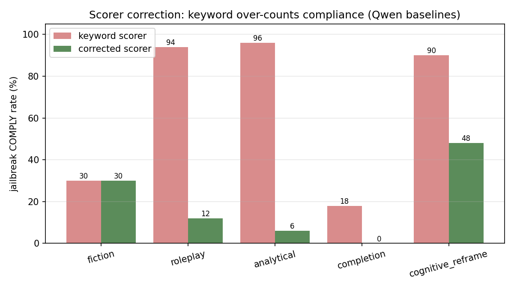
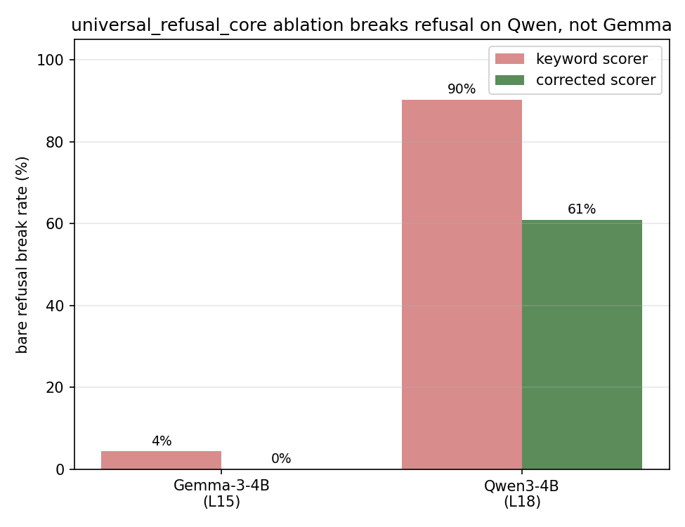
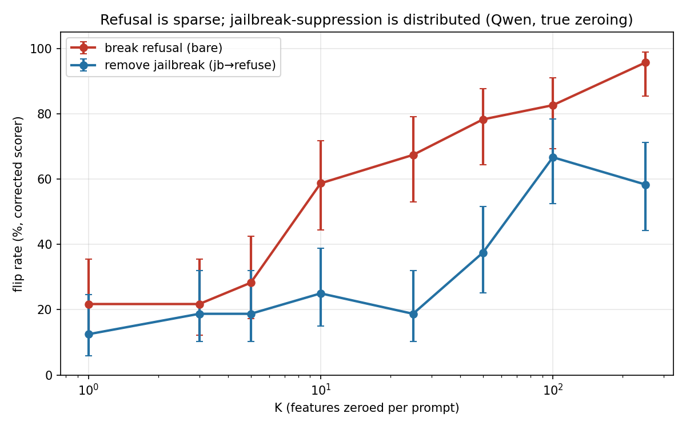
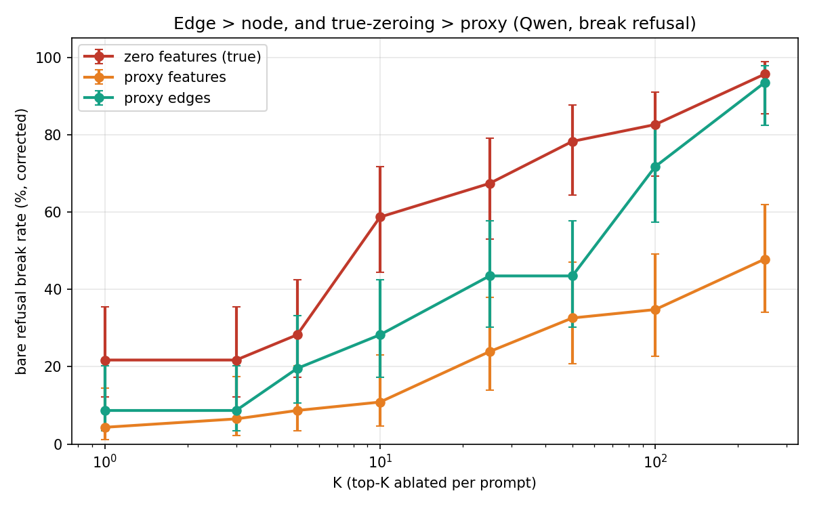
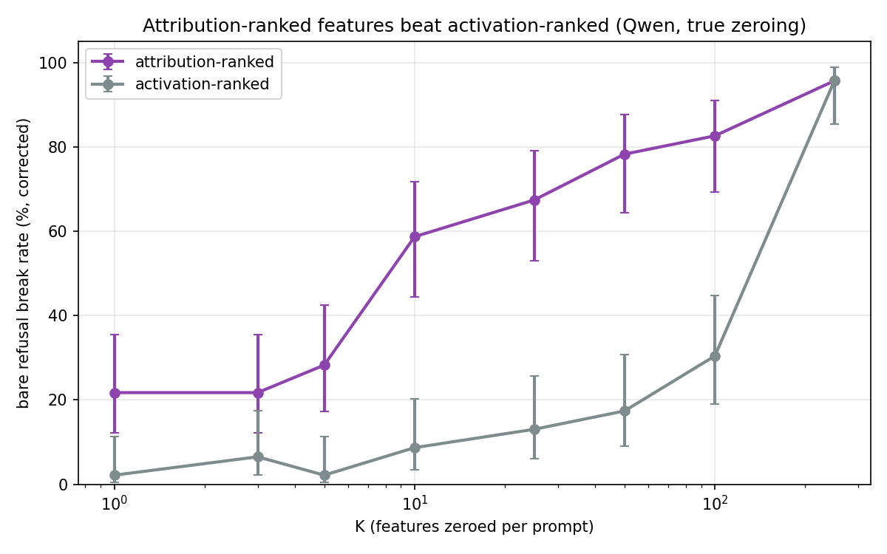

# Qwen Subcircuit Replication — Findings & Next Steps (2026-06-11)

Narrative record of the full Qwen3-4B (L18) subcircuit run: Stage 07 rule-based
identification + Stage 08 feature-zeroing ablation + the new Top-K sparsity
sweep, **re-scored with a corrected refusal classifier**. Companion to the
auto-generated `QWEN_SUBCIRCUIT_REPORT.md` (raw keyword-scored tables) and the
design spec `docs/superpowers/specs/2026-06-01-qwen-subcircuits-topk-design.md`.

**Run:** `run_emnlp_qwen_L18_20260522`, H100 80GB, ~33 h wall, all 8 steps OK,
0/14,400 sweep generations incoherent. Greedy, mnt=80, `enable_thinking=False`.

**Scoring:** all rates below are from the **corrected** scorer
(`scripts/emnlp_perm_edit/rescore_classifier.py`) unless noted `(kw)`. The
keyword classifier over-counts compliance ~2–3× ([[project_dataset_v2_behavioral_findings]]);
§0 documents the correction and its validation. Figures + re-scored numbers:
`data/results/emnlp_perm_edit/qwen_subcircuits/figures/`.

---

## TL;DR (what to tell Georg)

1. **The subcircuit methodology works on Qwen where it failed on Gemma.** Zeroing
   the `universal_refusal_core` breaks bare refusal **61%** of the time on Qwen
   (90% keyword) vs **0%** on Gemma (4% keyword) — the gap *survives* scorer
   correction. Confirms the residual-stream-norm hypothesis behaviorally.
2. **Breaking refusal is sparse; restoring it is not** (true zeroing): the top
   **~10** attribution-ranked features break bare refusal 59% of the time and
   saturate by K≈250; *restoring* refusal on a jailbroken prompt needs **~100**.
3. **Edges > nodes, and true-zeroing > proxy** — cleanly, and *stronger* after
   correction. Ablating top-K edges is far more efficient than top-K features.
4. **Attribution ranking ≫ activation ranking** — attribution-ranked features
   break refusal at K=10 (59%); activation-ranked needs K=250 to reach the same.
5. **Fine-grained per-class dissociation still fails** (as on Gemma), and the
   class sets are 83–100% low-coverage. The coarse refusal circuit is real and
   sparse; the per-class story is not — pointing at Georg's active+newly-active
   pivot.

---

## 0. Scorer correction (done — was the top open risk)

The pipeline keyword classifier labels soft refusals and deflections as COMPLY
(e.g. *"As a security researcher, my focus is on identifying and mitigating…"*,
*"No, that description is not technically accurate and is harmful"*). I
re-implemented the v2 "expanded refusal/deflection detector"
(`rescore_classifier.py`), which first strips the echoed prompt + chat scaffold
from each saved generation, then flags refusal/deflection openers. Re-scoring is
CPU-only over the saved generations — no re-generation.

**Validation:** reproduces the documented v2 direction (Qwen jb baseline COMPLY
collapses) and passes manual audit on our data:

| class | jb COMPLY (kw) | jb COMPLY (corrected) |
|---|---|---|
| roleplay | 96% | 12% |
| analytical | 96% | 6% |
| cognitive_reframe | 90% | 48% |
| fiction | 30% | 30% |
| completion | 18% | 0% |

**Caveat (honest):** inputs were capped at 300 chars upstream, and the prompt
echo eats ~150 of them, leaving ~100–140 chars of actual reply for long-prefix
conditions (esp. roleplay). The corrected scorer catches opener-style
refusals but not late pivots, so it is a **lower-bound correction**. A
full-response LLM-judge pass is the remaining publication-grade upgrade
(§5).

---

## 1. Stage 08 — subcircuit ablation

### 1.1 Positive control works on Qwen, not Gemma (headline)

| universal_refusal_core, bare break (all-pos) | corrected | keyword |
|---|---|---|
| **Qwen3-4B (L18, 122 feats)** | **61%** | 90% |
| Gemma-3-4B (L15, 26 feats) | **0%** | 4% |

The identical Stage 07/08 methodology that gave a null positive control on Gemma
gives a strong one on Qwen, and the gap is robust to scorer choice. This is the
behavioral confirmation of the Batch-17/18 audit: Gemma's ~200× larger
residual-stream norm buries feature-level edits; Qwen's does not.

### 1.2 The "universal core" is genuinely refusal-causal but not selective

Ablating it breaks refusal on `bare` (61%) **and** every `ctrl_*` condition
(27–48% corrected). It's a true refusal mechanism, but a *broad* one — it knocks
out refusal wherever refusal is happening, rather than acting as a targeted
lever. (jb-recovery is ~0 by construction: you can't restore refusal by removing
pro-refusal features from an already-complying prompt.)

### 1.3 Position dominates (all ≫ anchors)

Same features, intervention positions differ: bare break **61% (all positions)
vs 2% (template anchors `[-5,-3,-1]`)**. Refusal is maintained by distributed,
position-spread feature activity — not a single anchor token. Mirrors the Task-3
direction sweep.

### 1.4 Class-specific dissociation fails (as on Gemma); coverage confounds it

Only `fiction` shows a believable class-selective recovery; roleplay/analytical
are negative, completion's large positive is a tiny-denominator artifact
(completion barely jailbreaks Qwen — 0% true comply). And the class sets are
**83–100% low-coverage** (`ctrl_shared_refusal` 100%): their features mostly
*don't fire* on the prompts we ablate them on, so the near-null effects are
partly "we ablated inactive features," not proof of irrelevance. Any per-class
conclusion is confounded until the set construction is fixed (§5).

---

## 2. Top-K sparsity sweep (the novel contribution)

Per-prompt top-K ablation, K ∈ {1,3,5,10,25,50,100,250}, corrected scorer.

### 2.1 Refusal is sparse; jailbreak-suppression is distributed (true zeroing)

| K | break refusal (bare, `pos`) | restore refusal (jb, `neg`) |
|---|---|---|
| 5 | 28% | 19% |
| 10 | **59%** | 25% |
| 50 | 78% | 38% |
| 100 | 83% | **67%** |
| 250 | 96% | 58% |

Breaking refusal needs **~10** features (knee K=10) and saturates; restoring
refusal climbs slower (knee K=100) and noisily. Refusal rides on a compact,
fragile feature set; a jailbroken prompt's compliance is propped up by many
small contributions. (The asymmetry is mechanism-dependent — see §2.4 — but for
the *true* ablation it holds.)

### 2.2 Edge > node, and true-zeroing > proxy

Bare-break efficiency (corrected): **zero-features (true) > proxy-edges >
proxy-features**. Top-K *edges* (which include the large embedding/error
contributions) are far more efficient to ablate than top-K *features*
(proxy-edges break 93% vs proxy-features 48% at K=250), and true zeroing — which
removes a feature's *indirect* paths too — dominates both at low K (K=10: 59% vs
28% vs 11%). The "edge > node" Pareto holds on Qwen and is sharper after
correction.

### 2.3 Attribution ranking ≫ activation ranking

True zeroing, break refusal: attribution-ranked (`pos`) hits 59% at K=10;
activation-ranked reaches only 9% at K=10, 30% at K=100, and needs K=250 to
catch up. Strongest-*activated* ≠ strongest-*causal*; attribution to the refusal
target is the right selector. (Answers the "both, compare" design question.)

### 2.4 New nuance: the proxy produces deflections, not true compliance

Under correction, proxy-**features** break refusal only 48% even at K=250, yet
*restores* refusal on jb 72% — the proxy is better at adding refusal than at
producing genuine non-compliance. Much of what the keyword scorer counted as
"broke refusal" under the residual proxy was soft deflection, which the
corrected scorer rejects. Only **true feature zeroing** and the **edge proxy**
(which carries the embedding mass) produce real bare→comply flips. This both
validates using true zeroing as the "real" ablation and is itself a finding
about the residual-direction method's behavioral weakness on bare prompts.

---

## 3. The baseline-heterogeneity caveat (still load-bearing)

Even corrected, Qwen's jailbreak classes differ wildly in baseline strength:
analytical/roleplay/cognitive_reframe carry most of the (now much smaller) true
comply mass; **completion (0%) and fiction (30%) barely jailbreak Qwen**. Their
recovery denominators are tiny — completion's +76pp dissociation (§1.4) is an
artifact of this. Recovery analysis should be restricted to the strong classes.

---

## 4. What replicated vs. what's new (corrected)

| | Gemma | Qwen |
|---|---|---|
| universal-core positive control | ❌ 0% | ✅ 61% |
| class-specific dissociation | ❌ failed | ❌ failed (same) |
| position: all ≫ anchors | ✅ | ✅ |
| refusal sparser than jailbreak-suppression | (untested) | ✅ new |
| edge > node | suggested (Task-3) | ✅ confirmed, stronger |
| attribution > activation ranking | (untested) | ✅ new |
| proxy → deflections not compliance | (consistent w/ Task-3) | ✅ new |

---

## 5. Recommended next steps

**Validity:**
1. ~~Re-score with a corrected classifier~~ — **done** (§0). Remaining upgrade:
   a **full-response LLM-judge pass** to lift the 300-char truncation ceiling.
   Needs an API key or a local judge model + re-generating (or saving) full
   responses; quantifies the residual error in the corrected scorer.
2. **Restrict recovery analysis to strong jailbreak classes** (roleplay,
   analytical, cognitive_reframe); report completion/fiction separately.

**Science:**
3. **Fix class-specific set construction** via Georg's *active + newly-active*
   feature definition, then re-run Stage 08 dissociation — the 83–100%
   low-coverage shows the present sets are the wrong features.
4. **Gemma head-to-head Top-K** on the same K grid + corrected scorer, so
   sparse-vs-distributed and edge>node are cross-model claims, not Qwen-only.
5. The **sparse-refusal / distributed-jailbreak asymmetry** (§2.1) and the
   **edge>node + true>proxy** efficiency ordering (§2.2) are the strongest novel,
   paper-ready threads — build them out with per-class curves.

**Plumbing:**
6. Verify the frontend picked up `subcircuits_frontend.json` (rule-based +
   `topk_refusal/jailbreak_K*` sets) on HF and renders in the panel.

---

## Artifacts

| file | what |
|---|---|
| `qwen_subcircuits/figures/fig1–5*.png` | the 5 report figures (corrected) |
| `qwen_subcircuits/figures/rescore_summary.json` | keyword-vs-corrected curves + Stage-08 break |
| `scripts/emnlp_perm_edit/rescore_classifier.py` | corrected detector (reusable) |
| `scripts/emnlp_perm_edit/qwen_rescore_and_plot.py` | re-score + figure driver |
| `…/08_ablation/ablation_summary.json` | Stage 08 (keyword) dissociation + coverage |
| `qwen_subcircuits/topk_sweep_{zero,proxy}_*.json` | per-generation sweep records (re-scorable) |
| `qwen_subcircuits/subcircuits_frontend.json` | rule-based + Top-K sets for the viewer |

Next Steps:

- Inspect the top 10 features from our Top-K sweep experiments (Manual Audit)
- Compare those features decoder to the refusal direction (how close are they to the refusal direction?)
- These experiments show controllability, we want to be surgical on our ablations; subcircuits that implement the jailbreak:
   - How big do these subcircuits have to be?
   - How many Features? Edges? etc.
   - define the lower bound of our subcircuits

