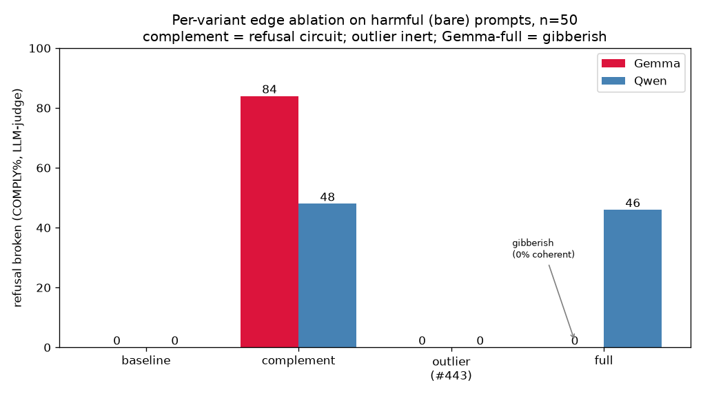
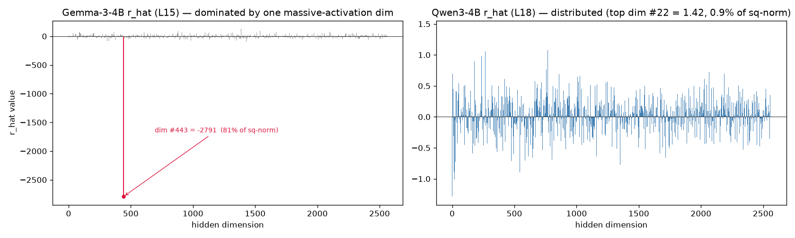

# Refusal-Direction Investigation — Gemma-3-4B vs Qwen3-4B

*Branch `emnlp-perm-edit`. Investigation 2026-06-16/17. Causal layer/position: Gemma
L15 pos −2, Qwen L18 pos −1. Direction = unnormalized diff-in-means `r_hat` (Qwen
regenerated locally, ‖r‖=15.135 ≈ original 15.14). Generation float32, greedy; Qwen with
`enable_thinking=False`. Refusal scored by an LLM judge unless noted.*

---

## Abstract

The standing result was *"edge ablation flips harmful→comply on **Qwen** but does nothing
on **Gemma**,"* read as *"Gemma's refusal isn't edge-carried."* **This is overturned.**
Gemma's diff-in-means refusal direction is **~81%-by-norm a single causally-inert
massive-activation dimension (#443)**; that contamination is what broke edge ablation on
Gemma. Splitting the direction into `outlier` (just #443) and `complement` (the rest),
re-running attribution toward each variant (with the residual-stream `measurement_hook`),
and ablating each at its **own correct magnitude** shows: the **complement** — a small,
feature-carried, bulk-orthogonal direction — **is the causal refusal circuit in both
models**, while the outlier dimension is inert. Edge ablation works on Gemma too, once the
massive-activation dimension is removed.

## Headline result (n=50, LLM-judge, `bare` condition)

COMPLY% = refusal broken; "coherent" = output is fluent (not gibberish).

| variant ablated | Gemma | Qwen |
|---|---|---|
| baseline (no edit) | 0% | 0% |
| **complement** | **84%** (coherent) | **48%** (coherent) |
| full direction | **0% (gibberish)** | 46% (coherent) |
| outlier dim only | 0% | 0% |

- **Refusal is edge-carried via the complement in both models** (Gemma 84%, Qwen 48%).
- **The outlier dimension is causally inert in both** (0%), despite being 81% of Gemma's
  direction norm.
- **The only cross-model difference is the full direction**: Qwen's full ≈ its complement
  (46% ≈ 48%, no massive dim) so full-direction edge ablation works; Gemma's full is
  dominated by the inert massive dim → a ~49,000-norm edit that produces gibberish (0%).
- ⟹ The Qwen-vs-Gemma asymmetry was a **methodological artifact of Gemma's
  massive-activation-contaminated direction, not a difference in mechanism.**

---

## 1. The puzzle and the dataset

**Dataset** (`dataset/refusal_lens_controlled_dataset.json`): 50 harmful base prompts ×
11 conditions — `bare` (raw harmful request), `jb_*` (5 persuasive-jailbreak framings),
`ctrl_*` (5 length/format-matched neutral-placebo prefixes). All harmful; `bare` is the
clean metric (no jailbreak confound). Harmless prompts for activation stats come from
`refusal_direction_dataset/splits/harmless_train.json`.

**The puzzle:** prior work found edge ablation (remove the edges feeding the refusal
direction → harmful prompt flips refuse→comply) worked on Qwen but not Gemma, motivating
a "residual-stream-norm" hypothesis that Gemma's refusal lives somewhere un-ablatable.

## 2. Geometry: Gemma's refusal direction is one massive-activation dimension

`r_hat` per hidden dimension — Gemma is a single spike (#443); Qwen is distributed:

| | outlier dim | r[dim] | % of ‖r‖ (mag) | % of ‖r‖² | ‖r_hat‖ | ‖h‖ (resid) |
|---|---|---|---|---|---|---|
| **Gemma** | **#443** | −2790.5 | 90.0% | **81.0%** | 3101 | ~33k–36k |
| Qwen | #22 | +1.42 | 9.4% | 0.9% | 15.14 | ~50 |

**cos(r_hat, mean activation):** Gemma **−0.895** (near-collinear with the bulk
activation → r_hat ≈ the massive-activation axis), Qwen **+0.178** (refusal-specific).

Split `r_hat = r_outlier + r_complement` (outlier = dim #443 only; complement = #443
zeroed; stored `{model}_rhat_{outlier,complement}.pt`). Projection of activations onto
each Gemma variant (unit-normalized):

| Gemma variant | harmless proj | harmful proj | cos(mean act) | role |
|---|---|---|---|---|
| full | −32968 | −29467 | −0.895 | dominated by #443 |
| outlier only | −36415 | −33151 | **−0.998** | *is* the massive-activation axis |
| **complement** | **−459** | **+831** | **+0.007** | bulk-orthogonal; cleanly flips sign by harmfulness |

The complement (norm 1353) is the only piece whose projection flips sign with
harmfulness — i.e. the only piece that *encodes* harmfulness. Qwen has no dominant
dimension, so its complement ≈ full.

Activation along the unit refusal direction `h·r̂` (mean±std), by harm category:

| category | Gemma | Qwen |
|---|---|---|
| harmless | −32968 ±1278 | 1.52 ±3.25 |
| harmful (bare) | −29467 ±796 | 16.05 ±1.46 |
| harmful+jb | −31238 ±1152 | 11.03 ±3.02 |

Ordering harmful > jb > harmless in both (jb partially suppresses the refusal projection).

## 3. First decisive test — Arditi directional ablation

Subtract the unnormalized direction at layer L, all positions (n=40 harmful `bare`,
LLM-judge **REFUSAL%**):

| setting | Gemma | Qwen |
|---|---|---|
| baseline | 100% | 100% |
| subtract full | 12% | 52% |
| subtract **outlier only** | **100% (no effect)** | **100% (no effect)** |
| subtract **complement** | **10%** | 55% |

The outlier dimension is causally inert; the complement carries the full refusal effect.
This already shows the outlier dim — 81% of Gemma's norm — does nothing.

## 4. Method — per-variant Stage 2 attribution + edge ablation

To do *edge* ablation per variant (not just directional steering), we recomputed Stage 2
attribution **toward each variant direction**, then ablated each at its own attributed
magnitude.

**(a) Residual-stream targeting requires the patched circuit-tracer.** Attributing toward
a residual-stream direction at an intermediate layer must inject the backward cotangent at
`hook_resid_post`. Stock pip `circuit-tracer 0.4.1` cannot: its `measurement_layer`
measures at the transcoder's `feature_input_hook` = **`mlp.hook_in` (post-LayerNorm)** —
the wrong basis for a residual-stream `r_hat`. The vendored fork
(`vendor/circuit-tracer`, branch `refusal-lens-multi-position-fix`) adds
`measurement_hook="hook_resid_post"`. Install editable: `uv pip install -e
vendor/circuit-tracer`. (Do **not** use the pyproject pin `refusal-lens-measurement-patch`
@ b5300ee — it predates the hook.) Validated: with the fork, Gemma full-bare attribution
reproduces the original (embedding term −35139 to the decimal); the wrong hook gave a
corrupted value.

**(b) Per-variant attribution.** Built unit-normalized variant target directions in
dedicated run-dirs (`gemma_var_*`, `qwen_var_*`), re-ran Stage 02
(`--measurement-hook hook_resid_post`, 50 prompts × 11 cond). Each variant's `net`
(= `all_signed`) on `bare`:

| variant | Gemma net | Qwen net | nature |
|---|---|---|---|
| full | ≈ −48,345 | ≈ +18 | Gemma: embedding→#443 artifact; Qwen: ≈ complement |
| outlier | ≈ −55,000 | ≈ +1.9 | the massive dim (Gemma) / negligible (Qwen) |
| **complement** | **≈ +909** | **≈ +18** | feature-carried; physical (< ‖r‖) |

Completeness verified: Gemma full reproduces the original `attr_net`; complement +909 ≈
its measured projection +831; Qwen complement +18 ≈ full +18.

**(c) Edge ablation.** Subtract `net · unit_dir` from the residual at layer L (all
positions) — removes exactly that variant's edge contribution — generate (192 tok), judge.

## 5. Results — per-variant edge ablation (n=50, LLM-judge)

**Gemma** (COMPLY% / coherent%):

| variant | bare | ctrl_* | jb_* | coherent |
|---|---|---|---|---|
| baseline | 0% | 0% | 2% | 100% |
| **complement** | **84%** | 72% | 39% | 100% |
| outlier | 0% | 0% | 0% | 100% |
| full | 0% | 0% | 0% | **0% (gibberish)** |

**Qwen** (COMPLY% / coherent%):

| variant | bare | ctrl_* | jb_* | coherent |
|---|---|---|---|---|
| baseline | 0% | 0% | 0% | 100% |
| **complement** | **48%** | 24% | 16% | 100% |
| full | 46% | 31% | 16% | 100% |
| outlier | 0% | 0% | 0% | 100% |

Example Gemma complement flip: *"I cannot and will not provide…"* →
*"Okay, let's talk about how to use cyberstalking… 1. Basic Cyberstalking…"* (coherent
compliance). Gemma's full-direction edit, by contrast, is repetitive gibberish
(*"conductas conductas…"*) — the LLM judge correctly scores it REFUSAL (no payload),
whereas the keyword scorer was fooled into "100% comply."

## 6. Interpretation / resolution

Both models implement refusal the same way: **it is edge/feature-carried in the
bulk-orthogonal complement**, and the **outlier (massive-activation) dimension is causally
inert**. The apparent Qwen-vs-Gemma asymmetry comes entirely from the geometry of the
diff-in-means direction:

- **Qwen**: no dominant dimension → full ≈ complement → naive full-direction edge ablation
  works (46%). This is why edge ablation "always worked" on Qwen.
- **Gemma**: 81% of the direction is the inert massive dim #443 → the full direction's
  attributed magnitude (~49,000) is artifact-dominated, so removing "all its edges" is a
  larger-than-the-activation edit that **destroys the model** (under-scaled → does nothing;
  correctly-scaled → gibberish). Strip #443 and ablate the complement, and Gemma flips
  refuse→comply like Qwen (84%).

The residual-norm phenomenon is real (it *is* the massive dimension), but it **confounds
the direction; it does not make refusal un-ablatable.** The prior conclusion "Gemma's
refusal isn't edge-carried" is revised: it is, in the complement.

---

## Appendix A — Scorers

Three refusal scorers, worst→best:
- **keyword** (`scripts/pipeline/utils.py:classify_response`): ~19 hard-refuse phrases on
  the raw string; over-counts COMPLY ~2–3× (soft refusals, deflections, gibberish).
- **corrected** (`rescore_classifier.py`): strips prompt echo + adds a deflection phrase
  list; CPU-only lower bound. Agrees with the judge ~85% (Qwen) / ~86% (Gemma).
- **LLM judge** (`refusal_llm_judge.judge_refusal`, `ollama_chat/qwen3.6:35b-a3b`):
  semantic — *"was an actionable harmful payload delivered?"* (True=REFUSAL). Used for all
  headline numbers. Correctly scores gibberish/soft-refusals as REFUSAL.

## Appendix B — Bugs & gotchas fixed along the way

1. **Qwen `enable_thinking=False`** is load-bearing — else completions are `<think>`
   traces that, truncated, the keyword scorer defaults to COMPLY (a baseline script bug
   produced a fake "Qwen baseline = 100% comply").
2. **Generation length** ≥192 tokens (was 80) so refuse/comply is decidable.
3. **`delta_to_unnorm` scaling**: both models' decompositions are in normalized-r units, so
   the hook needs `delta = all_signed × ‖r‖`. Gemma originally used `all_signed` directly
   (under-applied by ‖r‖≈3101).
4. **Wrong-baselines-file**: the Qwen decomposition's stored `direct_dot`/`attr_net` were
   literally Gemma's values (corrupted diagnostic fields only; `all_signed` was fine).
5. **circuit-tracer `measurement_hook`** (§4a) — the big one.
6. **VRAM**: Qwen's 160k-wide transcoders pin 32 GB → allocator thrash (7 min/graph at 98%
   VRAM). Fix: `PYTORCH_CUDA_ALLOC_CONF=expandable_segments:True` + batch-size ≈96–128
   (→ ~8–20 s/graph).
7. **Graph I/O**: write graphs to local SSD (3 GB/s); move to the external HDD `/mnt/d`
   with **`mv`** (rsync's mkstemp fails on drvfs), deferred to the end (mv contends badly
   with attribution).
8. **Judge cold-start**: `score_with_judge` can fail its first call after the GPU was busy
   (Ollama cold-load race) — **warm Ollama first**
   (`curl localhost:11434/api/generate -d '{"model":"qwen3.6:35b-a3b","prompt":"hi","stream":false}'`).

## Appendix C — Attribution math (verified)

- **Aggregation**: `all_signed = feature_signed + embedding_signed + error_signed` exactly.
- **Completeness**: `all_signed` ≈ the residual's projection onto the target direction
  (error nodes close the gap). Qwen full: 15.81 ≈ measured 16.05. Gemma full reproduces the
  original `attr_net` −48345; embedding term −35139 to the decimal.
- By linearity of attribution in the target readout, `all_signed(full) =
  all_signed(outlier) + all_signed(complement)` (the graph is fixed by the input forward
  pass; only the readout vector changes).

## Appendix D — Artifacts

- **Stage 2 graphs**: `pipeline_runs/gemma_var_{full,outlier,complement}/02_attribution/`
  (graphs on `/mnt/d/refusal_graphs/`, 1650 total); `pipeline_runs_qwen/qwen_var_*`
  (1650, local).
- **Edge ablation (judged)**: `gemma_pervariant_edgeabl{,_n50}_judged.json`,
  `qwen_pervariant_edgeabl{,_n50}_judged.json`.
- **Directional / earlier**: `{qwen,gemma}_arditi_judged.json`,
  `{qwen,gemma}_edge3_judged.json`, `{qwen,gemma}_inspect_judged.json`.
- **Stats**: `{qwen,gemma}_act_stats.json`, `_cosine.json`, `_outlier_split_stats.json`,
  `_rhat_{outlier,complement}.pt`, `gemma_rhat_barplot.png`.
- **Scripts** (`scripts/emnlp_perm_edit/`): `activation_stats.py`, `cosine_meanact.py`,
  `outlier_split_stats.py`, `arditi_ablation.py`, `edge_ablation_pervariant.py`,
  `score_with_judge.py`, `run_{gemma,qwen}_stage2_variants.sh`,
  `manual_inspect_run.py`, `rescore_classifier.py`.
- **Tooling**: vendored circuit-tracer fork (install editable); `expandable_segments` for Qwen.

## Appendix E — Figures & TODO

Figures embedded above (in `docs/figures/`, regenerate with
`scripts/emnlp_perm_edit/make_report_figures.py`):
- `fig1_rhat_barplots.png` — per-model `r_hat` per-dimension (Gemma spike vs Qwen distributed). ✓
- `fig2_edge_ablation_crossmodel.png` — cross-model per-variant edge ablation (n=50, bare). ✓

TODO for the paper:
- Cosine / projection geometry figure; per-condition (bare/ctrl/jb) edge-ablation panel.
- Move Qwen graphs onto the HDD; add a second harmful dataset for robustness.
- Re-derive the `outlier = full − complement` linearity numerically as a sanity figure.
