# Refusal-Lens Pipeline

End-to-end pipeline for attributing and analyzing the refusal circuit in Gemma-3-4b-it. Ingests harmful/harmless prompts, computes per-layer refusal directions, runs CLT attribution with the vendored circuit-tracer, verifies the attribution arithmetic, and labels every feature using the Gemma Scope HuggingFace dashboards.

For the design philosophy, stage specs, and forward roadmap see **[PIPELINE_PLAN.md](PIPELINE_PLAN.md)**. This README covers the current implementation state, the most recent experiment's numerical results, and deployment.

---

## Stage summary

| # | Script | Role | Status |
|---|---|---|---|
| 01 | `01_compute_direction.py` | Per-layer refusal directions (normalized + unnormalized) at all 34 layers | ✓ Done |
| 02 | `02_run_attribution.py` | CLT attribution graphs for bare + 5 jailbreak classes, per-prompt feature comparison | ✓ Done |
| 02b | `02b_statistical_analysis.py` | Paired stats (Wilcoxon, t-test, Cohen's d, bootstrap CIs), dual-mechanism decomposition, plots, markdown report | ✓ Done |
| 03 | `03_verify_attribution.py` | Verifies `sum(feature attributions) ≈ r · h[L=32]`, reports MLP contribution fraction | ✓ Done |
| 04 | `04_label_features.py` | Labels every unique feature using HuggingFace dashboard binary payloads (top/bottom logits, examples) | ✓ Done |
| 05 | `utils_viz.py` + `05_frontend_patches/` | Attribution circuit viewer with overlap coloring + bare↔JB compare | ✓ Done (50-prompt pending) |
| 06 | `06_causal_intervention.py` | Arditi-method causal intervention (Tejas's track) | Planned |
| 07 | `07_identify_subcircuits.py` | Rule-based subcircuit identification (11 subcircuits, set-logic) | ✓ Done |
| 08 | `08_ablate_subcircuits.py` | Targeted subcircuit ablation (uses Stage 07 output) | Planned |

Shared modules: `config.py` (model/layer/class constants), `utils.py` (run-dir helpers, prompt formatting, dataset selection).

---

## Latest experiment — `run_20260417_010035` (50 prompts)

### Stage 01 · Direction computation

<table>
<thead>
<tr><th>Layer</th><th align="right">Separation</th><th>Role</th></tr>
</thead>
<tbody>
<tr><td><code>L0</code></td><td align="right"><code>7.4</code></td><td>—</td></tr>
<tr><td><code>L11</code></td><td align="right"><code>1,346</code></td><td>early MLP buildup</td></tr>
<tr><td><code><strong>L15</strong></code></td><td align="right"><code><strong>3,101</strong></code></td><td><strong>best causal layer</strong> (Tejas)</td></tr>
<tr><td><code>L24</code></td><td align="right"><code>9,384</code></td><td>JB effects concentrate here → L32</td></tr>
<tr><td><code>L29</code></td><td align="right"><code>18,930</code></td><td>—</td></tr>
<tr><td><code><strong>L32</strong></code></td><td align="right"><code><strong>20,873</strong></code></td><td><strong>best separation layer</strong></td></tr>
<tr><td><code>L33</code></td><td align="right"><code>287</code></td><td>pre-RMSNorm artifact</td></tr>
</tbody>
</table>

- Matches Tejas's prior numbers within noise (L32: `20,827`; L15: `3,131`).
- **`cos(L15, L32) = −0.115`** — near-orthogonal. The full 34×34 cosine matrix (see "Mechanistic story" below) resolves this into three regimes separated by two pivots at L13→L14 and L17→L18.
- **`cos(L32, L33) = +0.83`** — the L33 separation collapse (`287` vs `20,873`) is a *magnitude* collapse only, not a directional rotation. RMSNorm preserves the direction but rescales it away.

### Stage 02b · Statistical analysis

All five jailbreak classes produce highly significant effects on net refusal attribution.

<table>
<thead>
<tr>
  <th>Class</th>
  <th align="right">Δnet</th>
  <th align="right">% change</th>
  <th align="right">Cohen's d</th>
  <th align="right">p (Wilcoxon)</th>
  <th>95% CI</th>
  <th align="right">Consistency</th>
</tr>
</thead>
<tbody>
<tr><td><strong>Analytical</strong></td><td align="right"><code>−73.7</code></td><td align="right"><code>−104.6%</code></td><td align="right"><code>−2.37</code></td><td align="right"><code>5.3e-15</code></td><td><code>[−82.1, −64.9]</code></td><td align="right"><code>49/50</code></td></tr>
<tr><td><strong>Fiction</strong></td><td align="right"><code>−65.3</code></td><td align="right"><code>−92.7%</code></td><td align="right"><code>−1.57</code></td><td align="right"><code>3.0e-13</code></td><td><code>[−76.6, −53.8]</code></td><td align="right"><code>47/50</code></td></tr>
<tr><td><strong>Cognitive reframe</strong></td><td align="right"><code>−50.2</code></td><td align="right"><code>−71.3%</code></td><td align="right"><code>−1.41</code></td><td align="right"><code>2.5e-14</code></td><td><code>[−60.2, −40.4]</code></td><td align="right"><code>49/50</code></td></tr>
<tr><td><strong>Roleplay</strong></td><td align="right"><code>−38.7</code></td><td align="right"><code>−54.9%</code></td><td align="right"><code>−0.91</code></td><td align="right"><code>1.4e-8</code></td><td><code>[−50.5, −27.0]</code></td><td align="right"><code>42/50</code></td></tr>
<tr><td><strong>Completion</strong></td><td align="right"><code><strong>+5.0</strong></code></td><td align="right"><code><strong>+7.2%</strong></code></td><td align="right"><code>+0.27</code></td><td align="right"><code>0.011</code></td><td><code>[−0.1, +10.2]</code></td><td align="right"><code>15/50</code></td></tr>
</tbody>
</table>

**Dual-mechanism decomposition** — how each class moves the positive-attribution (`dPos`) and negative-attribution (`dNeg`) halves separately:

<table>
<thead>
<tr><th>Class</th><th align="right">dPos (pro-refusal)</th><th align="right">dNeg (anti-refusal)</th><th>Dominant</th></tr>
</thead>
<tbody>
<tr><td>Roleplay</td><td align="right"><code>−22.5 (−16.7%)</code></td><td align="right"><code>−16.2 (−25.3%)</code></td><td>Balanced</td></tr>
<tr><td>Fiction</td><td align="right"><code>−43.1 (−32.0%)</code></td><td align="right"><code>−22.2 (−34.6%)</code></td><td>Balanced</td></tr>
<tr><td>Analytical</td><td align="right"><code>−44.7 (−33.2%)</code></td><td align="right"><code>−29.0 (−45.1%)</code></td><td>Balanced</td></tr>
<tr><td><strong>Completion</strong></td><td align="right"><code><strong>+19.7 (+14.6%)</strong></code></td><td align="right"><code>−14.6 (−22.8%)</code></td><td><strong>Pro-refusal recruitment</strong></td></tr>
<tr><td>Cognitive reframe</td><td align="right"><code>−33.8 (−25.1%)</code></td><td align="right"><code>−16.4 (−25.5%)</code></td><td>Dampening-dominant</td></tr>
</tbody>
</table>

Completion is the paradox: `35/50` prompts show *more* refusal attribution after the JB framing. `dPos` increases by `+14.6%` — new pro-refusal features are being recruited, not existing ones being amplified.

**Feature comparison sizes** — total unique features per bare-vs-JB pair:

<table>
<thead>
<tr><th>Class</th><th align="right">Bare</th><th align="right">JB</th><th align="right">Shared %</th><th align="right">JB-only %</th><th align="right">Sign-flip %</th></tr>
</thead>
<tbody>
<tr><td>Roleplay</td><td align="right"><code>8,342</code></td><td align="right"><code>12,540</code></td><td align="right"><code>65.7%</code></td><td align="right"><code>56.3%</code></td><td align="right"><code>17.5%</code></td></tr>
<tr><td><strong>Fiction</strong></td><td align="right"><code>8,342</code></td><td align="right"><code>12,996</code></td><td align="right"><code>58.5%</code></td><td align="right"><code><strong>62.5%</strong></code></td><td align="right"><code><strong>25.6%</strong></code></td></tr>
<tr><td>Analytical</td><td align="right"><code>8,342</code></td><td align="right"><code>12,109</code></td><td align="right"><code>63.0%</code></td><td align="right"><code>56.6%</code></td><td align="right"><code>23.1%</code></td></tr>
<tr><td>Completion</td><td align="right"><code>8,342</code></td><td align="right"><code>11,200</code></td><td align="right"><code><strong>73.5%</strong></code></td><td align="right"><code>45.3%</code></td><td align="right"><code>16.6%</code></td></tr>
<tr><td>Cognitive reframe</td><td align="right"><code>8,342</code></td><td align="right"><code>11,131</code></td><td align="right"><code>64.4%</code></td><td align="right"><code>51.8%</code></td><td align="right"><code>20.3%</code></td></tr>
</tbody>
</table>

Fiction restructures the circuit most dramatically — highest sign-flip rate (`25.6%`) and highest share of JB-only features. Completion preserves the most of the bare circuit (`73.5%` shared).

### Stage 03 · Attribution verification (M2)

<table>
<thead>
<tr><th>Metric</th><th align="right">Mean</th><th align="right">Std</th></tr>
</thead>
<tbody>
<tr><td>Full projection <code>r · h[L=32]</code></td><td align="right"><code>17,230.8</code></td><td align="right"><code>1,986</code></td></tr>
<tr><td>Σ feature attributions (MLP only)</td><td align="right"><code>70.47</code></td><td align="right"><code>17.6</code></td></tr>
<tr><td><strong>MLP ratio</strong></td><td align="right"><code><strong>0.404%</strong></code></td><td align="right"><code>0.077%</code></td></tr>
</tbody>
</table>

- `attr_net_mean = 70.47` exactly matches the bare condition in Stage 02b — keys plumb through correctly end-to-end.
- Per-layer decomposition (10 prompts × 34 layers) shows early-layer buildup — layers 7–11 alone contribute `~2,400` to the projection for a typical prompt.
- The remaining `99.6%` is carried by **attention heads + embeddings** — a property of the Gemma Scope transcoder set (MLP-only).

### Stage 04 · Feature labeling (M4)

<table>
<thead>
<tr><th>Metric</th><th align="right">Value</th></tr>
</thead>
<tbody>
<tr><td>Unique features collected</td><td align="right"><code>876</code></td></tr>
<tr><td>Labeled via HF Gemma Scope</td><td align="right"><code>876 (100%)</code></td></tr>
<tr><td>Priority features (in sign-flipped / dampened / amplified-anti buckets)</td><td align="right"><code>788 / 788</code></td></tr>
<tr><td>Sign-flipped features</td><td align="right"><code>603</code></td></tr>
<tr><td>Dampened features</td><td align="right"><code>115</code></td></tr>
<tr><td>Amplified-anti features</td><td align="right"><code>117</code></td></tr>
</tbody>
</table>

Labels come from `mwhanna/gemma-scope-2-4b-it` (byte-range HTTP against the dashboard binary).

> **Caveat.** Many top-token patches in Gemma Scope are polyglot or byte-level noise. Labels are correct representations of what the dashboard shows, but human-interpretable features will require reading activation examples on concrete prompts (Stage 05).

---

## Mechanistic story so far

A running narrative of what the pipeline has taught us about Gemma-3-4b-it's refusal circuit. This section grows as new stages and analyses land — last revised 2026-04-17 after A3 + A4 + A5 + A6 + A7 + A8 visualizations.

Plot paths below are relative to repo root; each was produced by the most recent pipeline run (`data/results/pipeline_runs/run_20260417_010035/`).

### 1. Refusal is linear, but the "direction" rotates in two sharp pivots

The diff-in-means between harmful and harmless activations gives a clean linear readout at every layer from `L9` onward, with separation climbing monotonically to `L32 (~20,873)` before collapsing at `L33` to `287`.

<figure>
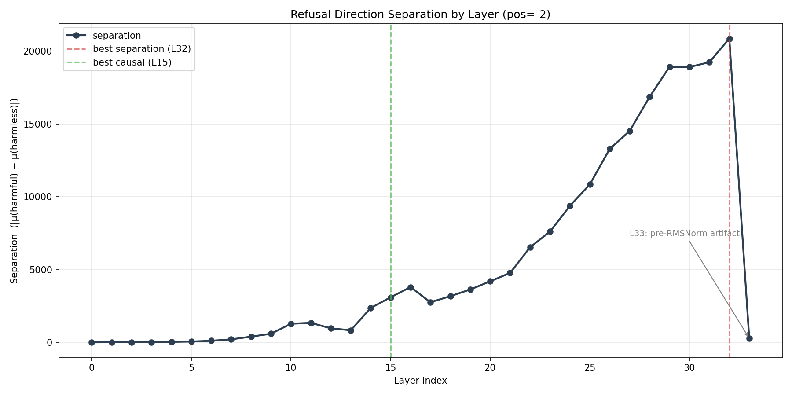
<figcaption><em><strong>Figure 1.</strong> Per-layer separation <code>|μ(harmful) − μ(harmless)|</code>. Monotonic climb through <code>L32</code>, collapse at <code>L33</code> from the pre-RMSNorm artifact.</em></figcaption>
</figure>

The full 34×34 cosine matrix between per-layer directions exposes three distinct *regimes* separated by two pivots:

<figure>
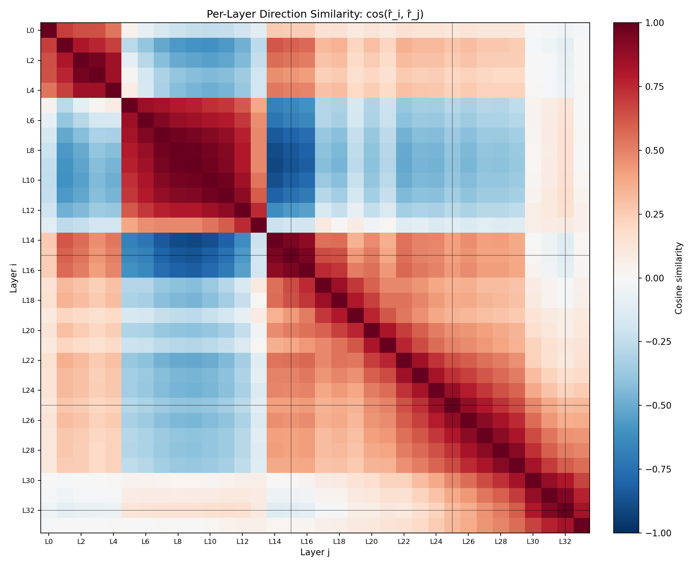
<figcaption><em><strong>Figure 2.</strong> Cosine similarity <code>cos(r̂_i, r̂_j)</code> for all layer pairs. Red = aligned, blue = anti-aligned. Grey gridlines mark <code>L15</code>, <code>L25</code>, <code>L32</code>.</em></figcaption>
</figure>

<table>
<thead>
<tr><th>Regime</th><th>Layers</th><th>Internal coherence</th><th>Example cosine</th></tr>
</thead>
<tbody>
<tr><td>A — early "proto-refusal"</td><td><code>L5–L13</code></td><td>Strong (<code>~0.5–0.9</code>)</td><td><code>cos(L5, L13) = +0.39</code></td></tr>
<tr><td><strong>Pivot 1 (sharp)</strong></td><td><code>L13 → L14</code></td><td>—</td><td><code><strong>cos(L13, L14) = −0.21</strong></code></td></tr>
<tr><td>B — causal band</td><td><code>L14–L17</code></td><td>Very strong (<code>~0.94</code>)</td><td><code><strong>cos(L14, L15) = +0.94</strong></code></td></tr>
<tr><td><strong>Pivot 2 (gentler)</strong></td><td><code>L17 → L18</code></td><td>—</td><td>gradual drop</td></tr>
<tr><td>C — late readout</td><td><code>L18–L33</code></td><td>Increasing toward <code>L32</code></td><td><code>cos(L25, L32) = +0.31</code></td></tr>
</tbody>
</table>

This explains the L15/L32 paradox: **L15 (Tejas's best-causal layer) and L32 (best-separation layer) live in different regimes**. `cos(L15, L32) = −0.115` — near-orthogonal. Causal steering works at L15 because downstream layers rewrite the direction; causal intervention applied to the L32 direction at L15 misses the then-current geometry.

A second observation from the heatmap: **`cos(L32, L33) = +0.83`**, so the L33 collapse is almost entirely a *magnitude* collapse, not a directional rotation. RMSNorm rescales the projection but preserves the direction. This tightens the L33 caveat — it's not that the refusal direction "disappears" at L33, it's that the residual stream is renormalized and the dot product shrinks by `~70×`.

Finally, Regime A (`L5–L13`) and Regime C (`L18–L33`) correlate weakly-to-negatively (`−0.5 to −0.1` in the heatmap's blue strips). The early "proto-refusal" is **not** just a noisier version of the final readout — they're distinct features rewritten at the L13→L14 pivot.

### 2. The signal is assembled in two waves, with a dampening layer mid-stream

<figure>
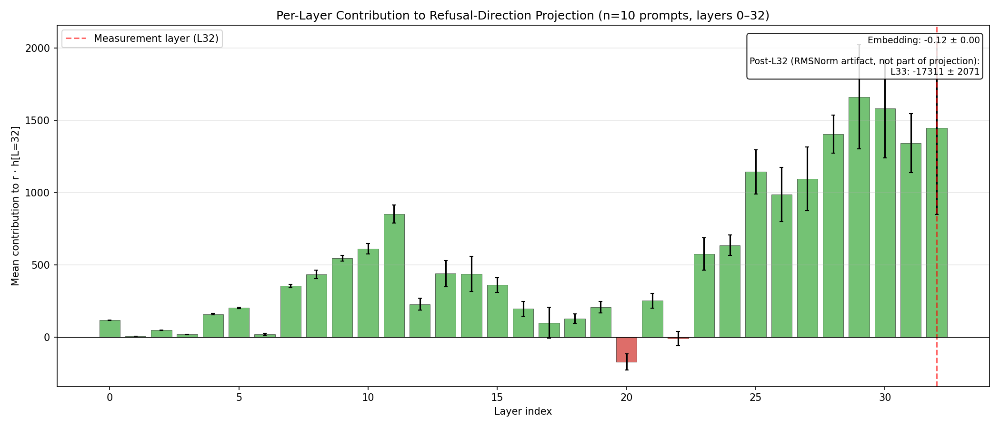
<figcaption><em><strong>Figure 3.</strong> Mean per-layer contribution <code>(h[L+1] − h[L]) · r̂</code> to the L32 projection (n=10 prompts). Layers 0–32 shown; post-measurement L33 is the RMSNorm artifact and is reported in the inset.</em></figcaption>
</figure>

<table>
<thead>
<tr><th>Phase</th><th>Layers</th><th align="right">Mean contribution</th><th>Behaviour</th></tr>
</thead>
<tbody>
<tr><td>Early wave</td><td><code>L7–L11</code></td><td align="right"><code>peaks ~850 at L11</code></td><td>first buildup</td></tr>
<tr><td>Mid plateau</td><td><code>L12–L19</code></td><td align="right"><code>200–450</code></td><td>modest contributions</td></tr>
<tr><td><strong>Dampener</strong></td><td><code><strong>L20</strong></code></td><td align="right"><code><strong>~−200</strong></code></td><td><strong>pulls projection down</strong></td></tr>
<tr><td>Late wave</td><td><code>L23–L32</code></td><td align="right"><code>L29–L30 ≈ 1,650 each</code></td><td>dominant ramp</td></tr>
<tr><td>Post-measurement</td><td><code>L33</code></td><td align="right"><code>−17,311</code></td><td>RMSNorm artifact, not part of projection</td></tr>
</tbody>
</table>

**Interpretation.** The separation at `L32` is mostly *late*-built. Tejas's L15 intervention works because downstream layers then amplify the L15 residual `~4×`. `L20` is an open question — a "pump-the-brakes" layer actively pulling the projection down.

### 3. MLP transcoders only capture ~0.4% of the refusal signal

<table>
<thead>
<tr><th>Metric</th><th align="right">Mean</th><th align="right">Std</th></tr>
</thead>
<tbody>
<tr><td>Full projection <code>r · h[L=32]</code></td><td align="right"><code>17,230</code></td><td align="right"><code>1,986</code></td></tr>
<tr><td>Σ feature attributions</td><td align="right"><code>70.47</code></td><td align="right"><code>17.6</code></td></tr>
<tr><td><strong>MLP ratio</strong></td><td align="right"><code><strong>0.404%</strong></code></td><td align="right"><code>0.077%</code></td></tr>
</tbody>
</table>

The `~99.6%` gap is carried by **attention heads + embeddings** — a property of the Gemma Scope transcoder set (MLP-only). Implication: any mechanistic intervention relying purely on transcoded MLP features will move `<1%` of the measured refusal signal. Attention-head attribution is a known gap (task S3).

### 4. Jailbreaks produce strong, statistically real changes

Five jailbreak classes × 50 prompts, paired bare-vs-JB, all statistically significant.

<figure>
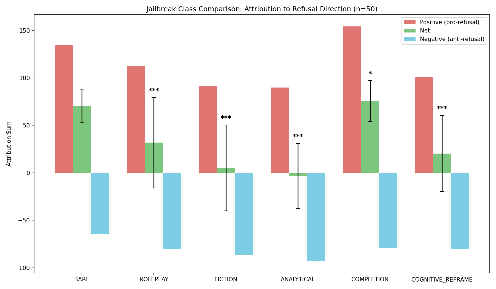
<figcaption><em><strong>Figure 4.</strong> Positive (pro-refusal), net, and negative (anti-refusal) attribution per class. Error bars are ±1 std on net; *, **, *** are Wilcoxon p-value significance thresholds.</em></figcaption>
</figure>

<figure>
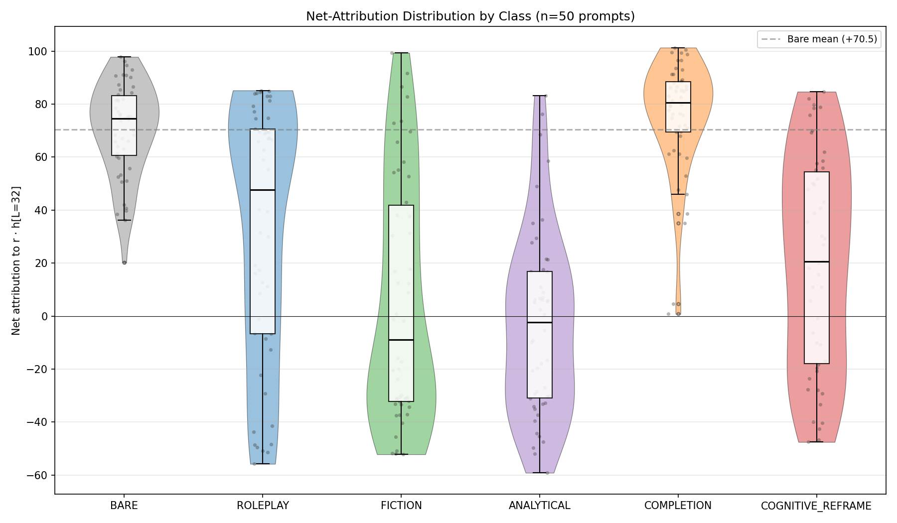
<figcaption><em><strong>Figure 5.</strong> Net-attribution distribution by class (<code>n=50</code> prompts). Violin shape + inner box + jittered per-prompt points. Dashed grey line at bare mean (<code>+70.5</code>).</em></figcaption>
</figure>

<figure>
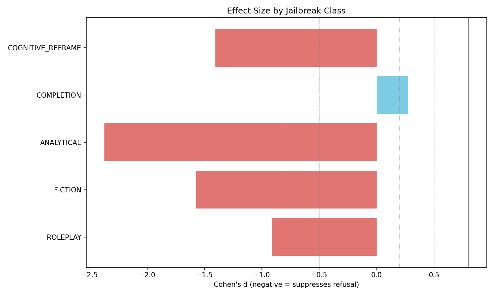
<figcaption><em><strong>Figure 6.</strong> Cohen's d per class. Dotted/dashed/solid grey verticals mark small/medium/large effect thresholds.</em></figcaption>
</figure>

Ordering by effect size:

```text
Analytical       d = −2.37   (strongest; 49/50 consistency)
Fiction          d = −1.57
Cognitive reframe d = −1.41
Roleplay         d = −0.91
Completion       d = +0.27   (INVERTED — discussed below)
```

The distribution plot (Figure 5) adds shape evidence to the effect-size summary:

- **Bare is remarkably tight** — IQR roughly `60–95`, no long tail. The model's default refusal behaviour is very consistent across our 50 prompts. **Every JB class broadens this distribution substantially** — jailbreaks *destabilize* the circuit, not just shift its mean.
- **Analytical is the only class whose median goes firmly negative.** Not just dampening — it flips the net sign on most prompts. This is what "most jailbreakable" actually looks like at the distribution level.
- **Fiction has the longest lower tail (`~−55`)** but retains a small residual cluster above `+50` — some prompts *resist* the fiction framing. Worth asking later whether that's a prompt-category pattern (A7 / A8 can answer).
- **Roleplay has the widest IQR** (`~−10 to +70`) despite only a `−38.7` mean shift — it's the most volatile class, a mix of total-flip and no-effect prompts.
- **Completion's mass sits *above* the bare-mean line** with a narrow tail down to ~0 — the "high-and-tight with a minority tail" shape. This visually previews the recruitment mechanism unpacked in #6.

### 5. Fiction reorganizes the circuit; completion preserves it

<figure>
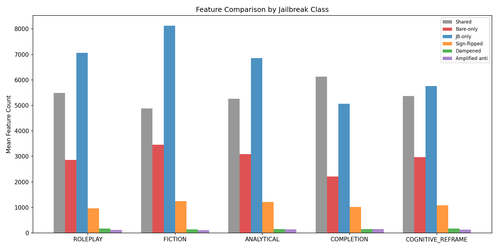
<figcaption><em><strong>Figure 7.</strong> Mean feature counts per JB class across six comparison buckets (shared / bare-only / JB-only / sign-flipped / dampened / amplified-anti).</em></figcaption>
</figure>

<table>
<thead>
<tr><th>Class</th><th align="right">Shared with bare</th><th align="right">JB-only features</th><th align="right">Sign-flipped</th></tr>
</thead>
<tbody>
<tr><td><strong>Fiction</strong></td><td align="right"><code>58.5%</code></td><td align="right"><code><strong>62.5%</strong></code></td><td align="right"><code><strong>25.6%</strong></code></td></tr>
<tr><td>Analytical</td><td align="right"><code>63.0%</code></td><td align="right"><code>56.6%</code></td><td align="right"><code>23.1%</code></td></tr>
<tr><td>Cognitive reframe</td><td align="right"><code>64.4%</code></td><td align="right"><code>51.8%</code></td><td align="right"><code>20.3%</code></td></tr>
<tr><td>Roleplay</td><td align="right"><code>65.7%</code></td><td align="right"><code>56.3%</code></td><td align="right"><code>17.5%</code></td></tr>
<tr><td>Completion</td><td align="right"><code><strong>73.5%</strong></code></td><td align="right"><code>45.3%</code></td><td align="right"><code>16.6%</code></td></tr>
</tbody>
</table>

Fiction uses the most novel features and flips the most shared features — it's not suppressing the circuit, it's *rewiring* it. Completion in contrast keeps almost three-quarters of the bare circuit intact — consistent with its paradoxical *strengthening* effect (see #6).

### 6. Completion is the paradox: it recruits *more* refusal

Completion-style JBs ("I cannot help with that, but what I can suggest is…") should *weaken* refusal but instead **strengthen it by `+7.2%`** (Cohen's d `= +0.27`).

<figure>
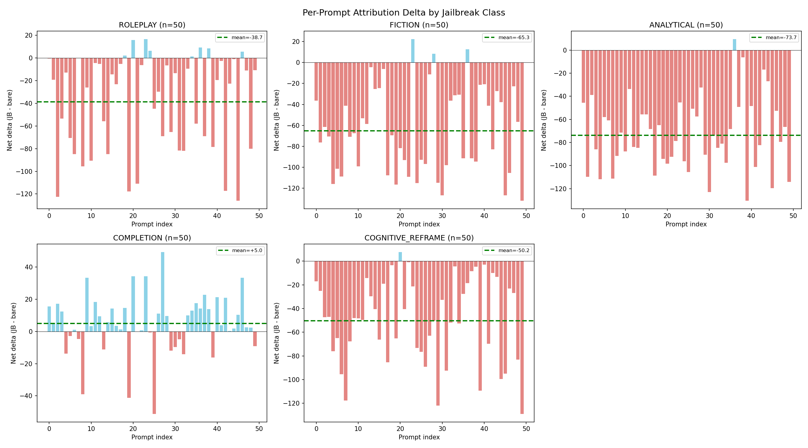
<figcaption><em><strong>Figure 8.</strong> Per-prompt deltas (<code>JB − bare</code>) for each class. Red bars suppress refusal, blue bars strengthen. Completion is visibly bimodal: 35 positive, 15 negative.</em></figcaption>
</figure>

<table>
<thead>
<tr><th>Class</th><th align="right">dPos</th><th align="right">dNeg</th><th>Interpretation</th></tr>
</thead>
<tbody>
<tr><td>Roleplay</td><td align="right"><code>−22.5</code></td><td align="right"><code>−16.2</code></td><td>Balanced dampening</td></tr>
<tr><td>Fiction</td><td align="right"><code>−43.1</code></td><td align="right"><code>−22.2</code></td><td>Balanced dampening</td></tr>
<tr><td>Analytical</td><td align="right"><code>−44.7</code></td><td align="right"><code>−29.0</code></td><td>Balanced dampening</td></tr>
<tr><td><strong>Completion</strong></td><td align="right"><code><strong>+19.7</strong></code></td><td align="right"><code>−14.6</code></td><td><strong>Pro-refusal recruitment</strong></td></tr>
<tr><td>Cognitive reframe</td><td align="right"><code>−33.8</code></td><td align="right"><code>−16.4</code></td><td>Dampening-dominant</td></tr>
</tbody>
</table>

Every other class dampens both halves. Completion is the only one that *grows* the pro-refusal half (`+14.6%`) while weakening the anti-refusal half — two mechanisms pulling in opposite directions, with pro-refusal winning. `35/50` prompts go up, `15/50` go down.

Two independent views converge on this:
- **Figure 5** (distribution by class) shows completion's mass sitting *above* the bare-mean line, with a thin tail down toward zero — "high-and-tight with a minority tail."
- **Figure 8** (per-prompt deltas) shows the same pattern in delta space: a cluster of blue (strengthening) bars with a minority of red (weakening) bars — visibly bimodal.

Both views suggest there's a specific set of features being *recruited* by the completion framing. Identifying which ones is `A2` — next in the analysis plan.

### 7. JB-affected features concentrate in the late regime (L24–L32)

Counting where each comparison bucket's features live by layer reveals a strikingly consistent spatial signature across all three mechanisms:

<figure>
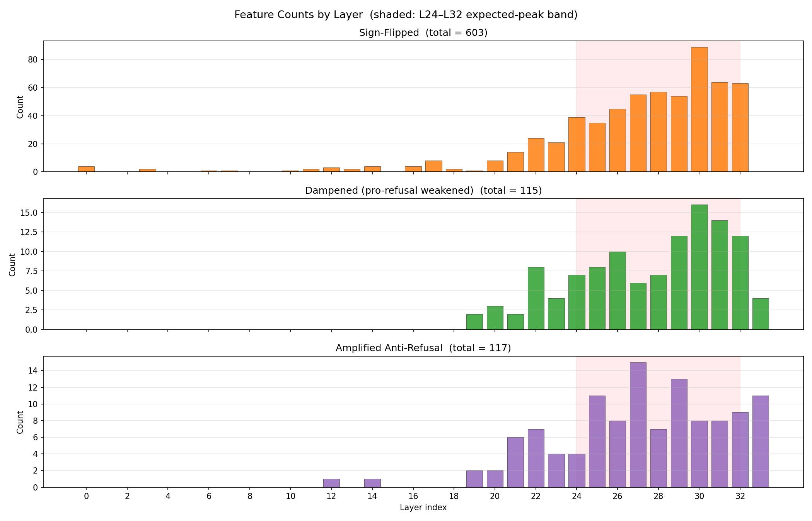
<figcaption><em><strong>Figure 9.</strong> Feature counts by layer for the three comparison buckets. Shaded band (<code>L24–L32</code>) is the predicted peak window. All three bucket totals match <code>label_coverage.json</code> exactly (<code>603 / 115 / 117</code>).</em></figcaption>
</figure>

<table>
<thead>
<tr><th>Bucket</th><th align="right">Total</th><th align="right">% in L24–L32</th><th align="right">% in L0–L14</th><th>Peak layer</th><th>Top 3 layers</th></tr>
</thead>
<tbody>
<tr><td>Sign-flipped</td><td align="right"><code>603</code></td><td align="right"><code><strong>83.1%</strong></code></td><td align="right"><code>3.3%</code></td><td><code>L30 (89)</code></td><td><code>L30, L31, L32</code></td></tr>
<tr><td>Dampened</td><td align="right"><code>115</code></td><td align="right"><code><strong>80.0%</strong></code></td><td align="right"><code>0.0%</code></td><td><code>L30 (16)</code></td><td><code>L30, L31, L29</code></td></tr>
<tr><td>Amplified-anti</td><td align="right"><code>117</code></td><td align="right"><code><strong>70.9%</strong></code></td><td align="right"><code>1.7%</code></td><td><code>L27 (15)</code></td><td><code>L27, L29, L25</code></td></tr>
</tbody>
</table>

Key observations:

- **~`80%` of all JB-affected features live in the `L24–L32` peak band.** Not just "late layers" — a specific 9-layer window ending at the measurement layer. This **exactly matches** the "late wave" signal-assembly band from #2 (`L23–L32`), and the Regime C cluster from the cosine heatmap in #1.
- **Dampening is a pure late-layer phenomenon.** Zero dampened features below `L15`. Pro-refusal features only *exist* in the late readout regime, so there's nothing to weaken earlier.
- **Amplified-anti peaks earlier** (`L27`) than sign-flipped and dampened (both `L30`). Anti-refusal recruitment happens slightly further from the measurement layer — a candidate for subcircuit decomposition in Stage 07.
- **Sign-flipping follows the regime pivot.** Only `3.3%` of sign-flipped features live in `L0–L14`; the ramp starts at `L15` (coincident with Pivot 1 from #1's cosine matrix) and accelerates through `L24–L32`. Flipping a feature's sign only becomes meaningful once the direction has rotated into Regime C.
- **Amplified-anti leaks into `L33`** (`9.4%`) vs `0%` sign-flipped and `3.5%` dampened. This is an open thread: some anti-refusal activations survive the RMSNorm magnitude collapse, unlike the other two mechanisms. Suggests anti-refusal recruitment happens partly in attention/embeddings at the last layer.

The takeaway: **every JB mechanism we've catalogued exploits the same `L24–L32` band where refusal is actively assembled**. If we want to intervene on the circuit rather than steer the direction, targeted interventions in this window should be substantially more effective than broad-layer interventions.

### 8. Only 12.7% of JB-affected features are universal — each class recruits its own subset

**What these features are.** Every feature in this analysis is an **MLP transcoder feature** from the Gemma Scope `transcoder_all/width_16k_l0_small_affine` set, keyed as `L{layer}:F{feature_idx}` (e.g. `L29:F1066`). A feature enters the analysis when it appears in the top-50 attribution list for at least one `(prompt, condition)` pair across the 50-prompt run. Per Section 7, roughly `80%` of the 788 unique features sit in the `L24–L32` band — late-layer MLP features. The UpSet below aggregates across all three comparison buckets (sign-flipped / dampened / amplified-anti) for each of the 5 JB classes.

**Important caveat — `bare` is not a column in this plot.** Every feature shown here is already "bare-relative" by construction: the comparison buckets are defined *relative to bare*, so bare is implicit. A separate pool in `feature_labels.json`'s `conditions_seen` field tracks which of the 6 conditions (`bare` + 5 JBs) had each feature in its own top-50, giving a striking complementary view:

<table>
<thead>
<tr><th>Condition</th><th align="right">Features ever in top-50</th></tr>
</thead>
<tbody>
<tr><td>roleplay</td><td align="right"><code>434</code></td></tr>
<tr><td>cognitive_reframe</td><td align="right"><code>426</code></td></tr>
<tr><td>fiction</td><td align="right"><code>401</code></td></tr>
<tr><td>completion</td><td align="right"><code>384</code></td></tr>
<tr><td>analytical</td><td align="right"><code>362</code></td></tr>
<tr><td><strong>bare</strong></td><td align="right"><code><strong>100</strong></code></td></tr>
</tbody>
</table>

Under bare refusal, only ~`100` MLP features ever carry top-50 attribution weight. Every JB class recruits **3–4× more features** into the top-50. That's a real finding in its own right: **bare refusal is a focused, concentrated computation; jailbreaks *broaden* the refusal circuit, pulling hundreds of additional MLP features into significant attribution**. Whether that broadening *helps* refusal (completion) or *scatters* it (roleplay) is what the UpSet below disambiguates — but the raw broadening itself is consistent across all 5 JBs. Building a `bare`-inclusive 6-way UpSet is a tracked follow-up.

<figure>
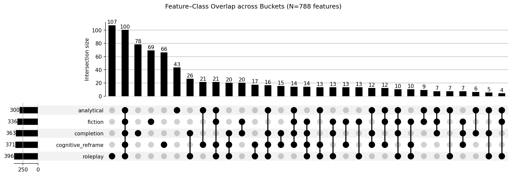
<figcaption><em><strong>Figure 10.</strong> Feature–class overlap UpSet across the 5 JB classes (bare is implicit in the comparison-bucket definition). Each column is a class-subset; bar height is the number of unique features affected in exactly that combination. Left-side horizontal bars show per-class totals (features appearing in that class's bucket, any type).</em></figcaption>
</figure>

<table>
<thead>
<tr><th>Class-set size</th><th align="right">Features</th><th align="right">% of 788</th><th>Interpretation</th></tr>
</thead>
<tbody>
<tr><td>1 (class-exclusive)</td><td align="right"><code>363</code></td><td align="right"><code><strong>46.1%</strong></code></td><td>Single-class-specific</td></tr>
<tr><td>2</td><td align="right"><code>147</code></td><td align="right"><code>18.7%</code></td><td>Shared by a pair</td></tr>
<tr><td>3</td><td align="right"><code>103</code></td><td align="right"><code>13.1%</code></td><td>Shared by a triple</td></tr>
<tr><td>4</td><td align="right"><code>75</code></td><td align="right"><code>9.5%</code></td><td>Shared by four classes</td></tr>
<tr><td><strong>5 (universal)</strong></td><td align="right"><code><strong>100</strong></code></td><td align="right"><code><strong>12.7%</strong></code></td><td><strong>Canonical refusal circuit — all 5 JBs</strong></td></tr>
</tbody>
</table>

Per-class totals paired with their effect sizes from #4:

<table>
<thead>
<tr><th>Class</th><th align="right">Total features</th><th align="right">Class-exclusive</th><th align="right">Cohen's d</th></tr>
</thead>
<tbody>
<tr><td>Roleplay</td><td align="right"><code>396</code></td><td align="right"><code><strong>107</strong></code></td><td align="right"><code>−0.91</code></td></tr>
<tr><td>Cognitive reframe</td><td align="right"><code>371</code></td><td align="right"><code>66</code></td><td align="right"><code>−1.41</code></td></tr>
<tr><td>Completion</td><td align="right"><code>363</code></td><td align="right"><code>78</code></td><td align="right"><code>+0.27</code></td></tr>
<tr><td>Fiction</td><td align="right"><code>336</code></td><td align="right"><code>69</code></td><td align="right"><code>−1.57</code></td></tr>
<tr><td>Analytical</td><td align="right"><code><strong>300</strong></code></td><td align="right"><code><strong>43</strong></code></td><td align="right"><code><strong>−2.37</strong></code></td></tr>
</tbody>
</table>

Observations:

- **A canonical refusal circuit exists.** The 100-feature 5-class intersection is the subset consistently affected regardless of JB framing. This is the natural anchor for Stage 07 subcircuit identification — intervening on these 100 should disrupt all five jailbreaks simultaneously.
- **But class-specificity dominates.** `46.1%` of all JB-affected features appear in only ONE class. Each jailbreak framing recruits its own specialized subset — it's not "more or less of a shared circuit."
- **Breadth is inversely related to strength.** Analytical affects the **fewest** features (`300`) but has the **strongest** effect (`d = −2.37`); roleplay affects the **most** (`396`) but the **weakest** (`d = −0.91`). Analytical operates on canonical pro-refusal features with precision; roleplay scatters effects across many targets — which is why its distribution in #4 has the widest IQR.
- **Roleplay is the most idiosyncratic class.** 107 class-exclusive features — far more than any other. Combined with its wide distribution shape, roleplay appears to trigger a diverse, prompt-dependent feature soup rather than a clean mechanism.
- **Largest pair-intersection is `completion + roleplay`** (26 features). Plausibly reflects "social/conversational" features the other three framings don't touch.
- **Completion's 78 class-exclusive features** are a direct A2 target — these are the specific features being *recruited* to produce the paradoxical +7.2% strengthening.

This sharpens the Stage 07 research question: separate the canonical 100 (affected universally) from each class's exclusive subset, and ask whether the class-exclusives have coherent functional roles (e.g. roleplay-exclusives all encoding "persona" features, completion-exclusives all encoding "refusal template" features, etc.).

### 9. Eleven rule-based subcircuits reveal two mechanism identities and a temporal sequence

Stage 07 partitions the 876 labeled features into 11 subcircuits using pure set-logic over `feature_labels.conditions_seen` and the bucket memberships in `feature_class_sets.json`. No ML fitting — every assignment is reproducible by a written rule. `834 / 876` features land in at least one named subcircuit (the residual 42 sit in 2–4 classes but aren't convergent at the ≥3-class threshold and aren't class-exclusive).

<figure>
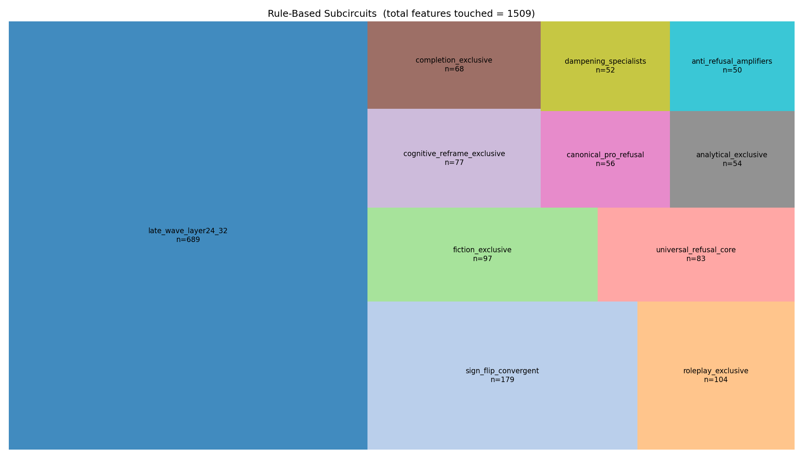
<figcaption><em><strong>Figure 11.</strong> Subcircuit sizes. <code>late_wave_layer24_32</code> (<code>n=689</code>) is a layer-based cross-cut that absorbs most features; the 10 other subcircuits partition behavior by class membership.</em></figcaption>
</figure>

<table>
<thead>
<tr><th>Subcircuit</th><th align="right">Size</th><th>Rule</th><th>Peak layer</th><th align="right">Mean act. freq.</th></tr>
</thead>
<tbody>
<tr><td><code>late_wave_layer24_32</code></td><td align="right"><code>689</code></td><td>Any feature with layer ∈ [24, 32]</td><td><code>L30 (×115)</code></td><td align="right"><code>0.0060</code></td></tr>
<tr><td><code>sign_flip_convergent</code></td><td align="right"><code>179</code></td><td>Sign-flipped in ≥3 JB classes</td><td><code>L30 (×34)</code></td><td align="right"><code>0.0072</code></td></tr>
<tr><td><code>roleplay_exclusive</code></td><td align="right"><code>104</code></td><td>Seen only in <code>roleplay</code>, no bare</td><td><code>L30 (×14)</code></td><td align="right"><code>0.0051</code></td></tr>
<tr><td><code>fiction_exclusive</code></td><td align="right"><code>97</code></td><td>Seen only in <code>fiction</code>, no bare</td><td><code>L28 (×14)</code></td><td align="right"><code>0.0060</code></td></tr>
<tr><td><code><strong>universal_refusal_core</strong></code></td><td align="right"><code><strong>83</strong></code></td><td>Seen in <strong>bare + all 5 JB</strong></td><td><code>L29 (×9)</code></td><td align="right"><code>0.0045</code></td></tr>
<tr><td><code>cognitive_reframe_exclusive</code></td><td align="right"><code>77</code></td><td>Seen only in <code>cognitive_reframe</code>, no bare</td><td><code>L30 (×9)</code></td><td align="right"><code>0.0060</code></td></tr>
<tr><td><code>completion_exclusive</code></td><td align="right"><code>68</code></td><td>Seen only in <code>completion</code>, no bare</td><td><code>L31 (×10)</code></td><td align="right"><code>0.0074</code></td></tr>
<tr><td><code><strong>canonical_pro_refusal</strong></code></td><td align="right"><code><strong>56</strong></code></td><td>Seen in <strong>all 5 JB but NOT bare</strong></td><td><code>L32 (×12)</code></td><td align="right"><code>0.0057</code></td></tr>
<tr><td><code>analytical_exclusive</code></td><td align="right"><code>54</code></td><td>Seen only in <code>analytical</code>, no bare</td><td><code>L26 (×7)</code></td><td align="right"><code>0.0046</code></td></tr>
<tr><td><code><strong>dampening_specialists</strong></code></td><td align="right"><code><strong>52</strong></code></td><td>Dampened in ≥3 JB classes</td><td><code>L30 (×8)</code></td><td align="right"><code>0.0031</code></td></tr>
<tr><td><code><strong>anti_refusal_amplifiers</strong></code></td><td align="right"><code><strong>50</strong></code></td><td>Amplified-anti in ≥3 JB classes</td><td><code>L25 (×8)</code></td><td align="right"><code>0.0078</code></td></tr>
</tbody>
</table>

#### 9.1 Two rules collapse into the same set — two mechanism identities for free

<figure>
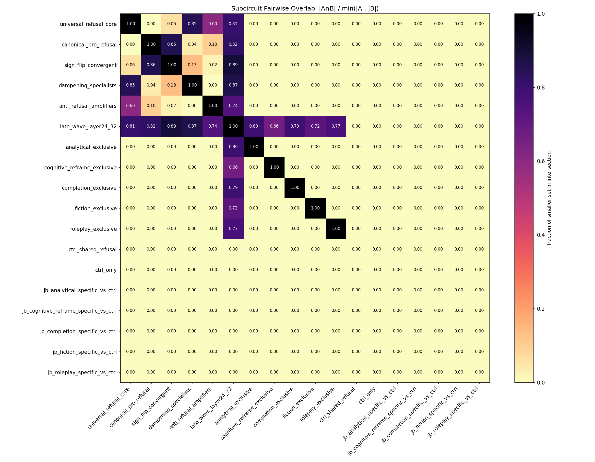
<figcaption><em><strong>Figure 12.</strong> Pairwise normalized overlap <code>|A ∩ B| / min(|A|, |B|)</code>. Warmer = one subcircuit is more contained in the other. Two off-diagonal hotspots (canonical ↔ sign-flip, universal ↔ dampening) expose mechanism identities; <code>late_wave</code> absorbs most subcircuits by construction.</em></figcaption>
</figure>

Two overlaps in the matrix land at <code>0.85+</code> despite the rules being defined completely independently:

- **`canonical_pro_refusal ∩ sign_flip_convergent = 48 / 56 = 86%`.** The "features recruited under all 5 JB classes but not bare" are almost exactly the "features that robustly flip attribution sign under JB." These are two different semantic definitions, and they collapse into the same set. **Read: *the canonical JB-recruited refusal features are the sign-flipped refusal features*.** Nothing in the rules forces this — it's a finding.

- **`universal_refusal_core ∩ dampening_specialists = 44 / 52 = 85%`.** The features being dampened across most JB classes are almost entirely drawn from the universal bare-refusal core itself. Dampening isn't a separate suppression circuit — *it's an attack on the canonical core*.

Together these pin down what each JB mechanism actually does at the feature level: **JBs weaken the universal core AND recruit a parallel sign-flipped pro-refusal set**. The two mechanisms use mostly disjoint features (`canonical_pro_refusal ∩ dampening_specialists = 2 / 52 = 0.04`) — so Stage 08 can ablate them independently and measure their contributions cleanly.

#### 9.2 The late wave is a temporal sequence, not simultaneous competition

<figure>
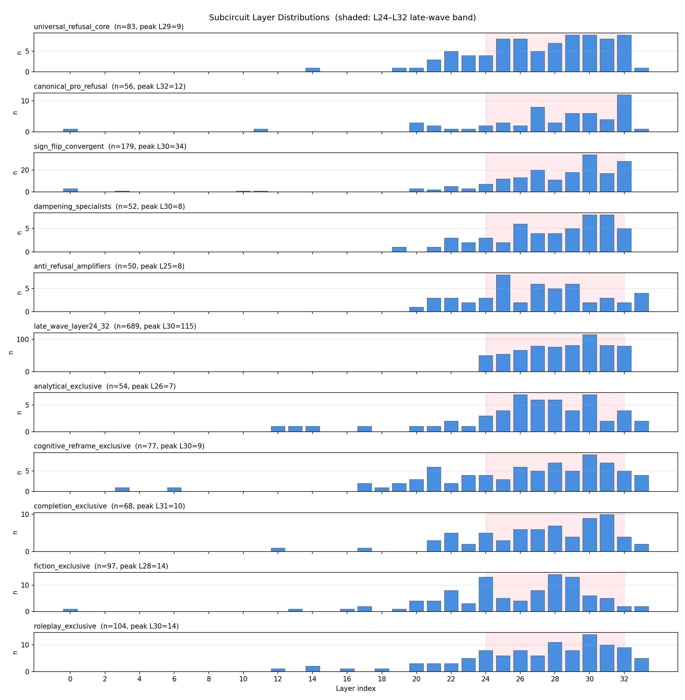
<figcaption><em><strong>Figure 13.</strong> Per-subcircuit layer distribution. Shaded band <code>L24–L32</code>. Peak layers read left-to-right in the forward pass: anti-refusal amplifiers (L25) → dampening specialists (L30) → universal core (L29) → canonical pro-refusal (L32).</em></figcaption>
</figure>

Reading peaks in forward-pass order:

<table>
<thead>
<tr><th>Subcircuit</th><th>Peak layer</th><th>Timing interpretation</th></tr>
</thead>
<tbody>
<tr><td><code>anti_refusal_amplifiers</code></td><td><code>L25</code></td><td>Bypass signal <em>amplifies first</em> — earliest in the late wave</td></tr>
<tr><td><code>universal_refusal_core</code></td><td><code>L29</code></td><td>Canonical refusal peaks mid-wave</td></tr>
<tr><td><code>sign_flip_convergent</code></td><td><code>L30</code></td><td>Sign reversals follow the core peak</td></tr>
<tr><td><code>dampening_specialists</code></td><td><code>L30</code></td><td>Pro-refusal dampening co-peaks with flipping</td></tr>
<tr><td><code>canonical_pro_refusal</code></td><td><code>L32</code></td><td>JB-reactive refusal recruitment lands <em>last</em></td></tr>
</tbody>
</table>

The JB dynamic isn't a simultaneous tug-of-war across L24–L32 — **it unfolds in phases**. Bypass activates early (L25), the canonical refusal core peaks (L29), dampening + sign-flipping strike mid-wave (L30), and JB-reactive pro-refusal recruitment arrives *last* (L32). This orders intervention targets by layer: an L25 intervention hits the bypass signal before suppression kicks in; an L32 intervention catches the reactive recruitment too late to change the readout.

#### 9.3 Brittle suppression vs robust bypass

<table>
<thead>
<tr><th>Subcircuit</th><th align="right">Mean activation frequency</th><th>Interpretation</th></tr>
</thead>
<tbody>
<tr><td><code>anti_refusal_amplifiers</code></td><td align="right"><code><strong>0.0078</strong></code></td><td>Common features — fire on many inputs</td></tr>
<tr><td><code>completion_exclusive</code></td><td align="right"><code>0.0074</code></td><td>—</td></tr>
<tr><td><code>sign_flip_convergent</code></td><td align="right"><code>0.0072</code></td><td>—</td></tr>
<tr><td><code>universal_refusal_core</code></td><td align="right"><code>0.0045</code></td><td>Specialized refusal features</td></tr>
<tr><td><code>dampening_specialists</code></td><td align="right"><code><strong>0.0031</strong></code></td><td>Rarest features — specialized suppressors</td></tr>
</tbody>
</table>

Anti-refusal amplifiers fire **2.5× more often** than dampening specialists. **Bypass is built from common, general-purpose features; refusal suppression relies on specialized, rarely-activated features.** The prediction is asymmetric robustness: specialized features are brittle under distribution shift (easy to knock out), general features are robust. Competing mechanism strengths are load-bearing on who-fires-how-often, not just feature count.

#### 9.4 Dampening attacks the strongest refusal features

Top-3 features by `|attribution|` of `universal_refusal_core` and `dampening_specialists` are **the same three features**, in the same order:

```text
L29:F1066    |attr|=8.04    top logits: ' لیک', ' carr', ' evolved'
L24:F1304    |attr|=4.39    top logits: 'ureau', ' sentidos', 'anea'
L25:F963     |attr|=3.84    top logits: '級', 'ận', 'omeres'
```

The features most causally load-bearing for bare refusal are exactly the features the model weakens under JB. **"Kill the strong, not the weak."** An ablation of these three features should approximately halve the bare refusal signal and simulate the JB effect simultaneously — a clean Stage 08 control condition.

#### 9.5 "OK, I'll help" is a single feature

The top anti-refusal amplifier is `L24:F107` at `|attr|=3.881`, peaking at L25, with top logits `' ok', ' okay', ' OK'`. A compliance-acknowledgment feature whose job under bare is already mildly anti-refusal; under JB, its magnitude amplifies across all three JB classes (dampening / amplified-anti thresholds reach ≥3). **This is a mechanistically interpretable bypass feature** — the model has a literal "OK, I'll help" vector that JBs recruit. Candidate for isolated ablation in Stage 08; easy to explain externally.

#### 9.6 Class-exclusive tokens are semantically coherent for the real jailbreaks

Top logits of each class-exclusive subcircuit's top features:

<table>
<thead>
<tr><th>Class</th><th>Top-feature logit themes</th><th>Read</th></tr>
</thead>
<tbody>
<tr><td><code>fiction_exclusive</code></td><td><code>' Another'</code>, <code>' styling'</code>, <code>'Stage'</code>, <code>' choreography'</code></td><td>Narrative / scene-setting vocabulary</td></tr>
<tr><td><code>roleplay_exclusive</code></td><td><code>' ok'</code>, <code>' okay'</code>, <code>' wow'</code>, <code>' sorry'</code>, <code>' Many'</code></td><td>Acknowledgment / conversational reactions</td></tr>
<tr><td><code>analytical_exclusive</code></td><td><code>' whether'</code>, <code>' Whether'</code>, <code>' ne'</code></td><td>Conditional / analytical connectives</td></tr>
<tr><td><code>cognitive_reframe_exclusive</code></td><td><code>' audience'</code>, <code>' comment'</code>, <code>' insult'</code>, <code>' string'</code>, <code>' bool'</code></td><td>Mixed — audience-reflection + code tokens</td></tr>
<tr><td><code>completion_exclusive</code></td><td><code>' Kardash'</code>, <code>'oka'</code>, <code>' Tra'</code>, <code>' mu'</code></td><td>Byte-level noise; no clear theme</td></tr>
</tbody>
</table>

Fiction, roleplay, and analytical look semantically coherent — the exclusive features match the linguistic register of each jailbreak style. Completion's exclusives are Gemma-Scope-style byte-level noise with no clear theme, which is consistent with completion being the weakest jailbreak (`d = +0.27`) and the paradoxical-strengthening class. **Completion's jailbreak works not by recruiting coherent bypass features but by failing to recruit them at all** — leaving the universal core plus some residual pro-refusal uptake, which explains the `+14.6%` dPos recruitment observed in #6.

#### 9.7 The 5 class-exclusive sets are 100% pairwise-disjoint

By construction — a feature can only be "seen in exactly one JB class." But this is load-bearing: it means the 363 class-exclusive features (`46.1%` of all affected features) form a clean, partitioned taxonomy. Each class has its own unique recruited set, with **no overlap** between classes. Combined with the 83-feature universal core, this is a 363 + 83 = 446-feature "identity-by-class" basis, covering `57%` of the 788 bucketed features. The remaining `43%` are multi-class but not all-class — the partial-overlap features to be explored when we layer embedding-based clustering.

#### Stage 08 ablation queue (from the subcircuit report)

The rule-based view gives us a prioritized ablation order for Stage 08, grounded in expected causal direction:

1. **`canonical_pro_refusal` (56)** — JB-specific pro-refusal recruitment. Ablation should *strengthen* JB bypass (removes the JB-only refusal boost).
2. **`sign_flip_convergent` (179)** — robust direction reversals. Ablation should partially restore bare behavior under JB.
3. **`dampening_specialists` (52)** — weakened pro-refusal features. Restoring them to bare strength should counter fiction/analytical bypass.
4. **`anti_refusal_amplifiers` (50)** — JB-amplified bypass signal. Suppressing them should *increase* refusal under JB.
5. **`universal_refusal_core` (83)** — shared baseline. Ablation should break refusal on bare *and* JB (control — proves the subcircuits matter at all).

The top-3 subcircuits are the priority story for Georg: "JBs do two disjoint things to the refusal circuit — they dampen the canonical core, and they recruit a sign-flipped parallel set. Both are interpretable at the feature level, both are concentrated in L24–L32, and they unfold in a fixed temporal order across the late wave."

---

## Gaps & open questions

Items flagged for future pipeline stages or deeper analysis.

<table>
<thead>
<tr><th>Gap</th><th>Status</th><th>Where it gets answered</th></tr>
</thead>
<tbody>
<tr><td>Does the model actually refuse bare prompts / comply under JB?</td><td>Not measured</td><td><code>A1</code> · Stage 02c — coherence + refusal classification</td></tr>
<tr><td>Which specific features are recruited by completion?</td><td>Not identified</td><td><code>A2</code> · Stage 02b extension — top <code>Δattribution</code> under completion</td></tr>
<tr><td>Why does bare refusal use only ~100 features while every JB recruits 3–4× more? Which specific bare features survive / disappear / get replaced under each JB?</td><td>Counts known, identities not mapped</td><td><code>A7+</code> · 6-way UpSet built from <code>feature_labels.json[conditions_seen]</code></td></tr>
<tr><td>Feature <code>clerp</code> labels are empty — left-side feature list shows bare <code>L{layer}:F{idx}</code> identifiers, not human-readable descriptions</td><td>Data available, synthesizer not built</td><td><code>S5-labeling</code> · LLM-synthesized labels from <code>top_logits</code> + <code>examples</code> + top attribution edges, written to <code>feature_labels.json[llm_label]</code> and injected into graph <code>clerp</code> at Stage 05 conversion</td></tr>
<tr><td>Side-by-side comparison of bare and selected JB graph in one view</td><td>Single-graph viewer works; compare UI not yet built</td><td><code>5c.iv</code> · <code>compare.html</code> with two iframes + URL-param graph selector (small vendored-JS patch)</td></tr>
<tr><td>What does <code>L20</code> do? Why is it the only negative-contribution layer?</td><td>Open</td><td>Dedicated follow-up (not in current plan)</td></tr>
<tr><td>What features live in Regime A (<code>L5–L13</code>) vs Regime C (<code>L18–L33</code>)? They're weakly anti-correlated</td><td>Open</td><td>Stage 07 subcircuit identification</td></tr>
<tr><td>What happens at the <code>L13→L14</code> pivot? Is there a specific attention head / MLP that triggers the rotation?</td><td>Open</td><td>Task <code>S3</code> (attention-head attribution) + follow-up probe</td></tr>
<tr><td><code>99.6%</code> of the refusal signal lives in attention + embeddings — which heads?</td><td>Not attributed</td><td>Task <code>S3</code> (attention-head attribution)</td></tr>
<tr><td>Are any two JB classes structurally similar (shared recruited features)?</td><td>Not cross-tabulated</td><td>Stage 07 subcircuit identification</td></tr>
</tbody>
</table>

---

## Deployment

### Local smoke test (no GPU required)

```bash
PYTHONPATH=src python3 -m pytest scripts/pipeline/tests/test_pipeline_local.py -v -W ignore::DeprecationWarning
```

Expected: 60/60 pass. Uses an existing run directory as a fallback for stages that need heavy compute.

### Full RunPod run (stages 01 → 04)

Prerequisites on the pod:
- `/workspace/Refusal-Lens` clone on the `foundation` branch
- `/workspace/venv` with torch (nightly for Blackwell GPUs: `pip install --pre torch --index-url https://download.pytorch.org/whl/nightly/cu128`), transformers, scipy, and the vendored circuit-tracer installed
- HuggingFace token available (either `~/.cache/huggingface/token` or `HF_TOKEN` env var)
- A GitHub fine-grained PAT exported as `GHP_TOKEN` for auto-push (scope: contents:write on the repo)
- Recommended hardware: **RTX A6000 (48GB)** or **A40 (48GB)** — model + transcoders fit in ~15–20 GB, Blackwell cards need PyTorch nightly

**Step 1 — start the experiment in a detached tmux session:**

```bash
tmux new-session -d -s pipeline -n run "cd /workspace/Refusal-Lens && source /workspace/venv/bin/activate && python -u scripts/pipeline/tests/test_runpod_1_4.py --n-prompts 50 2>&1 | tee /workspace/pipeline_output.log"
```

**Step 2 — export `GHP_TOKEN` in your SSH shell before adding the watcher window** (so the new window inherits it):

```bash
export GHP_TOKEN=ghp_...   # paste your fresh token
echo $GHP_TOKEN            # sanity check
```

**Step 3 — add the watcher window that prints heartbeats and auto-commits on completion:**

```bash
tmux new-window -t pipeline -n watcher "L=/workspace/pipeline_output.log; echo \"[watcher] monitoring \$L\"; until grep -q 'PIPELINE COMPLETE' \$L 2>/dev/null; do grep -q 'Pipeline stopped at Stage' \$L 2>/dev/null && { echo '[watcher] FAILED'; exit 1; }; echo \"[watcher \$(date +%H:%M:%S)] alive — tail: \$(tail -n1 \$L 2>/dev/null | cut -c1-120)\"; sleep 30; done && echo '[watcher] pipeline complete — committing...' && cd /workspace/Refusal-Lens && R=\$(grep -oE 'data/results/pipeline_runs/run_[0-9_]+' \$L | head -1) && echo \"[watcher] run_dir: \$R\" && cp \$L \$R/pipeline_output.log && U=\$(git remote get-url origin | sed \"s|https://|https://x-access-token:\$GHP_TOKEN@|\") && git pull --rebase \$U foundation && git add \$R && git commit -n -m 'pipeline run: stages 01-04 (50 prompts)' && git push \$U foundation && echo '[watcher] DONE — pushed to foundation'"
```

**Step 4 — attach to watch progress:**

```bash
tmux attach -t pipeline     # Ctrl+b n to switch windows, Ctrl+b d to detach
```

**Expected runtimes** (48 GB card, 50 prompts):
- Stage 01: ~1 min
- Stage 02: ~3–4 hours
- Stage 02b: ~1 min
- Stage 03: ~5–10 min
- Stage 04: ~2 min

### Sharing the frontend with collaborators

The attribution-graph browser (Stage 05) can be viewed on any machine without GPU, without running any pipeline compute — all the expensive steps are pre-computed and the rendered graph bundle is hosted on HuggingFace. The steps below are what Georg / Tejas / any collaborator runs on a fresh machine.

**Zero-to-browser in five steps, starting from nothing on a fresh machine:**

```bash
# 1. Clone WITH submodules — vendor/circuit-tracer (Anthropic's upstream frontend
#    assets) is a git submodule and must be populated for the viewer to render.
git clone --recurse-submodules -b foundation https://github.com/AutoInterp/Refusal-Lens.git
cd Refusal-Lens

# If you already cloned without --recurse-submodules, run this once instead:
# git submodule update --init --recursive

# 2. Create a Python environment (3.10+ required) and install the single
#    frontend-only dependency. No torch, no transformers, no circuit-tracer.
python3 -m venv venv
source venv/bin/activate        # Windows PowerShell: .\venv\Scripts\Activate.ps1
pip install huggingface_hub

# 3. (Only if the HF dataset is private) one-time login
# hf auth login
# Paste a read-scope token from https://huggingface.co/settings/tokens

# 4. List available runs, then pull one. Downloads ONLY the ~180 MB frontend
#    bundle (gzipped per-graph JSON + metadata + subcircuit definitions).
#    Raw .pt archives stay on HF and are never pulled unless you explicitly
#    invoke fetch_raw_graphs.py. Incremental — safe to re-run.
cd scripts/pipeline
python3 fetch_graph_data.py --list --dataset-repo moon70/refusal-lens-graphs
python3 fetch_graph_data.py --run run_20260418_172402 \
    --dataset-repo moon70/refusal-lens-graphs

# 5. Serve the resulting 05_frontend/ over HTTP
cd ../../data/results/pipeline_runs/run_20260418_172402/05_frontend
python3 -m http.server 8000
```

Then open one of:

- **`http://localhost:8000/?slug=000_bare`** — single-graph viewer, with a left-rail subcircuit panel (Stage 07 memberships) and a right-rail overlap legend (shared / JB-unique / bare).
- **`http://localhost:8000/compare.html`** — side-by-side bare ↔ JB viewer. Prompt and JB-class dropdowns in the toolbar; each iframe has its own independent subcircuit panel.

Total disk footprint on the collaborator machine for the 10-prompt bundle: ~180 MB (gzipped graph files) + a few KB of HTML/JS/CSS. No GPU, no model weights, no raw `.pt` files downloaded.

**Browser support:** the gzipped-fetch path uses `DecompressionStream('gzip')`, which requires Chrome 80+, Firefox 113+, Safari 16.4+. All released within the last ~2 years — should be fine on any current setup.

**Troubleshooting:**

- *"Cannot fetch `graph-metadata.json`"* → usually means `python3 -m http.server` is serving from the wrong directory. Make sure your pwd is the `05_frontend/` directory (it should contain `index.html` and a `data/` folder).
- *Blank page or spinning forever* → check the browser DevTools console. If you see `[gzip-fetch] DecompressionStream unavailable`, upgrade to a current browser.
- *Panel doesn't show subcircuit counts* → normal for the first ~2 s while the 3–4 MB gzipped graph JSON downloads and D3 binds nodes; the count updates every 1.5 s once data lands. If counts stay at 0 after 10+ seconds, check the DevTools console for fetch errors.

The on-disk graph files are gzipped (`*.json.gz`, ~12× smaller than plain). The in-browser fetch wrapper (`gzip-fetch.js`) decompresses them via `DecompressionStream` — no server config required. Works in Chrome 80+, Firefox 113+, Safari 16.4+.

**Updating when new runs land.** Re-run `fetch_graph_data.py --run <run>` — existing files are skipped, only new/changed bytes flow. The `data/graph-metadata.json` lists the graphs the viewer knows about; it's regenerated on each `stage_frontend()` call so newly-added graphs show up automatically in the dropdown. There's no client-side cache to bust beyond a hard reload.

**Uploading new runs (pipeline author):**

```bash
# After running 05_visualize_circuits.py locally with your run, push the
# staged bundle to HF. The push step gzips on the fly for upload bandwidth.
hf auth login   # once per machine, with a Write-scope token
python3 push_graph_data.py --run-dir data/results/pipeline_runs/run_YYYYMMDD_HHMMSS \
    --subcircuits-run data/results/pipeline_runs/run_20260417_010035 \
    --dataset-repo moon70/refusal-lens-graphs
```

The dataset repo is configurable via `--dataset-repo`. Currently `moon70/refusal-lens-graphs`; to migrate, change the flag (no code edits).

**Archiving raw `.pt` attribution graphs (one-time, for cold storage):**

The pruned `.json.gz` bundle is what the frontend needs — but the raw `.pt` files from `02_attribution/graphs/` (which contain the full 20k×20k adjacency matrix and every attribution edge, not just the pruned top-0.8) are worth keeping for future analyses that can't be done from the pruned view: re-pruning at different thresholds, Stage 08 subcircuit ablation, full gradient-based feature importance, etc.

Push them to the same HF dataset once, then `rm -rf` locally to reclaim disk:

```bash
# ~70-90 min upload at home connection speeds for a 10-prompt run (~80 GB)
python3 push_raw_graphs.py \
    --run-dir data/results/pipeline_runs/run_20260418_172402 \
    --dataset-repo moon70/refusal-lens-graphs
# Verifies remote file list before printing the rm command. Resumable — re-run to retry.
```

Pull a subset back on demand:

```bash
python3 fetch_raw_graphs.py --run run_20260418_172402 \
    --dataset-repo moon70/refusal-lens-graphs \
    --prompts 0,1,2            # optional: subset to save download time
```

Raw graphs live at `runs/<run>/raw_graphs/*.pt` in the dataset (LFS-tracked). `fetch_graph_data.py` never touches them, so collaborators who only want the frontend don't pay the download cost.

### Resuming after a crash

Stage 02 checkpoints after every prompt. To resume the attribution stage without redoing stages 01:

```bash
python -u scripts/pipeline/tests/test_runpod_1_4.py \
  --n-prompts 50 \
  --run-dir data/results/pipeline_runs/run_YYYYMMDD_HHMMSS \
  --skip-stage 01 \
  --resume
```

To re-run only the lightweight stages (e.g. after a 02b bug fix):

```bash
python -u scripts/pipeline/tests/test_runpod_1_4.py \
  --n-prompts 50 \
  --run-dir data/results/pipeline_runs/run_YYYYMMDD_HHMMSS \
  --skip-stage 01 02
```

### Security notes

- `GHP_TOKEN` appears in `ps` output during the `git push` — acceptable on a private pod, rotate the token afterward if the pod is shared.
- Prefer fine-grained PATs scoped to this repo's contents, not classic tokens with full-repo access.
- The watcher writes a copy of `pipeline_output.log` into the run directory before committing, so the log is preserved as part of the run artifact.

---

## Output directory layout

```
data/results/pipeline_runs/run_YYYYMMDD_HHMMSS/
├── run_config.json
├── config.json
├── pipeline.txt                       # stage-level log from test runner
├── pipeline_output.txt                # full stdout stream (added by watcher)
├── 01_direction/
│   ├── refusal_direction.pt           # normalized r_hat at best_separation_layer
│   ├── unnormalized_r.pt              # unnormalized r (all layers)
│   ├── direction_metadata.json        # per-layer separation, cosines, best layers
│   └── directions/layer_XX.pt         # normalized r_hat per layer
├── 02_attribution/
│   ├── attribution_results.json       # per-prompt, per-condition feature attributions
│   ├── attribution_checkpoint.json    # resume state
│   └── feature_comparison_aggregate.json
├── 02b_stats/
│   ├── statistical_analysis.json
│   ├── EXPERIMENT_SUMMARY.md
│   ├── class_comparison.png
│   ├── distribution_by_class.png
│   ├── per_prompt_deltas.png
│   ├── effect_sizes.png
│   ├── feature_comparison_summary.png
│   ├── separation_by_layer.png
│   └── cosine_heatmap.png
├── 03_verification/
│   ├── verification_results.json       # includes per_layer_aggregate (A4)
│   ├── per_layer_decomposition.json
│   └── per_layer_contribution.png      # A4 bar chart
└── 04_labels/
    ├── feature_labels.json            # {L:F → {top_logits, bottom_logits, examples, ...}}
    ├── feature_labels_cache.json      # raw HF payload cache (survives re-runs)
    ├── feature_comparison_labeled.json
    ├── label_coverage.json
    ├── layer_histogram.json           # A8 per-bucket layer counts
    ├── features_by_layer.png          # A8 histogram plot
    ├── feature_class_sets.json        # A7 per-class feature membership
    ├── feature_class_upset.png        # A7 UpSet overlap plot
    └── top_features_report.md
```

---

## Known caveats

- **Gemma-3-4b-it is not on Neuronpedia** — labels come from the HuggingFace Gemma Scope dashboards (byte-range HTTP requests against `index.json.gz`). Many top-token patches are polyglot / byte-level noise; semantic interpretation requires activation examples on concrete prompts.
- **Transcoders cover MLP only** — the MLP ratio of ~0.4% means 99.6% of the refusal signal is carried by attention + embeddings. This is a property of the transcoder set, not a bug.
- **Layer 33 anomaly** — forward hooks capture pre-RMSNorm, `hidden_states` captures post-RMSNorm. Stage 01 uses `hidden_states`, which is why L33 separation shows as 287 (not ~20k). Expected.
- **Position -2** is the "model" token in Gemma-3's chat template. Stage 01 and Stage 02 use this position.
- **PyTorch + Blackwell GPUs** — stable PyTorch only supports up to sm_90. RTX PRO 6000 Blackwell (sm_120) needs `torch --pre` from the nightly cu128 index.
